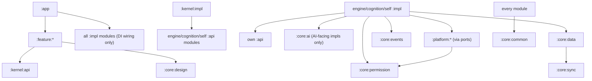

# NEXA — ANDROID ENGINEERING SPECIFICATION
## The Complete Engineering Foundation: How NEXA Is Built

| | |
|---|---|
| **Document** | NEXA Android Engineering Specification |
| **Version** | 1.0.0 |
| **Date** | 2026-07-13 |
| **Status** | Foundation Draft — for engineering review, then ratification |
| **Audience** | Android engineers (all levels), platform/security/performance specialists, DevOps, engineering leadership |
| **Sources of truth** | ARCHITECTURE.md + ARCHITECTURE_V2.md (system design) · PRODUCT_REQUIREMENTS.md (scope, NFRs, kill criteria) · CONSTITUTION.md and behavior docs (what the code must guarantee) |
| **Scope** | HOW the Android application is engineered: standards, structure, stack, budgets, pipelines. No feature implementation. No application code. |
| **Design horizon** | This codebase will be maintained for 10+ years. Every decision below is made for year ten, not for the demo. |

---

## Contents

§1 Project Philosophy · §2 Technology Stack · §3 SDK Strategy · §4 Modular Architecture · §5 Folder Structure · §6 Clean Architecture Rules · §7 State Management · §8 Dependency Injection · §9 Navigation · §10 Local Storage · §11 Networking · §12 AI Layer Integration · §13 Permission Framework · §14 Background Work & OEM Survival · §15 Security · §16 Performance Budgets · §17 Error Handling · §18 Testing Strategy · §19 CI/CD · §20 Git Strategy · §21 Coding Standards · §22 Engineering Decision Log · §23 Engineering Anti-Patterns · §24 Future Evolution · Closing: ARB Review · 20 Risks · 20 Assumptions · 20 CTO-Locked Decisions

---

# 1. Project Philosophy

Ten engineering principles. Each is enforced by tooling or process — a principle without an enforcement mechanism is a poster, not a principle.

| # | Principle | Meaning | Enforcement |
|---|---|---|---|
| E1 | **Boring code, interesting product.** | Novelty budget is spent on the product (memory, trust, voice), never on the codebase. Standard patterns, stable libraries, no clever abstractions before the third use case. | Code review rule: any non-standard pattern requires a written justification in the PR |
| E2 | **The module graph is the architecture.** | If the dependency graph doesn't show it, it isn't real. All layering (ARCHITECTURE_V2 §26) is expressed as Gradle module boundaries. | Konsist tests in CI fail the build on any forbidden edge |
| E3 | **Offline-first is not a mode.** | Every read comes from local storage; network is an outbox/inbox. There is no `if (offline)` codepath to rot. | Repository contract tests run with network disabled; features failing offline (beyond declared degradations) block merge |
| E4 | **Security-first: the sensitive path is the paved path.** | Encrypted storage, Gatekeeper-mediated capability access, and scrubbed logging are the *default* APIs handed to engineers — the insecure variant does not exist in the codebase. | Lint bans raw SQLite/SharedPreferences/sensitive-API access outside `:core:*` and `:platform:*`; P2-egress tests in CI |
| E5 | **Performance is a budget, not a hope.** | Every subsystem has numeric budgets (§16) tracked per-commit. A regression is a red build, not a retro item. | Macrobenchmark + compose-metrics gates in CI on a physical device lab |
| E6 | **Privacy-first: data has a class, code respects it.** | Every datum carries a privacy class (P0/P1/P2); modules declare the classes they may touch. | Type-level privacy annotations + Konsist checks; egress tests |
| E7 | **Testability is a design input.** | Domain logic is JVM-pure and tests in milliseconds; anything requiring an emulator to test its logic is misdesigned. | Domain modules have zero Android dependencies (compile-enforced) |
| E8 | **Accessibility-first.** | TalkBack parity and non-visual consent flows are launch gates (PRD §22.1), engineered from the first composable, not audited at the end. | Accessibility test suite + semantics lint in CI |
| E9 | **Maintainability = readability × ownership.** | Every module has exactly one owning team; every file is written for the engineer who reads it in 2031 without you present. | CODEOWNERS enforced; review checklist (§20.4) |
| E10 | **Delete relentlessly.** | Dead code, unused flags, expired experiments, superseded abstractions are removed the release after they die. The codebase's size should track the product's size, not its age. | Quarterly deletion sprint; unused-code detection in CI |

# 2. Android Technology Stack

Every choice justified; alternatives noted. **Rule: additions to this stack require an Engineering Decision Log entry (§22) and tech-lead approval — the stack is curated, not accreted.**

## 2.1 Language & core

| Area | Choice | Alternatives rejected | Why |
|---|---|---|---|
| Language | **Kotlin 2.x (K2 compiler)**, JVM target 17; C++17 via NDK only inside `:core:inference-local` and codec/DSP hotspots | Java (verbosity, no coroutines); Flutter/RN/KMP-UI (this is a platform-deep product: Accessibility, VoiceInteraction, FGS, AIDL — cross-platform UI toolkits fight the exact APIs we live on) | Ecosystem default; structured concurrency; K2 build speed; expect/actual-ready for future KMP domain reuse (§24) |
| Async | **Coroutines + Flow exclusively** | RxJava (legacy, second paradigm), LiveData (lifecycle-bound, non-composable), callbacks | One concurrency model across the codebase; structured cancellation is load-bearing for streaming AI (§12) |
| Serialization | **Wire (Protobuf)** for contracts + Proto DataStore; **kotlinx.serialization** for local JSON and type-safe nav routes | protobuf-java/kotlin (heavier runtime, worse Kotlin ergonomics than Wire); Gson/Moshi (reflection/second stack) | Schema-first (P6 in ARCHITECTURE); Wire generates lean Kotlin, no reflection |
| Build | **Gradle (Kotlin DSL) + version catalog + convention plugins in `build-logic/` + configuration cache + remote build cache** | Bazel (power we don't need yet; hiring cost); buildSrc (invalidation problems) | 60+ modules need centrally-defined module types ("android-feature", "kotlin-domain", "android-platform") so a new module is 5 lines |

## 2.2 UI

| Area | Choice | Why |
|---|---|---|
| UI toolkit | **Jetpack Compose only** — no XML layouts, no View interop except unavoidable platform surfaces (widgets via Glance, overlay windows via ComposeView host) | Single UI paradigm; stream-heavy assistant UI (token streaming, partial ASR) is naturally declarative |
| Version pinning | **Compose BOM**, updated on a monthly cadence after benchmark pass | BOM guarantees internally-consistent artifact versions; ad-hoc version mixing is a known crash source |
| Design system | **Material 3 via `:core:design` wrapper — features never import `androidx.compose.material3` directly.** All components consumed as `Nexa*` components with our tokens (motion tokens per MOTION Philosophy §25) | **M3 Expressive readiness:** when M3 Expressive components/tokens stabilize, migration is one module's job (`:core:design`), not a 40-module rewrite. This isolation rule is what "readiness" means in practice |
| Widgets | **Glance** for homescreen widgets (brief + quick ask) | Compose-consistent mental model |
| Lists/paging | **Paging 3** for unbounded lists (conversation history, memory browser, activity feed) | Memory-bounded scrolling over years of data (10-year horizon: some users will have 100k+ items) |

## 2.3 Data & persistence

| Area | Choice | Why |
|---|---|---|
| Structured store | **Room over SQLCipher** (custom SQLite build bundling SQLCipher + `sqlite-vec` extension) | §10; one transactional, encrypted store incl. vectors |
| Settings/flags | **Proto DataStore** (typed, schema'd); plain Preferences DataStore banned for anything but throwaway debug toggles | Type safety + migration path; SharedPreferences banned entirely (no encryption, sync races) |
| Blobs | **EncryptedFile** (Jetpack Security) with per-store keys | §15 |
| Key-value cache | In-memory LRU caches with explicit eviction; no disk KV store | Disk caches of personal data multiply the encryption/deletion surface |

## 2.4 Platform services

| Area | Choice | Why / rules |
|---|---|---|
| Background jobs | **WorkManager** for all deferrable work (sync, consolidation, model downloads); expedited work for user-facing async | §14; the only sanctioned scheduler — raw JobScheduler/AlarmManager use is lint-banned outside `:core:background` |
| Long-running | **Foreground Services** with exact Android 14/15 types: `microphone` (active voice), `specialUse` (assistant session in `:sense`), `dataSync` (initial restore only), `camera` (live vision modes) | Type misuse = Play rejection; each FGS has a documented start/stop contract and timeout |
| Assistant role | **VoiceInteractionService + ROLE_ASSISTANT** (primary invocation path), QS tile + bubble fallback | ARCHITECTURE v1 §8.2 — the single most important platform integration |
| Accessibility | **AccessibilityService** in Automation Engine only, per declared purpose; never for data collection | §13.4; Play policy compliance documented per release |
| Camera | **CameraX** (+ Camera2 interop where CameraX gaps demand) | Device-compatibility abstraction is exactly our problem (mid-range fleet) |
| On-device ML | **ONNX Runtime Mobile** (primary, portable) + **ML Kit** (GMS devices: OCR/language-ID convenience behind ports) + **llama.cpp** (GGUF chat models) + **AICore/Gemini Nano** opportunistic | Every ML capability sits behind a port with a no-GMS implementation (ARCHITECTURE v1 §33.2) |
| Media/audio | **Media3** for playback surfaces + audio focus/session management; low-latency voice I/O via AAudio/Oboe in the voice engine | Voice pipeline needs sub-frame audio control; Media3 handles the "polite citizen" concerns (focus, ducking, outputs) |
| Auth | **Credential Manager** (passkeys primary, per §21.2 v1 architecture) | Passwordless is the account model; Credential Manager is the platform path on 14+, with compat back to 26 |
| Navigation | **Navigation Compose, type-safe (kotlinx.serialization routes)** | §9 |
| Startup | **App Startup** for ordered, lazy initializers; **Baseline Profiles + Startup Profiles + ProfileInstaller**; **Macrobenchmark** for CI enforcement | §16 budgets are unachievable without profile-guided AOT |
| Integrity | **Play Integrity API** (soft-fail), classic requests only where needed. SafetyNet is dead — the "alternative" for no-GMS builds is **server-side risk scoring + hardware key attestation** where available, and graceful degradation: local features never require attestation (v1 §21.4) | Integrity gates sync/marketplace abuse, never core function |
| AndroidX baseline | Lifecycle, Activity, Core-ktx, Window (foldables), Biometric, Splashscreen — latest stable via catalog | Standard platform hygiene |

## 2.5 Tooling & quality stack

| Area | Choice | Alternatives rejected | Why |
|---|---|---|---|
| DI | **Hilt (KSP)** | see §8 | see §8 |
| Static analysis | **detekt + ktlint (via detekt-formatting) + Android Lint (custom rules) + Konsist** | — | Four layers: style, bugs, platform misuse, architecture |
| Screenshot tests | **Roborazzi** (Robolectric-based) | Paparazzi (no interaction support, layoutlib drift) | JVM-speed screenshots *plus* interaction tests in one stack |
| Crash/observability | **Sentry (self-hosted-capable) + OpenTelemetry Android** | Crashlytics (GMS-bound — breaks no-GMS builds; user data transits Google — conflicts with privacy posture) | Privacy-scrubbed, GMS-independent, OTel trace continuity with backend |
| Dependency updates | **Renovate** with grouped PRs + benchmark gate | Dependabot (weaker grouping/scheduling) | Monthly cadence, auto-merge patch-level only after green |
| Distribution | Play (primary) + RuStore/AppGallery/direct-APK **from the same codebase via build flavors** (`gms`/`nogms`) | — | CIS market reality (v1 §33.3) |

# 3. SDK Strategy

| Setting | Value | Rationale |
|---|---|---|
| **minSdk** | **26** (Android 8.0) | Below 26 lacks notification channels, sane job scheduling, and adaptive icons; CIS-market share below 26 is ~2–3% and falling; the support cost of 21–25 (implicit background limits chaos) exceeds the reach value. Raise policy: minSdk may rise when a level drops below 2% of *our* active fleet AND a maintenance-cost case is documented — reviewed yearly, never mid-cycle |
| **targetSdk** | Latest stable **within 6 months of release** (Play policy requires ~1 year; we beat it by half) | Each bump gets a formal behavior-change audit: a tracked checklist of every documented behavior change, each marked N/A / handled / needs-work, tested on the beta channel before rollout |
| **compileSdk** | Latest stable **within 1 month of release** | Compiling against latest is low-risk and unlocks lint/API awareness early; compileSdk ≠ targetSdk bumps are decoupled on purpose |
| Preview SDKs | Never in `main`; explored in spike branches only | Stability over novelty (E1) |
| API-level feature gating | **Capability detection over version checks** wherever the platform allows (`isAtLeastX` only for hard API gates) | OEM fleets lie about behavior at the same API level (v1 §33.1) |
| Kotlin/AGP/Gradle | Kotlin minor versions within 1 quarter; AGP majors after one point release matures; all pinned in the version catalog | Toolchain churn is a tax on 60 modules; batch it, benchmark it |

**Migration strategy (10-year posture):** one engineer per release cycle owns "platform currency" (SDK bumps, deprecation burn-down, migration guides). Deprecated-API usage is a tracked metric with a quarterly reduction target; a deprecation that reaches "removed in next SDK" status with usages remaining blocks the targetSdk bump — so currency debt can never silently accumulate.

---

# 4. Modular Architecture

## 4.1 Module type system

Every Gradle module is exactly one of five types, each created by a convention plugin (so a new module = declare type + owner, inherit everything):

| Type | Plugin | May contain | May depend on |
|---|---|---|---|
| `kotlin-domain` | `nexa.kotlin.domain` | Pure Kotlin: models, ports (interfaces), use-case logic | Other domain/api modules, stdlib, coroutines, `javax.inject` — **zero Android** |
| `android-api` | `nexa.android.api` | Public contracts of an engine/feature: interfaces, models, nav routes | `kotlin-domain`, `:core:common` |
| `android-impl` | `nexa.android.impl` | Implementations, DI bindings | Own `:api`, `:core:*`, `:platform:*` (via ports) |
| `android-feature` | `nexa.android.feature` | Compose UI, ViewModels | `:kernel:api`, feature-owned `:api` modules, `:core:design`, `:core:common` |
| `android-platform` | `nexa.android.platform` | The ONLY modules importing sensitive Android APIs (telephony, calendar, accessibility, camera, sensors, notifications) | `:core:permission`, `:core:common` |

## 4.2 Module inventory & ownership

Teams: **CORE** (Core Platform), **AI** (AI Systems), **ENG** (Engines: voice/vision/automation), **COG** (Cognition), **EXP** (Experience/features), **TRUST** (Permission/security/privacy surfaces), **INFRA** (DevX/build/CI).

| Module group | Modules | Owner |
|---|---|---|
| App shell | `:app` (composition root, process manifests, DI wiring) | CORE |
| Kernel | `:kernel:{api,impl}` — blackboard, scheduler, arbitration, compute economy | COG |
| Reasoning | `:reasoning:{api,impl}` — pipeline stages, stakes classifier | COG |
| Router | `:router:{api,impl}` — manifests, filters, scoring, fallback chains | AI |
| AI core | `:core:ai` (ModelPorts, prompt infra, guardrails) · `:core:inference-local` (`:inference` process, llama.cpp/ORT NDK) | AI |
| Cognition engines | `:cognition:{worldmodel,goal,planning,critic,reflection,learning,curiosity,preference}:{api,impl}` | COG |
| Self engines | `:self:{identity,personality,emotion,trust,relationship,experience}:{api,impl}` | COG |
| Capability engines | `:engine:memory:{api,impl}` · `:engine:context:{api,impl}` · `:engine:automation:{api,impl}` · `:engine:voice:{api,impl,whisper,tts,androidspeech}` · `:engine:vision:{api,impl,ocr,screen,camera}` · `:engine:plugin:{api,impl,wasm,quickjs,mcp}` (V3) | ENG |
| Core services | `:core:common` (result types, tracing, i18n utils) · `:core:proto` (generated contracts) · `:core:permission` (Gatekeeper, consent, audit) · `:core:data` (Room/SQLCipher, DataStore, vector index, crypto) · `:core:sync` (CRDT, outbox, keys) · `:core:events` (typed bus, AIDL bridge) · `:core:background` (WorkManager façade, FGS contracts) · `:core:network` (gRPC/OkHttp stack) · `:core:design` (design system, motion tokens, theming) | CORE (permission/data crypto: TRUST) |
| Platform adapters | `:platform:{telephony,calendar,contacts,files,notifications,accessibility,camera,sensors,connectivity,media}` | ENG + TRUST review |
| Features | `:feature:{chat,voice-ui,overlay,memory-browser,workflows,goals,trust,timeline,onboarding,settings-privacy,marketplace(V3)}` | EXP |
| Quality | `:benchmark` · `:konsist-tests` · `build-logic/` | INFRA |

~64 modules at V1 scope (cognition/self modules that ship post-V1 exist as `:api` stubs from day 1 — the seams are real even when implementations are Phase B/C).

## 4.3 Dependency rules (the law of the graph)



**Forbidden edges (Konsist-enforced, build-failing):**

1. `:feature:* → :engine|:cognition|:self` impl **or** api (features talk to the kernel, period).
2. Any `:impl → :impl` across engines (blackboard/events mediate — no engine imports another engine).
3. `:cognition:* ↔ :self:*` direct edges (kernel mediates).
4. Anything → `:app` (the root is a sink).
5. `kotlin-domain` → any Android artifact.
6. Any module except `:core:data` → SQLCipher/Room runtime; except `:core:network` → OkHttp/gRPC; except `:platform:*` → sensitive OS APIs; except `:core:ai`/`:core:inference-local` → model runtimes.
7. `:core:* → :engine|:feature|:cognition|:self` (foundation never looks up).

## 4.4 api/impl split & Dynamic Features

- **Every engine/cognition/self module splits api/impl.** Cost: module count. Payoff: compile-time substitutability (fakes in tests, stubs for unshipped phases), build parallelism, ABI discipline for the future SDK (ARCHITECTURE_V2 §26).
- **Dynamic Feature Modules: NOT used for code in V1–V2.** DFMs cannot host always-on services reliably, complicate DI and testing, and our features are too interconnected. **Dynamic *Asset* Packs ARE used** for: GGUF/ONNX model files, TTS voice packs, OCR script packs (install-time for the offline kit, on-demand for extras). Re-evaluate DFMs only for `:feature:marketplace` at V3 (genuinely optional, size-heavy surface).

# 5. Folder Structure

## 5.1 Repository layout (`nexa-android`)

```
nexa-android/
├── app/                          # :app — composition root
│   └── src/main/                 # process manifests (:main, :sense, :inference)
├── kernel/{api,impl}/
├── reasoning/{api,impl}/
├── router/{api,impl}/
├── cognition/
│   ├── worldmodel/{api,impl}/  goal/{api,impl}/  planning/{api,impl}/
│   ├── critic/{api,impl}/  reflection/{api,impl}/  learning/{api,impl}/
│   └── curiosity/{api,impl}/  preference/{api,impl}/
├── self/
│   ├── identity/{api,impl}/  personality/{api,impl}/  emotion/{api,impl}/
│   └── trust/{api,impl}/  relationship/{api,impl}/  experience/{api,impl}/
├── engine/
│   ├── memory/{api,impl}/  context/{api,impl}/  automation/{api,impl}/
│   ├── voice/{api,impl,whisper,tts,androidspeech}/
│   ├── vision/{api,impl,ocr,screen,camera}/
│   └── plugin/{api,impl,wasm,quickjs,mcp}/
├── core/
│   ├── common/  proto/  ai/  inference-local/  permission/
│   ├── data/  sync/  events/  background/  network/  design/
├── platform/
│   ├── telephony/  calendar/  contacts/  files/  notifications/
│   └── accessibility/  camera/  sensors/  connectivity/  media/
├── feature/
│   ├── chat/  voice-ui/  overlay/  memory-browser/  workflows/
│   ├── goals/  trust/  timeline/  onboarding/  settings-privacy/
├── benchmark/                    # macrobenchmarks, baseline profile generators
├── konsist-tests/                # architecture law
├── build-logic/                  # convention plugins (module types §4.1)
├── config/                       # detekt.yml, lint.xml, compose-stability.conf
├── evals/                        # jailbreak corpus, language parity, injection suites (CI-run)
└── gradle/libs.versions.toml     # the single version catalog
```

## 5.2 In-module structure & naming

```
<module>/src/main/kotlin/ai/nexa/<module-path>/
├── (api module)      Model.kt, XxxPort.kt, XxxContract.kt, nav routes
├── (impl module)     internal/ everything; di/XxxModule.kt bindings
├── (feature module)  XxxScreen.kt, XxxViewModel.kt, XxxUiState.kt,
│                     components/, di/
└── (domain)          model/, usecase/, port/
```

**Naming conventions (lint-enforced where possible):**

- Package root `ai.nexa.*`; applicationId `ai.nexa.app` (suffixes `.debug`, `.beta`).
- Interfaces are plain nouns (`MemoryStore`); implementations carry the *strategy*, not "Impl" (`SqliteMemoryStore`, `FakeMemoryStore`) — `XxxImpl` is allowed only when there will never be a second implementation, and that claim is reviewed.
- Ports end in `Port` (cross-boundary), repositories in `Store` (persistence), use-cases are verb phrases (`RecallMemories`), events past tense (`NotificationPosted`), Compose screens `XxxScreen`, stateless components `NexaXxx` in `:core:design`.
- One public type per file; file = type name. Test files mirror: `SqliteMemoryStoreTest`, `ChatScreenTest`.
- Resources: `feature_chat_*` prefixing (no cross-feature resource collisions); all user-visible strings in localized resources — **hardcoded UI strings are a lint error** (trilingual product, E8/P9).

# 6. Clean Architecture Rules

## 6.1 The three classic layers, per module

- **Presentation** (`:feature:*`): Compose + ViewModel only. Knows *kernel api* and *design system*. Contains zero business rules — a feature module should be rewritable in a week without touching product behavior.
- **Domain** (`kotlin-domain` parts of api modules): entities, ports, policies. Pure Kotlin, milliseconds-fast tests, KMP-ready. This is where product law lives (e.g., proactive gate logic, plan validation rules).
- **Data** (`:core:data` + impl modules): Room/DataStore/network adapters implementing domain ports. Mapping at every boundary: DB entities ≠ domain models ≠ wire DTOs (three model families, generated mapping where mechanical).

## 6.2 The NEXA-specific layers (how the special layers obey the same law)

| Layer | Rule |
|---|---|
| **AI Layer** (`:core:ai`, `:router`) | The ONLY code touching model runtimes/endpoints. Exposes `ModelPort` flows; consumes vendor-neutral `ChatRequest`. Prompt templates are versioned resources, not string literals in logic. LLM output enters the rest of the app ONLY as schema-validated typed data (P7) |
| **Automation Layer** (`:engine:automation`) | Accepts only validated `Plan` objects — there is deliberately no API to "just perform" a side effect. Tier selection, compensation, and verification are internal; features cannot bypass to `:platform:*` |
| **Voice Layer** (`:engine:voice`) | Owns the audio pipeline end-to-end behind `SttPort`/`TtsPort`/`WakePort`; session state machine is domain logic (JVM-tested); audio I/O isolated in impl |
| **Vision Layer** (`:engine:vision`) | Tree-first, pixels-second rule encoded in the API shape: screen queries return structured nodes; bitmap paths require an explicit privacy-class parameter |
| **Memory Layer** (`:engine:memory`) | The only writer to memory stores; lifecycle state machine (capture→…→delete) is domain logic; derivation-graph writes are mandatory in the store API (you cannot insert a derived fact without sources — the API has no such method) |
| **Plugin Layer** (`:engine:plugin`, V3) | Skill runtimes in `isolatedProcess`; the host side treats every skill output as untrusted input (provenance-tagged at the boundary, per Art. 23) |

## 6.3 Boundary rules

Use-cases return `Result<T, DomainError>` — exceptions do not cross module boundaries (§17). All ports are `suspend`/`Flow` — no blocking signatures exist in any api module. Every port has a Fake in a `-testing` fixture consumed by dependents' tests (fixtures are part of the api contract, maintained by the api owner).

# 7. State Management

## 7.1 The pattern: MVI with a single immutable UiState

- Each screen: one `@Immutable data class XxxUiState`, one sealed `XxxUiEvent`, one ViewModel exposing `StateFlow<XxxUiState>` + accepting `onEvent(XxxUiEvent)`. Reducers are pure functions, unit-tested.
- **Single source of truth:** UiState is *derived* from engine/kernel flows (`combine` + `stateIn(WhileSubscribed(5s))`); ViewModels hold no authoritative data — kill the process, state rebuilds identically from stores. Survival-critical UI state (draft text, active consent) goes through `SavedStateHandle`.
- **One-shot effects** (navigation, toasts): modeled as *state* wherever possible (e.g., `pendingNavigation` consumed-and-cleared); a `Channel`-backed effect stream is permitted only where state modeling is genuinely awkward, and each use is review-justified. `SharedFlow` for broadcast domain events on the internal bus, never as a UI effect hack.
- **Streaming UI** (token stream, partial ASR, plan progress): modeled as incremental `UiState` updates driven by engine `Flow`s — never by mutating a `mutableStateListOf` from a coroutine outside the reducer. Backpressure: token flows are `conflate()`d at the UI boundary; the UI renders newest state, engines never block on rendering.

## 7.2 Compose state rules

- `remember`/`mutableStateOf` only for *view-local, ephemeral* state (scroll, expansion, text field composition). Anything a screenshot of the UI would show as *content* lives in UiState.
- Stability is engineered: `compose-stability.conf` for cross-module classes, kotlinx `ImmutableList`/`persistentListOf` for collections in UiState, **strong skipping mode ON**, lambdas passed to children are stable references (no capturing-in-place of changing values).
- Compose compiler metrics are produced in CI per merge; a new *unstable* parameter on a shipped composable's signature is flagged for review (§16 recomposition budget).
- Snapshot system rules: no `Snapshot.withMutableSnapshot` outside `:core:design` internals; no reading state in `LaunchedEffect` keys that changes every frame.

# 8. Dependency Injection

## 8.1 Decision

| Option | Verdict |
|---|---|
| **Hilt (KSP)** — **chosen** | Compile-time validation across 60+ modules (a graph error is a build error, not a runtime crash in `:sense` at 3 a.m.); standard Android component integration (ViewModel, WorkManager, Service — all of which we use heavily); largest hiring pool; multi-process support is explicit |
| Koin | Runtime resolution = runtime failure class we refuse in a 3-process, background-heavy app; weaker large-graph tooling |
| Dagger (raw) | Hilt is Dagger with the boilerplate curated away; raw Dagger's flexibility buys nothing here |
| kotlin-inject / kotlin-inject-anvil | Attractive KMP story, but ecosystem/tooling maturity in 2026 doesn't beat Hilt for an Android-first decade; revisit at the KMP decision point (§24) |
| Manual DI | 64 modules × 3 processes = a hand-rolled framework by month six, unowned and untested |

## 8.2 Rules

1. **Domain modules use `javax.inject` annotations only** (`@Inject`, `@Qualifier`) — zero Hilt/Dagger dependency, so they stay JVM-pure and KMP-ready.
2. **Bindings live in impl modules** (`di/` package, `@Module @InstallIn`); `:app` contributes only aggregation and process-scoped wiring. Features never define bindings for engine types.
3. **Scopes:** `@Singleton` for stores/engines/kernel; `@ViewModelScoped` for per-screen collaborators; custom `@EngineScope` = Singleton + owned `CoroutineScope` (SupervisorJob + named dispatcher) injected, never created ad hoc — this is how structured concurrency per engine (v1 §8.3) is materialized. `:sense`/`:inference` processes get their own component roots with a minimal graph (no UI, no feature bindings — process-boundary hygiene is a Konsist check on their classpaths).
4. **Constructor injection only.** Field injection allowed solely where the platform forces it (Services, BroadcastReceivers) — and those classes immediately delegate to an injected collaborator.
5. No service locators, no static singletons with state, no `@JvmStatic` accessors to the graph (§23).

---

# 9. Navigation

## 9.1 Strategy

**Navigation Compose with type-safe routes** (kotlinx.serialization `@Serializable` route classes). Alternatives rejected: Voyager/Decompose (third-party bus factor on a 10-year codebase; Decompose reconsidered only at KMP time), custom navigator (novelty budget, E1).

- **Feature navigation contract:** each feature's `:api`-visible routes live in a small `nav` package of the feature (or the feature's api module when other features must link to it). Cross-feature navigation goes through a `NexaNavigator` port (kernel-adjacent) — **feature A never imports feature B** to navigate to it (§4.3 rule 1 extends to navigation).
- **One activity** (`:main` process). The overlay/assist surface is a separate window (ComposeView in the assist session), not a second activity stack. Widgets/tile deep-link into the single activity.
- **Deep links:** every user-facing screen has a stable `nexa://` route (and `https://nexa.app/...` App Links for shareable surfaces); deep links are declared next to route classes and validated by a CI test that walks the route table. Notification taps, widget taps, and assist escalations are all deep links — one entry mechanism, testable.

## 9.2 Back stack rules

1. Back always means "up one level of the user's mental stack," never "lose my work": screens with drafts intercept back only to offer save/discard (once).
2. Voice session UI is a *modal overlay*, not a stack entry — dismissing returns to exactly the prior state.
3. Process death restores the stack (route classes are Parcelable-serializable by construction) plus each screen's SavedStateHandle essentials. A cold-start deep link synthesizes the correct parent stack.
4. No conditional navigation graphs based on runtime state (login/onboarding gates are *destinations*, not graph surgery).
5. Consent sheets are never skippable via back-stack manipulation — the Plan pauses regardless of UI navigation (consent state lives in the kernel, not the nav graph).

# 10. Local Storage

| Store | Technology | Content | Rules |
|---|---|---|---|
| Primary DB | **Room over SQLCipher** (bundled SQLite build: SQLCipher + `sqlite-vec` in one .so) | conversations, memory graph, experiences, world model, plans, audit log, workflows, trust ledger | One database file per privacy tier (P1 store, P2 store with biometric-bound key); migrations mandatory + tested from every shipped schema version (automated migration test matrix); `fallbackToDestructiveMigration` is **banned** — user memory is never collateral |
| Vectors | `sqlite-vec` tables inside the same DB | embeddings for recall | Same transaction/encryption boundary as source rows — insert/delete of a memory and its vector is atomic |
| Settings | **Proto DataStore** | preferences, flags, tier index, dials | Schema'd protos with explicit migration; no business data in settings |
| Blobs | **EncryptedFile** | saved captures, doc cache, model-adjacent user artifacts | Per-file DEKs wrapped by store keys; every blob row-referenced from the DB (no orphan files — GC job reconciles) |
| Models | Plain files, integrity-checked (hash + signature) | GGUF/ONNX/voices | Not secret, but tamper-checked at load; stored in no-backup dir |
| Cache | In-memory LRU only + OkHttp cache for public CDN content | inference cache (P0 only), thumbnails | Personal-data disk caches are banned; memory caches sized + `onTrimMemory`-responsive |

**Backup/restore:** Android Auto-Backup is **disabled** (`allowBackup=false`) — cloud backup is exclusively NEXA's E2E path (`:core:sync`), because OS backup would exfiltrate encrypted-at-rest data under keys we can't control on restore. Key loss = data loss is a documented, user-messaged property (recovery code UX per v1 §21.3).

**Deletion:** every store implements the causal-deletion contract (tombstone + cascade over the derivation graph, §22.2 v2). CI runs deletion-cascade integrity tests per release (PRD kill gate).

# 11. Networking

| Concern | Standard |
|---|---|
| Transport | **gRPC (grpc-kotlin) over OkHttp** for app↔cloud (streaming-first: LLM tokens, voice fallback, sync ops); plain OkHttp for CDN downloads (models, packs). REST exists only for third-party APIs consumed by skills — core services are gRPC-only |
| Contracts | Wire-generated from `nexa-cloud/proto` (single proto source of truth; **buf breaking-change CI on both repos** — a wire break is a build break, not an outage) |
| TLS | TLS 1.3; **certificate pinning** on `*.nexa.app` with dual-pin (current + next) and remote pin-rotation manifest; pinning failure = hard fail closed for API traffic, soft informative state for the app (offline mode) |
| Timeouts | Per-call budgets from the latency contract: interactive-voice 4s hard, interactive 10s, background 60s; connect 3s; streaming calls use deadline + idle-timeout, never infinite |
| Retry | **Retries only on idempotent calls** (all mutating RPCs carry idempotency keys); exponential backoff + full jitter, budget-capped (max 2 for interactive, 5 for background); hedged requests exclusively for interactive-voice reads per router policy. Retry logic lives in `:core:network` interceptors — feature-level retry loops are banned |
| Offline queue | The **outbox pattern** in `:core:sync`: every mutation is written locally first, queued as an op, drained by WorkManager (network-constrained, batched, Wi-Fi/charging-biased for bulk). UI reflects local state immediately; sync status is observable state, not a spinner |
| Caching | Response caching only for P0 public content (CDN + OkHttp cache). Personal data is never HTTP-cached — the local DB *is* the cache (E3) |
| Sync strategy | CRDT op-log per ARCHITECTURE v1 §24.3: append local ops → upload batches → FCM/poll nudge → fetch remote ops → merge (automerge semantics) → converge. Conflict-free by construction; *semantic* conflicts surface to the reconciliation stage, never to a "pick a version" dialog |
| Observability | Every call tagged with trace ID (OTel) + privacy class; network inspector builds log metadata only — bodies are never logged, even in debug (habit-forming) |

# 12. AI Layer Integration

How Android code talks to intelligence — the contract that keeps 60 modules honest while models churn underneath.

## 12.1 The seam

- Features/engines express *intent*, not model calls: they submit typed requests to the **kernel** (reactive path) or offer tools to it. Only the Reasoning Pipeline / engines call `ModelPort`s; only `:core:ai` + `:router` know models exist. A feature module importing anything model-shaped is a Konsist failure.
- `ChatRequest` carries: messages, tool schemas, **privacy class** (from data provenance — set by code, never by a model), **latency budget**, language hint, context bundle. The router resolves placement (local `:inference` process vs. cloud) per ARCHITECTURE v1 §11 — callers cannot force a vendor (AF-04 works both directions: features can't hardcode models either).

## 12.2 Streaming

- Every generation API is `Flow<ChatDelta>` (token/tool-call/usage deltas). Backpressure by conflation at UI boundaries; engines consume unconflated.
- Flows are **cold and cancellable**: collector cancellation propagates through the router to (a) cloud stream cancellation (gRPC deadline/cancel — we stop paying for unwanted tokens) and (b) native cancel tokens in `:inference` (llama.cpp abort callbacks). Cancellation-to-silence latency budget: ≤150 ms — barge-in (§17 v1 architecture) depends on it, so it's benchmarked in CI.
- Structured concurrency: generation runs in the caller's scope; ViewModel cleared → stream dies → resources free. No detached "fire and forget" inference anywhere (§23).

## 12.3 The `:inference` process contract

- Single AIDL service (`LocalInferenceService`) + `SharedMemory` tensor/token transport; oneway callbacks for streaming with a sequence-numbered frame protocol (dropped-binder-frame tolerant).
- The process is disposable by design: `:main` treats binder death as "model unloaded," re-binds lazily, restores KV-cache from checkpoint when economical. OOM in a model can never take down UI or `:sense`.
- Model load/unload policy (LRU, memory-pressure, thermal) lives in `:core:ai`'s runtime manager — callers never manage model lifecycle.

## 12.4 Context passing & prompt discipline

- The context bundle (memory recalls + situation snapshot + identity frame) is assembled by the kernel's GROUND stage with a deterministic token budgeter — prompt assembly is *code with tests*, not string concatenation in features. Templates are versioned resources with per-model dialect rendering; provenance tags wrap every untrusted span (Art. 23 rendering).
- Schema-validated structured output with bounded repair (≤2) is the only path from model output to typed objects (P7). The validator layer is owned by AI team; schemas live next to their consumers.

# 13. Permission Framework

## 13.1 Two-layer model

**Layer 1 — Android permissions** (OS truth) and **Layer 2 — the Permission Engine** (`:core:permission`: capabilities, scopes, purposes, grants, audit — ARCHITECTURE v1 §15). Rules:

1. All privileged access flows through the **Gatekeeper** façade; `checkSelfPermission`/sensitive APIs outside `:core:permission` + `:platform:*` are lint-banned (E4).
2. **Progressive disclosure:** onboarding requests notifications only; every other permission is requested at first feature use, preceded by a pre-permission explainer (product copy from INTERACTION §4). Deny → the feature's declared degraded mode, never a nag loop (Art. 10).
3. **Plan-time resolution:** plans surface *all* their capability asks in one consent sheet (v1 §15.2); run-time Gatekeeper re-checks at execution.
4. Special-access surfaces get dedicated flows + a **capability health dashboard** (settings) reflecting live status of: Assistant role, Notification access, Accessibility, Overlay, Exact alarms, Battery-unrestricted.

## 13.2 Sensitive-surface policies

| Surface | Policy |
|---|---|
| **AccessibilityService** | Automation Engine only; disclosed purpose ("performs actions you ask for"); never reads screens for ambient collection; Play-policy declaration reviewed each release; user-visible "what accessibility is used for" screen |
| **NotificationListener** | Lives in `:sense`; triage/OTP/digest only; content never leaves device (P1/P2 by class); per-app exclusion list user-editable; secure-flag and lockscreen redaction respected |
| **Notifications (posting)** | All outbound notifications go through the proactive ladder's budget enforcer — engines cannot post directly (`NotificationManager` is wrapped in `:core:background`, raw use banned) |
| **Background execution** | Requesting battery-optimization exemption is allowed only from the capability health flow with honest copy; never during onboarding |
| **Microphone/Camera** | FGS-typed sessions only, visible indicators always; wake-word path documented separately (AlwaysOnHotword vs. in-process per device, §17 v1) |

# 14. Background Work & OEM Survival

## 14.1 Scheduling standards

- **WorkManager is the only scheduler.** `:core:background` exposes semantic APIs (`enqueueSyncBatch`, `scheduleIdleConsolidation`) — no feature constructs WorkRequests directly, so constraints policy is centralized: sync = network+battery-not-low; consolidation/learning = charging+idle (+Wi-Fi for downloads); user-facing async = expedited.
- Exact alarms only for user-created time triggers (workflows/reminders) via `AlarmManager` wrapped in `:core:background`, with the Android 14 `SCHEDULE_EXACT_ALARM` grant flow.
- FGS inventory (type, trigger, stop condition, timeout) is a maintained table in `:core:background` docs; adding an FGS requires TRUST review (Play policy + battery).
- The **compute economy** (§27 v2): background engines spend attention units; the battery governor's PowerState scales prices — enforced in the kernel scheduler, so battery policy is mechanical.

## 14.2 OEM survival matrix

`:sense` liveness is the product (wake word, context, notifications). Strategy per vendor — each with detection heuristic, onboarding flow, and fallback:

| OEM | Known behaviors | Our countermeasures |
|---|---|---|
| **Samsung (One UI)** | "Put unused apps to sleep," adaptive battery; moderate FGS tolerance | Request exclusion from sleeping list during capability-health flow; verify via liveness telemetry; One UI-specific copy |
| **Xiaomi/Redmi/POCO (MIUI/HyperOS)** | Autostart permission OFF by default; "No restrictions" battery needed; task-swipe kills services | Autostart + battery flow with illustrated steps (device-model-matched screenshots); post-onboarding liveness check → guided fix; largest fleet share in our market = most-tested path |
| **Huawei/Honor (EMUI/MagicOS)** | "App launch" management kills aggressively; Huawei = no GMS | Protected-apps flow; `nogms` flavor (push via own WebSocket fallback, HMS location port); Honor treated as separate matrix entry post-split |
| **Oppo/Realme (ColorOS)** | Battery optimization + background freeze; autostart list | Guided flow; deep-link to the exact settings screen per ColorOS version |
| **Vivo (Funtouch/OriginOS)** | Background power consumption limits; autostart | Same pattern; verified per major version |
| **OnePlus (OxygenOS)** | Aggressive battery optimization (shared ColorOS base now) | Same as Oppo path |
| **Pixel/AOSP** | Baseline behavior; `AlwaysOnHotwordDetector` most likely available | Reference platform for budgets |

**Universal mechanisms:** (1) *Liveness self-healing* — `:main` verifies `:sense` heartbeat on every app open, boot, and FCM high-priority ping; dead → restart + one-time diagnosis card ("Xiaomi has put NEXA to sleep — fix it in 2 taps"). (2) *Reactive parity* — every ambient feature has an on-demand equivalent, so a killed `:sense` degrades the product, never zeroes it (PRD PR-2). (3) *Fleet telemetry* — liveness rates per OEM/version dashboarded; regressions on OEM updates are alerted within days. (4) dontkillmyapp.com procedures embedded and version-checked.

---

# 15. Security

## 15.1 Data at rest

- **SQLCipher** databases (per-tier keys); **EncryptedFile** blobs; keys generated in **Android Keystore**, StrongBox when present, with per-store DEKs wrapped by a Keystore master key. P2 store key additionally biometric-bound (`setUserAuthenticationRequired`, time-boxed validity).
- Key hierarchy and E2E sync keys per ARCHITECTURE v1 §21.3 (URK → device keys → collection keys → DEKs; XChaCha20-Poly1305). Crypto code exists only in `:core:data`/`:core:sync`, reviewed by TRUST; hand-rolled crypto anywhere else is a firing-offense-grade review block.
- `allowBackup=false`; sensitive screens set `FLAG_SECURE` (consent sheets, memory browser, vault); logs/screenshots of P2 surfaces suppressed.

## 15.2 Network & identity

- Certificate pinning with rotation (§11); device-bound tokens (DPoP-style proof-of-possession, keys in Keystore); passkeys via Credential Manager for account auth; per-install attestation via **Play Integrity** where GMS exists.
- **Integrity posture (soft-fail, v1 §21.4):** verdicts gate sync abuse-prevention and (V3) marketplace publishing — never local features. `nogms` builds substitute hardware key attestation + server-side risk scoring. We never brick the assistant over attestation: degraded ≠ dead (P5).

## 15.3 Application hardening & tamper detection

- No secrets in the APK — zero vendor API keys client-side (all inference via NEXA gateway); R8 full mode + resource shrinking (obfuscation is hygiene, not a boundary); `debuggable=false` release enforcement + debug-build network isolation from prod.
- Tamper detection: signature self-check + Play Integrity verdict + native-lib hash verification at startup; response is *risk-scoring* (server trust level drops) not user punishment — a false positive must never lock a legitimate user out of their own memory (their data, their device — Art. 6 logic).
- Exported components: none exported without permission + signature checks; AIDL endpoints verify caller UID/signature; deep links validate + sanitize all params (nav args are typed, never raw strings into queries).
- Dependencies: SBOM generated per release; OSV/dependency scanning in CI; new dependencies require a review (maintenance health, license, transitive weight). Secrets for CI live in the secret manager, never in the repo — gitleaks pre-commit + CI scan.
- Third-party pentest of consent/sandbox/IPC surfaces before V1 launch, then annually (PRD §17 PR-7).

# 16. Performance Budgets

Budgets are per-commit gates on the physical device lab (reference: mid-range 6 GB / Android 12; plus one low-end 4 GB and one flagship). Numbers inherit PRD §10; this section adds the engineering-level splits.

| Budget | Target | Enforced by |
|---|---|---|
| Cold start → first frame | ≤ 900 ms P90 | Macrobenchmark `startup` suite; App Startup graph audited (no synchronous I/O in initializers — lint) |
| Cold start → interactive | ≤ 1.2 s P90 | Macrobenchmark; baseline + startup profiles regenerated per release |
| Warm start | ≤ 400 ms P90 | Macrobenchmark |
| Voice: wake → listening UI | ≤ 250 ms | pipeline trace assertions in integration tests |
| Voice: barge-in cancel-to-silence | ≤ 150 ms | benchmark (see §12.2) |
| Input acknowledgment (any surface) | ≤ 100 ms | Compose trace tests (MOTION §25.2) |
| Jank | ≤ 1% janky frames P95 sessions; 0 frozen frames in core flows | JankStats field telemetry + Macrobenchmark `frameTimeline` |
| Recomposition | Hot paths (token stream, voice orb, list scroll): recomposition count budgets asserted in tests; skippability ≥ 95% of `:core:design` components | Compose compiler metrics diffed per PR; Roborazzi recomposition-count tests |
| Memory | `:main` ≤ 250 MB PSS steady; `:sense` ≤ 60 MB; `:inference` model-dependent, hard-capped by tier with `onTrimMemory` unload ≤ 2 s | LeakCanary (debug) zero-leak policy; device-lab memory soak |
| APK/AAB | Base download ≤ 60 MB; offline kit via asset packs (≤ 700 MB Tier A, deferrable) | size-diff bot on every PR (fails > +2 MB unjustified) |
| Battery | Background ≤ 3%/day budget split per v2 §27 table; per-subsystem attribution telemetry | device-lab 24 h battery soak per release; fleet dashboards |
| Binary hygiene | No main-thread disk/network (StrictMode fatal in debug + CI); DB queries ≤ 16 ms P95 on reference device | StrictMode CI runs; Room query benchmarks |

# 17. Error Handling

## 17.1 The taxonomy

One sealed `DomainError` hierarchy in `:core:common`: `Network(retryable)`, `Permission(missing capability)`, `ModelFailure(route, fallback state)`, `ValidationFailure`, `StorageCorruption`, `Cancelled`, `Internal(bug)`. Use-cases return `Result<T, DomainError>`; **exceptions never cross module boundaries** — they are caught at the adapter that produced them and mapped. Uncaught exception = bug, not a control path.

## 17.2 Rules by layer

- **Coroutines:** every engine scope has a `CoroutineExceptionHandler` that logs-with-context + degrades the engine (kernel suspension per v2 §5.2.4) — one bad engine never kills a process. `runCatching` around suspend calls is banned when it swallows `CancellationException` (lint rule enforces rethrow).
- **Recovery ladder:** retry (idempotent, budgeted, §11) → fallback (router escalation chains; degraded modes per P5) → park (plan checkpoint, resume later) → surface honestly (BIBLE §7 language — never raw error codes, never "Xatolik yuz berdi" without a next step). Every feature's design doc names its behavior at each rung.
- **Storage corruption:** detected via integrity checks → quarantined store + rebuild-from-sync (if enrolled) or guided recovery; never silent data loss, never `fallbackToDestructiveMigration`.
- **Crash policy:** crash on *programmer error* in debug (fail fast), never crash on *data/environment* in release (map to DomainError). `!!` and unchecked casts on external data are lint errors.

## 17.3 Logging & crash reporting

- Structured logging façade in `:core:common` (Timber-backed): every log site carries module tag + severity + optional trace ID. **Privacy law of logging: no message content, no PII, no prompts, no memory text — ever, at any level, in any build.** A privacy-scrubbing lint rule flags string interpolation of suspicious types into log calls.
- Release logging: WARN+ to a ring buffer (encrypted, user-exportable for support with consent); Sentry receives crashes/ANRs with scrubbed breadcrumbs (metadata only), symbolicated via uploaded mappings; user-toggleable diagnostics per privacy dashboard.
- Every crash cluster gets an owner within 24 h of the first fleet report; crash-free < 99.8% freezes the release train (PRD §22.1).

# 18. Testing Strategy

## 18.1 The pyramid (targets by count share)

| Layer | Share | What & where |
|---|---|---|
| **Unit (JVM)** | ~70% | Domain logic, reducers, engines' state machines, plan validation, gate policies — millisecond tests, no Android. Every api module ships `-testing` fixtures (Fakes) |
| **Integration** | ~20% | Room DAOs + migrations (every shipped version pair), sync merge semantics, Gatekeeper flows, AIDL contracts (`:inference` frame protocol), WorkManager policies (TestDriver), navigation route table |
| **UI** | ~10% | Compose: semantics-based interaction tests per screen (Robolectric-hosted for speed; device-hosted smoke pack); **Roborazzi screenshots** for `:core:design` components + key screens × (light/dark × uz/ru/en × font-scale 1.0/1.3/2.0 × RTL-readiness) |

## 18.2 The NEXA-specific suites (release-gating, from PRD §22)

- **Behavioral AI evals (`evals/`):** Identity-Lock jailbreak corpus (T1–T8 × 3 languages × mixed-script), injection/capability-invariance suite, language-parity suites, persona-consistency scoring, calibration checks. Run: nightly + on any prompt/template/router/model-manifest change. **Zero-pass gates** exactly as the PRD kill criteria define.
- **Privacy tests:** P2-egress harness (instrumented build, traffic-inspected, exercises every feature — any P2 byte on the wire fails); deletion-cascade integrity; Learning-Ledger completeness (behavior delta ⇒ ledger entry).
- **Security tests:** pinning bypass attempts, exported-surface fuzzing, AIDL caller-verification, tamper-response.
- **Accessibility:** semantics coverage lint (every interactive node labeled), TalkBack traversal tests on consent + core flows, non-visual consent completion test, reduced-motion parity snapshot diffs.
- **Performance:** Macrobenchmark suites (§16) on the device lab; battery soak; recomposition budgets.
- **Offline suite:** the full repository contract test matrix with network disabled (E3), plus airplane-mode E2E smoke (chat, voice, memory, translation).
- **OEM matrix:** liveness/battery/FGS behavior on physical Xiaomi/Samsung/Huawei/Oppo devices per release candidate.

## 18.3 Test standards

Naming ``fun `recall merges vector and entity results by rank fusion`()``; Given-When-Then structure; no mocking of types we own (use Fakes — mocks only at true third-party boundaries); no `Thread.sleep` (virtual time via `runTest`); flaky test = quarantined within a day, fixed or deleted within a sprint (flake rate is an INFRA KPI); coverage is tracked but **not gated** (coverage gates breed assertion-free tests) — mutation testing sampled quarterly on domain modules instead.

# 19. CI/CD

## 19.1 Pipelines (GitHub Actions)

| Pipeline | Trigger | Contents | Budget |
|---|---|---|---|
| **PR check** | every PR | compile (affected-module graph only) · ktlint/detekt/lint · Konsist · unit + integration tests (affected) · Roborazzi diff · APK size diff · compose-metrics diff · gitleaks | ≤ 15 min |
| **Merge (main)** | every merge | full build both flavors (gms/nogms) · full test suite · assemble internal build → Play internal track + Firebase-free internal distribution | ≤ 40 min |
| **Nightly** | cron | device-lab Macrobenchmark · behavioral evals (`evals/`) · P2-egress harness · dependency/OSV scan · migration matrix · battery soak (rotating) | — |
| **Release candidate** | release branch cut | everything above + full OEM matrix + accessibility suite + deletion-cascade + pentest regression pack + **Version Kill Criteria checklist (PRD §22) auto-populated**; three sign-offs (QA/Safety/Privacy) recorded as required checks | — |

Remote build cache + module-graph-aware affected-target computation keeps PR feedback fast at 60+ modules. Self-hosted runners hold the device lab; secrets in environment-scoped GitHub secrets backed by the cloud secret manager.

## 19.2 Static analysis config

- **ktlint** (official style) via detekt-formatting — zero-config bikeshed-killer; **detekt** with NEXA ruleset (complexity ceilings, forbidden imports list, coroutine rules, log-privacy rule); **Android Lint** with custom rules: no raw scheduler use, no `NotificationManager` outside `:core:background`, no sensitive API outside `:platform:*`, no hardcoded UI strings, no `SharedPreferences`; **Konsist**: the §4.3 graph law + naming conventions + process-classpath hygiene. All four run identically pre-commit (optional hook) and in CI (mandatory).
- Baselines: existing-violation baselines are only allowed at rule *introduction* and must burn down to zero within two releases (tracked).

## 19.3 Release pipeline

- **Release train:** cut `release/x.y` from main every 4 weeks; only cherry-picked fixes land on release branches. Version scheme `major.minor.patch (versionCode = date+build)`.
- **Tracks:** internal (daily) → closed beta (~5k users, 1 week min) → open/production **staged rollout 1% → 5% → 20% → 50% → 100%**, with §15-PRD failure metrics + crash/ANR/battery vitals watched at each step; automatic halt criteria mirror the kill gates. Play Console + RuStore/AppGallery/APK-site releases from the same RC artifacts (nogms flavor where applicable).
- Rollback: server-side kill switches (flags, model manifests, driver registry) first-line; binary rollback via halted rollout + expedited patch. In-app self-update channel for direct-APK installs (signed manifest, Play-policy compliant by absence of Play).
- Store metadata (listing, data-safety form) is versioned in-repo; the data-safety form diff is part of TRUST sign-off (a mismatch is a §22.1 kill).

# 20. Git Strategy

## 20.1 Branching

**Trunk-based development.** `main` is always releasable; feature branches live ≤ 3 days (bigger work = feature-flagged incremental merges); `release/x.y` branches for the train; no long-lived develop/GitFlow (merge-hell tax with 60 modules and zero benefit under flags). Flags: server-side (Fleet) for product behavior, local BuildConfig for compile-time surface exclusion; every flag has an owner + expiry date (flag debt tracked, expired flags fail CI).

## 20.2 Commits

**Conventional Commits** (`feat:`, `fix:`, `perf:`, `refactor:`, `test:`, `build:`, `docs:` + module scope: `feat(engine/voice): …`). Commits are atomic and revertable; commit messages explain *why* when the diff can't. Squash-merge to main (linear history — bisectability is a debugging feature on a 10-year codebase); PR title becomes the commit message and follows the same convention (CI-linted).

## 20.3 Pull requests

- ≤ ~400 changed lines soft cap (stacked PRs for larger work); description = what/why/how-tested + screenshots/recordings for UI + eval results for AI-touching changes.
- Required: green PR pipeline + 1 approving review (2 for `:core:permission`, `:core:data` crypto, `:core:sync`, evals, and anything TRUST-owned) + CODEOWNERS auto-routing.
- No self-merge on protected paths; no force-push to shared branches; revert-first culture (a red main is reverted, then investigated).

## 20.4 Review checklist (the reviewer's contract)

1. Does the module graph still tell the truth? (no new sneaky edges, right module for the code)
2. Privacy: any new data captured/stored/logged/transmitted? Right privacy class? Ledger/audit implications?
3. Errors: every failure path mapped to DomainError with a user-honest surface? Cancellation safe?
4. Offline: what happens with no network? (must be answered, even if "N/A because…")
5. Performance: allocations in hot paths, main-thread I/O, recomposition stability, new deps' weight?
6. Tests: logic tested at the lowest layer possible; fixtures updated; flaky-risk assessed?
7. i18n: strings externalized; layouts survive 2× font scale and long Uzbek/Russian strings?
8. Constitution check for behavior-touching changes: could this violate an Article or an Anti-Feature? (When in doubt, tag TRUST.)

---

# 21. Coding Standards

## 21.1 Kotlin

- Official Kotlin style (ktlint-enforced). Immutability by default: `val`, immutable data classes, `copy()` for evolution; `var` requires a reason a reviewer can see.
- Null-discipline: platform types annotated away at adapters; `!!` banned (lint); `lateinit` only for framework-injected fields; `checkNotNull`/`requireNotNull` with messages for invariants.
- Sealed hierarchies for closed sets (events, errors, states); enums for pure enumerations; no stringly-typed logic.
- Functions: do one thing, ≤ ~40 lines soft cap (detekt); ≤ 4 parameters (introduce a parameter object past that); no boolean-flag parameters that fork behavior (make two functions); expression bodies where they aid clarity, never to show off.
- Extension functions for local ergonomics only — no "utility dumping grounds" (`StringExt.kt` with 50 members is a design smell; utilities belong to a domain concept or don't exist).

## 21.2 Coroutines & Flow

- Structured concurrency only: work runs in injected scopes (`@EngineScope`, `viewModelScope`); `GlobalScope`/unscoped `CoroutineScope()` banned (detekt). Dispatchers are injected (`DispatcherProvider`) — hardcoded `Dispatchers.IO` breaks tests and is banned.
- `suspend` functions are main-safe by contract (they internally move off-main); Flows are cold, exceptions materialized as values (`catch` → error state), completion handled; `stateIn/shareIn` always with explicit scope + started policy + replay documented.
- No blocking bridges: `runBlocking` only in tests/main() of tools; `Thread`/`ExecutorService` creation banned outside `:core:*` internals with review.

## 21.3 Compose

- Composables are pure functions of state: no side effects outside `LaunchedEffect/DisposableEffect/SideEffect`; hoist state — stateful components only in `:core:design` with documented contracts.
- Stability rules per §7.2; `derivedStateOf` for computed-from-frequently-changing; keys on all `LazyColumn` items; no business logic, no formatting logic (that's a presenter/mapper), no direct engine calls in composables.
- Previews for every design-system component and every screen state (loading/content/error/empty) — previews are documentation; Roborazzi turns them into regression tests.
- Modifier order documented convention (semantics → layout → drawing → pointer); one `Modifier` parameter, first optional param, defaulted.

## 21.4 Documentation & comments

- KDoc mandatory on: every api-module public declaration, every port, every DomainError, every convention plugin. Format: what it's for + invariants + threading/cancellation expectations.
- Comments explain *why* (constraints, tradeoffs, links to decisions/issues) — never *what* (the code says what). Commented-out code is deleted (git remembers).
- Each module has a `README.md`: purpose, owner, key types, "how to test me." Architecture Decision Records live in `docs/adr/` (template: context → options → decision → consequences) — §22 summarizes, ADRs elaborate.
- `TODO(name, ISSUE-123):` format enforced by lint — a TODO without an owner and ticket fails CI.

## 21.5 Constants & magic numbers

- No magic numbers/strings in logic: named constants with units in the name (`RECALL_BUDGET_MS`, `MAX_REPLAN_COUNT`); tunable-by-design values live in remote config with documented defaults; UI dimensions come from the design-token system, never inline `dp` in feature code (design system provides spacing scale).

# 22. Engineering Decision Log

| # | Decision | Alternatives | Why | Revisit when |
|---|---|---|---|---|
| ED-01 | Kotlin-only, native Android (no cross-platform UI) | Flutter, RN, KMP-UI | Platform-deep product (assist role, a11y, FGS, AIDL); §2.1 | A desktop/iOS mandate arrives → KMP for domain first (§24) |
| ED-02 | Modular monolith, ~64 modules, api/impl splits | Single module; multi-APK | Enforceable boundaries + parallel teams + single-process latency (v1 §8.1) | Never for the split itself; module *count* reviewed yearly |
| ED-03 | Three OS processes (`:main/:sense/:inference`) | 1 process; 4+ | Crash/RAM isolation vs. IPC tax balance (v1 §8.2, v2 §26.2) | Only with device-lab proof of a better topology |
| ED-04 | Hilt (KSP) | Koin, kotlin-inject, manual | Compile-time safety at 60-module scale (§8.1) | KMP migration decision point |
| ED-05 | MVI + single immutable UiState | MVVM-loose, Redux libs | Stream-heavy UI, replayable state, no framework dependency (§7) | — |
| ED-06 | Navigation Compose type-safe | Voyager, Decompose, custom | First-party longevity; serializable routes (§9) | KMP decision point |
| ED-07 | Room+SQLCipher single encrypted store incl. sqlite-vec | Realm, separate vector DB, plain Room + EncryptedFile only | One transactional encryption/deletion boundary (§10; v1 §13.2) | Vector scale > sqlite-vec limits (fleet p99 recall latency) |
| ED-08 | gRPC + Wire protobuf | REST+Moshi, GraphQL | Streaming-first product; schema-first contracts (§11) | — |
| ED-09 | Sentry + OTel, no Firebase/Crashlytics | Crashlytics | nogms builds + privacy posture (§2.5) | — |
| ED-10 | Trunk-based + 4-week release train | GitFlow | Flow efficiency; flags over branches (§20.1) | — |
| ED-11 | Roborazzi screenshots | Paparazzi | Interactions + screenshots in one stack (§2.5) | — |
| ED-12 | WorkManager-only scheduling behind `:core:background` façade | Direct JobScheduler/Alarm use per feature | Central constraints policy = battery budget enforceability (§14.1) | — |
| ED-13 | Dynamic *asset* packs, no dynamic *feature* modules in V1–V2 | DFM-first | Services/DI/test complexity for zero benefit at our feature coupling (§4.4) | `:feature:marketplace` at V3 |
| ED-14 | `allowBackup=false`; E2E sync is the only backup | OS auto-backup | Key-control integrity (§10) | — |
| ED-15 | M3 wrapped in `:core:design`; no direct material3 imports in features | Direct M3 usage | One-module M3-Expressive migration; token control (§2.2) | — |
| ED-16 | Evals as CI gates (jailbreak/injection/language/persona) | Manual QA of AI behavior | The Constitution is testable or it's marketing (§18.2) | Never |
| ED-17 | minSdk 26 | 24, 29 | Coverage vs. maintenance curve in CIS fleet (§3) | Yearly data review |
| ED-18 | Strong skipping + stability config + metrics-diff in CI | Hope | Recomposition budget is a gate (§16) | — |
| ED-19 | Fakes over mocks for owned types | Mock-everything | Behavioral contracts survive refactors; fixtures as api artifacts (§18.3) | — |
| ED-20 | gms/nogms flavors from one codebase | Separate fork for Huawei/CIS stores | Fork = double maintenance forever (§2.5, §14.2) | — |

# 23. Engineering Anti-Patterns (absolutely forbidden)

**Architecture:** feature→engine direct calls (kernel bypass) · engine↔engine imports · god-module `:core:common` dumping (it holds result/tracing/i18n utilities — nothing else) · business logic in ViewModels or composables · new module without convention plugin/type/owner · reflection on internal types · circular module deps (build-impossible, but also: "interface in common to fake it" hacks.

**Concurrency:** `GlobalScope` · `runBlocking` on main · fire-and-forget inference · swallowing `CancellationException` · hardcoded dispatchers · shared mutable state without confinement.

**Data & privacy:** `SharedPreferences` · unencrypted personal data anywhere · logging content/PII at any level · disk caches of personal data · `fallbackToDestructiveMigration` · direct `NotificationManager`/scheduler/sensitive-API use outside sanctioned modules · storing derived facts without derivation edges.

**Compose/UI:** XML layouts (except sanctioned hosts) · hardcoded strings/dimensions · unstable collection params on hot paths · `mutableStateOf` as data layer · side effects in composition · screens unusable at 2× font scale.

**Process & hygiene:** `!!` on external data · empty catch blocks · TODO without owner+ticket · commented-out code · copy-pasted module boilerplate (that's what convention plugins are for) · flags without expiry · direct merges to main bypassing CI · "temporary" hacks without an ADR noting the debt · benchmarks run only on flagships · English-only testing of user-visible flows.

# 24. Future Evolution

| Axis | How this architecture absorbs it |
|---|---|
| **10M users** | No client change: fleet services scale (v1 §29); client cost levers = router weights via config; crash/battery telemetry already per-cohort. The device fleet diversifies → OEM matrix + device-tier manifests carry it |
| **100M users** | Region cells server-side (client: gateway discovery + account-home routing — already in the sync client contract); config/flag partitioning by region; language packs become per-region default sets; nothing in the module graph changes — that was the point of local-first |
| **Wear OS** | New `:feature:wear` + `:app-wear` shell against `:kernel:api` (embodiment profile per IDENTITY §7.2: glance economy) · Horologist/Compose-for-Wear in `:core:design-wear` · voice session handoff via presence fusion. Engines untouched |
| **Android XR** | Compose spatial support consumed, again, only through `:core:design` (ED-15 pays off) · new surface = new feature modules · voice-first interaction model already the product's native mode |
| **Desktop** | The staged KMP path: `kotlin-domain` modules are already multiplatform-shaped (zero Android, `javax.inject` only) → introduce KMP targets for domain + `:core:common`/proto → Compose Multiplatform shell + JVM adapters for `:core:*` ports → sync carries state (v2 §34.1). Decision gate: revisit ED-01/04/06 as a package |
| **Android Auto / Automotive OS** | Car App Library surface for templated UI + the voice embodiment (car profile: terse, co-presence-aware — IDENTITY §7.2 row exists already); `:platform:media` + audio focus discipline (§2.4) are the hard parts, already owned |
| **Tablets** | `WindowSizeClass`-adaptive layouts mandated in `:core:design` canonical scaffolds from V1 (cheap now, painful later); two-pane memory browser/chat as the first adaptive targets |
| **Foldables** | Jetpack Window fold posture consumed in design scaffolds; continuity rule: fold state change never loses in-progress state (UiState already survives — §7.1); hinge-aware voice orb placement is a design-token concern |

The unifying property: **surfaces multiply, the mind doesn't.** Every new form factor is a new thin client of `:kernel:api` plus an embodiment profile — the 10-year bet that makes multi-device NEXA an integration problem, never a rewrite.

---

# Closing Review — Android Architecture Review Board pass

**Verdict: APPROVED for implementation, with three tracked concerns.**

*(1) Module count vs. team size.* 64 modules for a small early team is process-heavy. Accepted because convention plugins make modules near-free and the graph *is* the architecture (E2) — but INFRA must keep module creation under 10 minutes and PR CI under 15, or discipline will erode. *(2) The bundled SQLite build* (SQLCipher + sqlite-vec) is a custom native artifact we must own, patch (CVEs), and test across ABIs — assign explicit ownership (CORE) and a quarterly update cadence. *(3) Behavioral eval gates* are novel CI citizens; flakiness there would train engineers to ignore red — evals must meet the same flake-quarantine SLA as tests (§18.3). — With these tracked, the board finds the design coherent, enforceable, and appropriately boring.

## The 20 biggest engineering risks

1. Uzbek ASR/TTS quality below product bar on mid-range NPUs (mitig.: eval-gated model iterations, cloud fallback tier)
2. OEM background-kill variance breaking `:sense` on exactly our market's fleet (§14.2)
3. Custom SQLite build (SQLCipher+vec) security patching lag
4. `:inference` shared-memory protocol bugs → silent token corruption (mitig.: sequence-numbered frames, checksums, contract tests)
5. Play policy shifts on assistant role / accessibility / notification access (PRD PR-4)
6. Compose performance on 4 GB devices (mitig.: budgets on low-end lab device, not just reference)
7. SQLCipher + sqlite-vec performance at 100k+ memories (recall ≤ 120 ms gate)
8. Baseline-profile drift making cold-start budget flaky in CI
9. Battery budget erosion by accumulating background features (mitig.: AU economy + per-subsystem attribution)
10. gRPC streaming behavior on CIS mobile networks (carrier proxies, NAT timeouts) — needs field pilots early
11. E2E key ceremony UX failures → data-loss support burden (v1 R9)
12. Eval-gate flakiness normalizing red builds (ARB concern 3)
13. Trilingual string/layout expansion breaking UI at 2× font scale (mitig.: screenshot matrix)
14. KSP/Hilt/AGP upgrade coupling stalls toolchain currency (§3 migration owner)
15. Konsist rule gaps letting graph erosion in silently (mitig.: quarterly architecture audit)
16. nogms flavor bit-rot (push/location/OCR ports) without dedicated CI (mitig.: nogms in merge pipeline, not just nightly)
17. AIDL/binder limits under streaming load between processes (mitig.: SharedMemory transport, backpressure tests)
18. Wake-word DSP path unavailability forcing CPU path battery costs on most OEMs
19. Device-lab capacity becoming the CI bottleneck (mitig.: affected-target selection, benchmark sharding)
20. Team knowledge concentration: kernel + crypto + inference each currently one-brain domains (mitig.: pairing rotation, ADR discipline)

## The 20 biggest engineering assumptions

1. Mid-range 2026 devices (6 GB) can run our nano/small models within thermal budget
2. minSdk 26 covers ≥97% of the target fleet through 2028
3. llama.cpp/ONNX Runtime remain maintained, licensable, and Android-viable for the decade
4. sqlite-vec scales to per-user memory volumes through V3 (else ED-07 revisit)
5. Assistant role registration is grantable on the majority of CIS OEM builds
6. NotificationListener remains policy-viable for our messaging-assist path (D-07 dependency)
7. Play Integrity soft-fail posture stays sufficient for abuse control at scale
8. gRPC-over-OkHttp works through regional carrier middleboxes (risk 10 validates)
9. Hilt/KSP keeps pace with Kotlin versions without long stalls
10. Compose remains Google's strategic UI toolkit for 10 years
11. WorkManager honors constraints acceptably across OEM matrix (with §14.2 flows applied)
12. AICore/Gemini Nano presence grows but never becomes load-bearing (we only ride it opportunistically)
13. On-device LoRA (Phase C) becomes feasible on 2027+ NPUs
14. E2E CRDT sync merge complexity stays manageable without server-side schema knowledge
15. The three-process topology's IPC overhead stays within voice latency budgets on low-end devices
16. Trilingual model quality gap (uz vs en) narrows with our data flywheel rather than widening
17. 4-week release train matches Play review latency realities incl. sensitive-permission reviews
18. Device lab of ~12 physical models sufficiently predicts fleet behavior
19. Roborazzi/Robolectric rendering fidelity stays close enough to devices for screenshot gates
20. Team scales to ~15–25 Android engineers by V2 without module-ownership gaps

## The 20 decisions that must not change without CTO approval

1. Local-first: reads from local stores; cloud as amplifier (E3)
2. Privacy classes P0/P1/P2 with P2-never-leaves-device as an architectural filter
3. E2E encryption for sync; server holds ciphertext only; `allowBackup=false`
4. The Gatekeeper choke point: no sensitive API outside `:core:permission`/`:platform:*`
5. Plans-as-data: no side-effect API outside the Plan executor
6. LLM output crosses into logic only as schema-validated typed data (P7)
7. The module graph law (§4.3) and its Konsist enforcement
8. Three-process topology
9. Kotlin + Compose + coroutines as the sole language/UI/concurrency stack
10. Hilt as the DI framework
11. Room+SQLCipher single-boundary encrypted storage incl. vectors
12. gRPC + protobuf schema-first contracts with breaking-change CI
13. Behavioral eval suites as release-blocking CI gates
14. The three independent release vetoes (QA/Safety/Privacy) with no executive override
15. minSdk floor policy (data-driven, yearly, never mid-cycle)
16. No Firebase/Crashlytics; observability stack stays GMS-independent
17. No secrets in the APK; all model vendor access via NEXA gateway
18. Trunk-based development with the release train
19. `:core:design` as the sole M3/design entry point (ED-15)
20. Engineering metric constitution: performance/battery budgets as merge gates, engagement never as an engineering KPI

*End of Android Engineering Specification v1.0.0.*
