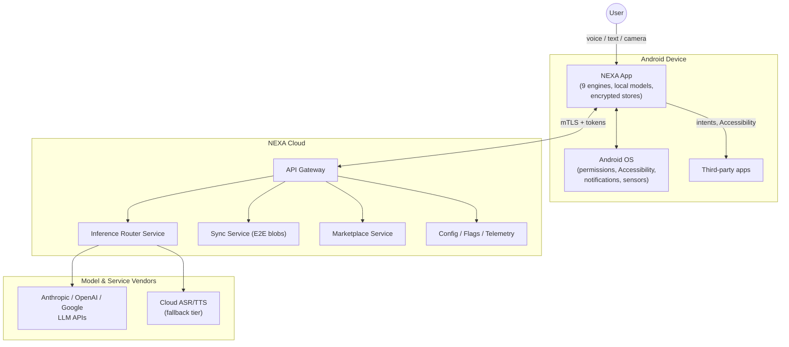
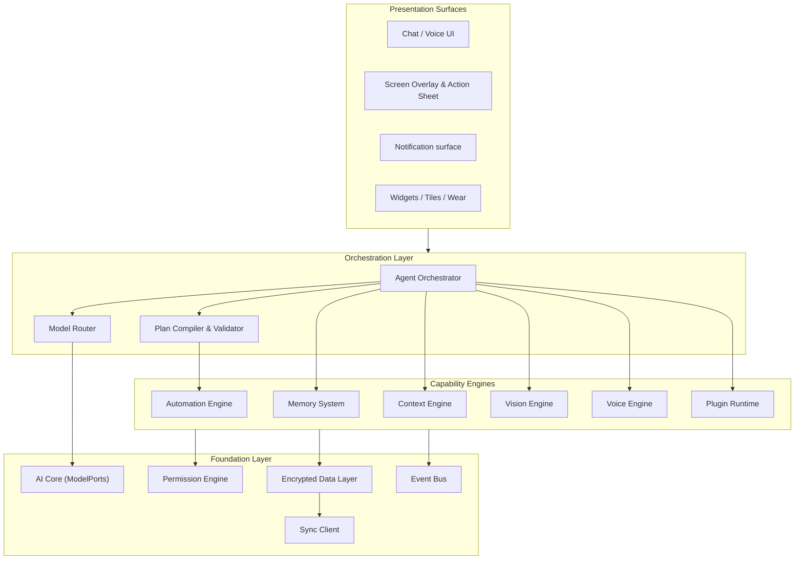
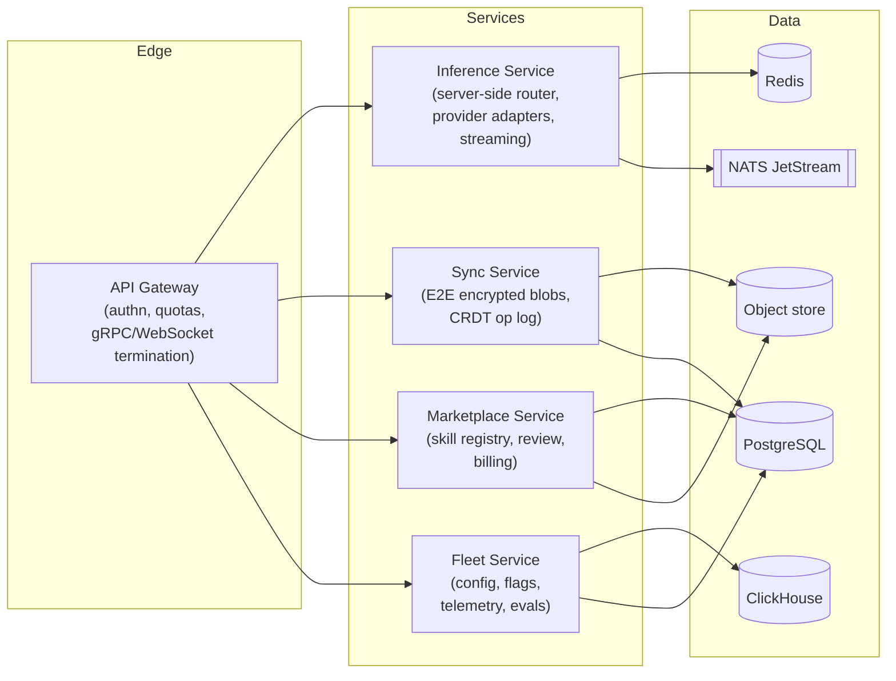
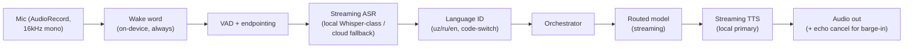
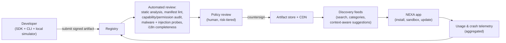
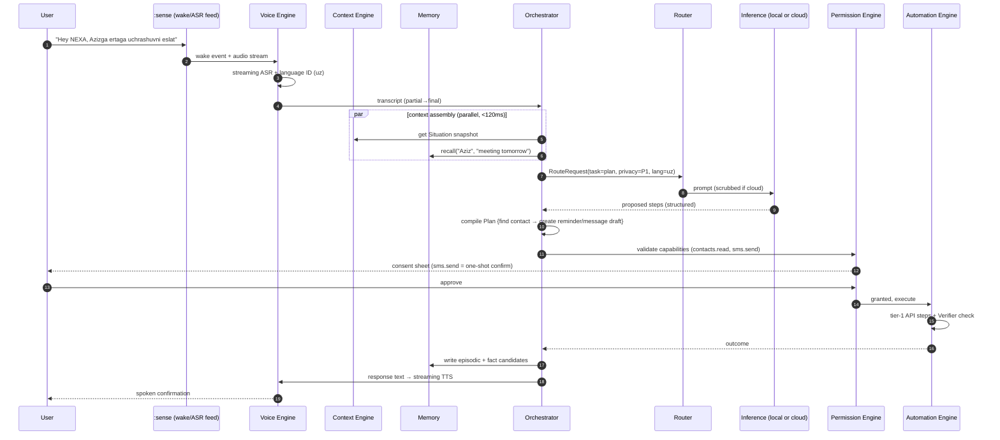
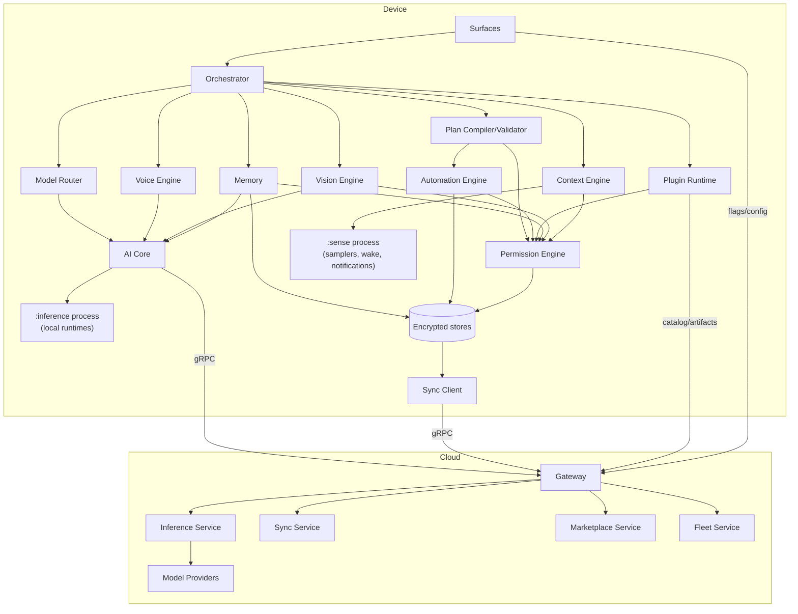

# NEXA — AI Operating Companion for Android
## Complete Technical Architecture Specification

| | |
|---|---|
| **Document** | NEXA Architecture Specification |
| **Version** | 1.0.0 |
| **Status** | Foundation Draft — for engineering review |
| **Date** | 2026-07-12 |
| **Audience** | Engineering leadership, senior Android engineers, backend engineers, AI/ML engineers, security review |
| **Classification** | Internal — Confidential |

---

## Table of Contents

1. [Executive Summary](#1-executive-summary)
2. [Vision](#2-vision)
3. [Core Philosophy](#3-core-philosophy)
4. [Design Principles](#4-design-principles)
5. [Functional Goals](#5-functional-goals)
6. [Non-Functional Goals](#6-non-functional-goals)
7. [Overall System Architecture](#7-overall-system-architecture)
8. [Android Architecture](#8-android-architecture)
9. [Backend Architecture](#9-backend-architecture)
10. [AI Core](#10-ai-core)
11. [AI Model Router](#11-ai-model-router)
12. [Multi-Agent Architecture](#12-multi-agent-architecture)
13. [Memory System](#13-memory-system)
14. [Context Engine](#14-context-engine)
15. [Permission Engine](#15-permission-engine)
16. [Automation Engine](#16-automation-engine)
17. [Voice Engine](#17-voice-engine)
18. [Vision Engine](#18-vision-engine)
19. [Plugin System](#19-plugin-system)
20. [Skill Marketplace Architecture](#20-skill-marketplace-architecture)
21. [Security Model](#21-security-model)
22. [Privacy Model](#22-privacy-model)
23. [Local vs Cloud Processing](#23-local-vs-cloud-processing)
24. [Data Flow](#24-data-flow)
25. [Event Flow](#25-event-flow)
26. [Dependency Diagram](#26-dependency-diagram)
27. [Module Dependency Graph](#27-module-dependency-graph)
28. [Folder Structure](#28-folder-structure)
29. [Scalability Strategy](#29-scalability-strategy)
30. [Offline Strategy](#30-offline-strategy)
31. [Performance Strategy](#31-performance-strategy)
32. [Battery Optimization](#32-battery-optimization)
33. [Android Compatibility Strategy](#33-android-compatibility-strategy)
34. [Future Expansion Strategy](#34-future-expansion-strategy)
35. [Technical Risks](#35-technical-risks)
36. [Recommended Technology Stack](#36-recommended-technology-stack)

---

# 1. Executive Summary

NEXA is an **AI Operating Companion** for Android: a persistent, context-aware, multi-model AI layer that lives on the device, understands the user over months and years, perceives the device state (screen, notifications, sensors, calendar, communications), and acts on the user's behalf through automation — all within Android's security sandbox and with the user's explicit, auditable consent.

NEXA is deliberately **not** a chatbot with a system prompt. It is a platform composed of nine cooperating engines:

| Engine | Responsibility |
|---|---|
| **AI Core** | Model abstraction, inference orchestration, prompt/response lifecycle |
| **Model Router** | Chooses the cheapest capable model (on-device or cloud) per task |
| **Agent Orchestrator** | Decomposes goals into multi-agent plans and supervises execution |
| **Memory System** | Long-term episodic, semantic, and procedural memory with vector recall |
| **Context Engine** | Fuses device signals into a live "user situation" snapshot |
| **Permission Engine** | Mediates every capability access; consent, audit, revocation |
| **Automation Engine** | Executes workflows across apps via Accessibility, intents, and APIs |
| **Voice Engine** | Wake word, streaming ASR, TTS, barge-in, trilingual (uz/en/ru) |
| **Vision Engine** | Camera understanding, screen understanding, OCR, live translation |

The architecture is **local-first**: every feature is designed to degrade gracefully to on-device operation, with cloud used for heavyweight reasoning, cross-device sync, and the skill marketplace. Data ownership stays with the user; cloud memory is end-to-end encrypted by default.

**Key architectural decisions** (each justified in its section):

1. **Modular monolith on-device, microservices-lite in the cloud.** The Android app is a single APK composed of ~30 strictly-layered Gradle modules; the backend starts as a small set of deployable services (Gateway, Inference Router, Sync, Marketplace) rather than a premature microservice mesh.
2. **Capability-based internal security.** No engine touches an Android permission directly; everything flows through the Permission Engine's capability tokens, giving one choke point for consent, audit, and policy.
3. **A unified `ModelPort` abstraction** with declarative model manifests, so adding a new AI model (local GGUF/ONNX, Gemini Nano via AICore, Claude, GPT, or a self-hosted model) is a configuration change, not a code change.
4. **Plans as data.** Agents produce typed, inspectable execution plans (a DAG of tool calls) that the Permission Engine can veto step-by-step — the foundation for both safety and the plugin/skill ecosystem.
5. **CRDT-based encrypted sync** for memory and settings, enabling multi-device continuity without the server ever reading user memory.

The remainder of this document specifies each subsystem, compares the viable architectural options, and recommends one with reasoning. It is written to be handed to an engineering team as the project's technical foundation.

---

# 2. Vision

## 2.1 The gap NEXA fills

Every mainstream assistant today is constrained by one of three ceilings:

- **Chatbots (ChatGPT, Claude apps, Gemini app):** superb reasoning, but blind to the device. They cannot see your screen, act in your apps, or remember your life without you re-explaining it.
- **OS assistants (Siri, Google Assistant, Bixby):** integrated with the device, but shallow — intent-slot systems bolted onto a fixed set of first-party actions, with weak reasoning and no extensibility.
- **OEM AI layers (Galaxy AI, Apple Intelligence):** capable but closed. Features are curated by the OEM; developers and users cannot extend them; they only ship on flagship hardware.

NEXA's thesis: **the assistant that wins is the one that combines frontier reasoning, deep device integration, persistent memory, and an open extensibility model — and can be installed from an APK on any modern Android phone.**

## 2.2 What "Operating Companion" means

An operating companion:

1. **Perceives** — screen content, notifications, location, calendar, communication patterns, ambient audio (opt-in), camera (on demand).
2. **Remembers** — facts about the user, preferences, past conversations, recurring routines, relationships — over years, across devices.
3. **Reasons** — using the best available model for the task, locally when possible, in the cloud when necessary.
4. **Acts** — sends messages, books things, fills forms, drives apps, manages files, runs multi-step workflows — under a consent regime the user can inspect and revoke.
5. **Anticipates** — proactively surfaces the right action at the right moment (leave now for your meeting; your flight gate changed; you promised Aziz a document yesterday).
6. **Speaks the user's languages** — Uzbek, English, and Russian as first-class, including code-switching within a sentence, which no mainstream assistant handles well today. This is a wedge: Central Asia is structurally underserved by Siri/Google Assistant.

## 2.3 Five-year product horizon

- **Year 1:** Best-in-class personal assistant on Android — voice, memory, screen understanding, automation, trilingual.
- **Year 2:** Skill marketplace opens; third parties ship NEXA skills; cross-device sync (tablet, Wear OS, desktop client).
- **Year 3:** NEXA as ambient layer — proactive intelligence, deep workflow automation, enterprise variant.
- **Year 4–5:** NEXA as a platform other products embed (SDK), federation with home/car devices, on-device models handle the majority of daily interactions.

The architecture in this document is sized for the Year 3–5 horizon while remaining shippable in Year 1.

---

# 3. Core Philosophy

Four beliefs shape every decision below.

## 3.1 The device is the user's; NEXA is a guest

Android's permission model is not an obstacle to route around — it is the trust contract that makes an agentic assistant acceptable. NEXA never escalates beyond what Android grants, never abuses Accessibility for hidden actions, and makes every automated action **attributable, inspectable, and reversible where possible**. Trust is the product; capability without trust is malware.

## 3.2 Local-first, cloud-amplified

The user's memory, context, and personal data live on the device first. The cloud is an **amplifier** (bigger models, sync, marketplace), never a **requirement** for core function. This is simultaneously a privacy stance, a latency strategy, a cost strategy, and an availability strategy (offline in the Tashkent metro, NEXA still works).

## 3.3 Intelligence is a supply chain, not a model

Models will change every quarter. NEXA treats models as **interchangeable suppliers** behind a routing layer that optimizes for capability, latency, cost, and privacy per request. No feature may hard-code a model. The moat is not the model — it is the memory, context, integration, and skill ecosystem accumulated around the routing layer.

## 3.4 Actions are plans; plans are data

Whenever NEXA acts on the world, the action is first materialized as a **typed plan** — a machine-readable DAG of steps with declared capabilities. This single decision yields: pre-execution consent UI ("NEXA wants to: read your last 3 messages with Aziz → draft a reply → send it"), step-level permission enforcement, dry-run mode, audit logs, resumability after interruption, and a uniform substrate for plugins and skills. LLM output is never executed directly; it is compiled to a plan, validated, then executed.

---

# 4. Design Principles

These are binding rules for the engineering team. Each has a short rationale and an enforcement mechanism.

| # | Principle | Rationale | Enforcement |
|---|---|---|---|
| P1 | **Ports and Adapters everywhere.** Domain logic depends only on interfaces (`ModelPort`, `MemoryPort`, `SttPort`, …); platform/vendor code lives in adapter modules. | Models, ASR vendors, and Android APIs churn; the domain must not. | Gradle module boundaries + Konsist/ArchUnit rules in CI |
| P2 | **No engine touches Android permissions directly.** All capability access goes through the Permission Engine. | Single choke point for consent, audit, policy, and enterprise controls. | Lint rule banning `checkSelfPermission`/sensitive APIs outside `:core:permission` adapters |
| P3 | **Local-first by default; cloud is an explicit, per-request decision** made by the Router with a declared privacy class. | Privacy, latency, offline, cost. | Router is the only module holding cloud inference credentials |
| P4 | **Plans before actions.** No side-effectful operation without a validated `Plan` object. | Safety, consent UI, auditability, resumability. | Automation Engine accepts only `Plan`, never raw text |
| P5 | **Every subsystem must define its degraded mode.** (No network, no model, permission revoked, low battery.) | An operating companion that dies offline is a chatbot. | "Degraded mode" section required in every module's design doc; chaos tests in CI |
| P6 | **Schema-first, versioned contracts** between app↔backend and core↔plugins (Protobuf; additive evolution only). | Fleet of old app versions + third-party plugins must not break. | Buf breaking-change checks in CI |
| P7 | **Deterministic core, probabilistic edges.** Routing, permission checks, plan validation, and memory writes are deterministic code; LLMs propose, engines dispose. | Debuggability and safety of an agentic system. | Code review rule: LLM output crosses into the deterministic core only as validated typed data |
| P8 | **Measure everything, ship nothing dark.** Every inference carries a trace ID from wake word to TTS; every feature behind a remote flag. | Latency and cost are product features; regressions must be visible in hours. | OpenTelemetry spans mandatory in engine interfaces |
| P9 | **i18n is architecture, not translation.** uz/en/ru shape ASR choice, tokenizer costs, prompt design, TTS, and evaluation sets. | Retro-fitting multilingual is 10× the cost. | Language-tagged eval suites gate every model/router change |
| P10 | **Battery and RAM are budgets, not outcomes.** Each background subsystem has an explicit daily energy budget and a memory ceiling. | Persistent companions get uninstalled when they drain 15%/day. | Perf CI on physical device farm; budget regressions block release |

---

# 5. Functional Goals

Grouped by capability area. **MoSCoW** priorities: M = must (v1), S = should (v1.x), C = could (v2+).

## 5.1 Conversation & Intelligence

| ID | Goal | Priority |
|---|---|---|
| F-1 | Multi-turn text conversation with streaming responses | M |
| F-2 | Full-duplex voice conversation: wake word ("Hey NEXA"), streaming ASR, barge-in, low-latency TTS | M |
| F-3 | Trilingual understanding and generation (Uzbek, English, Russian) incl. code-switching; per-conversation language auto-detection | M |
| F-4 | Automatic model routing across ≥2 cloud providers + ≥1 on-device model | M |
| F-5 | Multi-agent task execution for complex goals (research + act + verify) | S |
| F-6 | Proactive suggestions from context (time-to-leave, follow-ups, anomalies) | S |
| F-7 | Live translation mode (speech↔speech and camera overlay) uz/en/ru + extensible | S |

## 5.2 Memory & Context

| ID | Goal | Priority |
|---|---|---|
| F-10 | Long-term memory: facts, preferences, people, places, routines; survives reinstall via encrypted sync | M |
| F-11 | Conversation history with semantic search ("what did we decide about the visa documents?") | M |
| F-12 | Context snapshot: location class, activity, calendar pressure, notification load, focus state | M |
| F-13 | User-visible memory browser: view, edit, delete any memory ("Why do you know this?") | M |
| F-14 | Cross-device memory continuity (phone ↔ tablet ↔ web) | S |

## 5.3 Device Integration & Action

| ID | Goal | Priority |
|---|---|---|
| F-20 | Notification intelligence: summarize, prioritize, smart-reply, digest mode | M |
| F-21 | Calendar: read, create, modify events; conflict detection; meeting prep briefs | M |
| F-22 | Contacts & communication graph awareness | M |
| F-23 | SMS: read (with consent), draft, send; spam/OTP classification | M |
| F-24 | Calls: identify, announce, call-note capture; post-call summary (where OS permits) | S |
| F-25 | File management: search, organize, summarize documents via SAF | M |
| F-26 | Screen understanding: "what am I looking at?", contextual actions on any screen | M |
| F-27 | App automation via Accessibility + intents + deep links ("order my usual from Yandex Eats") | S |
| F-28 | Browser automation for web tasks (form filling, price checking) via custom-tab/WebView agent | C |
| F-29 | Workflow automation: user- and AI-authored multi-step routines with triggers (time, location, notification, event) | S |
| F-30 | Sensor/peripheral awareness: GPS, activity recognition, Bluetooth devices, Wi-Fi state | M |
| F-31 | Camera understanding: identify, read, translate, count, explain what the camera sees | M |
| F-32 | OCR on images, screenshots, and documents (Latin + Cyrillic scripts) | M |

## 5.4 Platform & Ecosystem

| ID | Goal | Priority |
|---|---|---|
| F-40 | Plugin system: sandboxed third-party capabilities with declared permissions | S |
| F-41 | Skill marketplace: discovery, install, update, revenue share, review pipeline | C |
| F-42 | Cloud sync of memory/settings/workflows (E2E encrypted) | M |
| F-43 | Multi-profile support (work/personal personas) | C |
| F-44 | Wear OS / widget / quick-settings-tile surfaces | S |

---

# 6. Non-Functional Goals

Numbers are targets for the P90 device class (mid-range: 6–8 GB RAM, e.g. Redmi Note-class), not just flagships — this matters for the Uzbek/CIS market.

## 6.1 Performance

| Metric | Target | Notes |
|---|---|---|
| Wake word → listening indicator | ≤ 250 ms | on-device DSP/low-power path |
| Voice question → first audio of answer (cloud model) | ≤ 1.8 s P50, ≤ 3.5 s P90 | streaming ASR + streaming LLM + streaming TTS |
| Voice question → first audio (on-device model) | ≤ 1.2 s P50 | |
| Text question → first token | ≤ 700 ms P50 (cloud), ≤ 400 ms (local) | |
| Screen-understanding action sheet | ≤ 1.5 s from invocation | |
| Cold app start → interactive | ≤ 1.2 s P90 | baseline profiles mandatory |
| Memory recall injection overhead | ≤ 120 ms | vector search must be local |

## 6.2 Reliability & Availability

- Core assistant (text chat with local model, memory read, workflows without cloud steps): **100% available offline**.
- Cloud API availability: 99.9% monthly; graceful degradation (queue-and-retry for sync; fallback routing between model providers within 2 s of provider failure).
- Crash-free sessions ≥ 99.8%; ANR rate < 0.05%.
- No data loss: memory writes are transactional; sync is eventually consistent with conflict-free merge (CRDT).

## 6.3 Resource Budgets (per Principle P10)

| Resource | Budget |
|---|---|
| Battery, background (context engine + wake word) | ≤ 3% of battery/day on P90 device |
| Battery, active voice session | ≤ 1% per 10 min |
| RAM, background residency | ≤ 180 MB |
| RAM, peak with local 3B model loaded | ≤ 2.2 GB (model unloads under pressure) |
| APK base size | ≤ 60 MB (models & language packs via dynamic delivery) |
| Cellular data, background/day | ≤ 5 MB default (sync batched on Wi-Fi/charging) |

## 6.4 Security & Privacy (summarized; details §21–22)

- E2E encryption for synced memory (server cannot decrypt).
- All local personal data encrypted at rest (SQLCipher / EncryptedFile), keys in Android Keystore/StrongBox.
- Complete audit log of every automated action and every permission use, user-visible.
- Third-party plugins run sandboxed with zero default capabilities.

## 6.5 Scale Targets

- Architecture validated for 10 M MAU / 1 M DAU voice users; designed to extend to 100 M MAU (see §29).
- Backend cost ceiling: ≤ $0.04/DAU/day blended inference cost at steady state (routing enforces this).

## 6.6 Quality & Localization

- Model-quality eval gates per language (uz/en/ru) — a router or prompt change may not ship if any language regresses > 2% on its eval suite.
- ASR word-error-rate targets: en ≤ 8%, ru ≤ 10%, uz ≤ 14% (v1, improving as Uzbek data accumulates).
- Accessibility: full TalkBack support; the assistant itself is an accessibility aid.

---

# 7. Overall System Architecture

## 7.1 Architectural style decision

**Options considered for the overall system:**

| Option | Description | Pros | Cons |
|---|---|---|---|
| A. Thin client + cloud brain | Device is a mic/screen; all intelligence server-side (classic Alexa/Assistant model) | Simple client; centralized iteration | Dead offline; privacy-hostile; latency floor = network RTT; cost scales linearly with usage; contradicts §3.2 |
| B. Fat client, no backend | Everything on device | Maximum privacy; zero server cost | No frontier models; no sync; no marketplace; mid-range devices cannot run capable models |
| C. **Local-first hybrid (chosen)** | Full engine stack on device; cloud provides big-model inference, E2E sync, marketplace, and fleet services | Offline core; privacy-preserving; frontier reasoning when needed; cost-controllable via routing | Most complex option; dual implementations for some paths |

**Recommendation: C.** The complexity cost is real but is exactly where the defensible engineering value lies. Options A and B are both ceilings NEXA exists to break (§2.1).

## 7.2 System context (C4 level 1)



Key property: **vendor model APIs are reached only through the NEXA Inference Service**, never directly from the device (exception: on-device AICore/Gemini Nano, which is local). Reasons: key security (no vendor API keys in the APK), centralized cost control, provider failover, request-level privacy scrubbing, and a single place to enforce per-user quotas.

## 7.3 On-device macro-architecture (C4 level 2)



**Layering rules (enforced by module graph, §27):**

1. Surfaces depend on Orchestration; never directly on Engines.
2. Engines depend only on Foundation; never on each other directly — cross-engine communication goes through the Event Bus or the Orchestrator. (This prevents the "everything imports everything" decay that kills assistant codebases.)
3. Foundation depends on nothing above it.

## 7.4 The request lifecycle in one paragraph

A user utterance (voice/text/screen gesture) enters a Surface. The **Context Engine** attaches the current situation snapshot; the **Memory System** attaches relevant recalled memories. The **Orchestrator** classifies the goal: *answer* (single model call), *act* (plan required), or *converse* (dialogue continuation). The **Model Router** selects a model under the request's privacy class and latency budget. For *act* goals, the LLM's proposed steps are compiled by the **Plan Compiler** into a typed Plan, validated against the **Permission Engine**, shown for consent if required, then executed by the **Automation Engine** with step-level audit. Results, new facts, and feedback flow back into Memory, and privacy-scrubbed telemetry flows to the Fleet service.

---

# 8. Android Architecture

## 8.1 App architecture decision

**Options:**

| Option | Pros | Cons |
|---|---|---|
| A. Single-module MVVM app | Fast to start | Collapses at this scope; unenforceable boundaries; 30+ engineers cannot work in parallel |
| B. Multi-APK / dynamic-feature-first | Small installs | Play-delivery complexity dominates; IPC between features; dynamic features cannot host always-on services well |
| C. **Modular monolith: single APK, ~30 Gradle modules, Clean Architecture layering (chosen)**, dynamic delivery only for heavy assets (models, language packs) | Enforceable boundaries; parallel teams; single process for low-latency engine cooperation; testable domain | Requires build discipline; longer initial setup |

**Recommendation: C.** The engines must cooperate at sub-100 ms latencies (voice pipeline, context injection) — same-process function calls, not IPC. Dynamic delivery is reserved for what genuinely benefits from it: ONNX/GGUF model files, TTS voices, OCR script packs.

## 8.2 Process & service topology

NEXA runs as **three OS processes**, deliberately:

| Process | Contents | Rationale |
|---|---|---|
| `:main` | UI surfaces, orchestrator, engines, data layer | Primary process |
| `:sense` | Wake-word detector, Context Engine samplers, NotificationListenerService, VoiceInteractionService host | Small (under 60 MB), crash-isolated, long-lived; the main process can be killed by the OS without losing the always-on senses |
| `:inference` | Local model runtimes (llama.cpp / ONNX Runtime) | Native-heap isolation: a model OOM must not kill the UI; the process can be killed aggressively to reclaim ~2 GB instantly |

Communication: `:sense` to `:main` via AIDL plus an authenticated persistent event queue; `:inference` exposes a single AIDL `LocalInferenceService` with SharedMemory tensor transport so KV-caches survive across calls.

**Android component strategy:**

- **`VoiceInteractionService` + `RoleManager.ROLE_ASSISTANT`**: NEXA registers as the device assistant. This is the single most important integration decision — it grants OS-sanctioned wake-word hosting, `ACTION_ASSIST` invocation (long-press power / gesture), and AssistStructure/`onProvideAssistContent` access to the current screen *without* Accessibility on modern Android. Fallback when the user declines the role: overlay bubble + Accessibility path.
- **`AccessibilityService`**: used *only* by the Automation Engine for cross-app actions and by screen understanding as a fallback; gated by dedicated onboarding with explicit scope explanation (required by Play policy).
- **`NotificationListenerService`** in `:sense` for notification intelligence.
- **Foreground services**: `microphone` type during active voice; `specialUse`/`dataSync` per Android 14+ rules; everything else via **WorkManager** (expedited for user-facing work, deferrable+constrained for sync/indexing).
- **App Startup + baseline profiles + Macrobenchmark** in CI for the §6.1 cold-start target.

## 8.3 In-module architecture pattern

**MVI with Compose** for surfaces; **hexagonal (ports/adapters)** for engines.

- Surfaces: unidirectional data flow — `UiEvent -> ViewModel(reducer) -> UiState (StateFlow) -> Compose`. MVI over loose MVVM because assistant UIs are stream-heavy (partial ASR, streaming tokens, plan progress) and a replayable state machine makes them debuggable.
- Engines: pure Kotlin domain module + adapter modules. Example: `:engine:voice:domain` defines `SttPort`; `:engine:voice:whisper`, `:engine:voice:androidspeech`, `:engine:voice:cloud` implement it.
- Dependency injection: **Hilt** (KSP). Engine implementations are bound in the `:app` composition root; domain modules carry zero Hilt dependency (plain `javax.inject`), so they compile as JVM-only and unit-test in milliseconds.
- Concurrency: **Kotlin coroutines + Flow everywhere**; structured concurrency with a supervisor scope per engine; no RxJava, no callbacks at boundaries. Native runtimes are wrapped in dedicated dispatchers with cancellation propagated to native cancel tokens.

## 8.4 Data layer

- **Room + SQLCipher** for structured stores (conversations, memory graph, plans, audit log, workflow definitions).
- **Vector search on-device** (decision in §13) for memory recall.
- **Proto DataStore** for settings/flags.
- **EncryptedFile** for blobs (kept audio snippets, cached documents).
- All keys via **Android Keystore**, StrongBox where available; per-store keys wrapped by a master key; a biometric-bound key protects the sensitive memory tier.

---

# 9. Backend Architecture

## 9.1 Shape decision

**Options:**

| Option | Pros | Cons |
|---|---|---|
| A. Full microservices from day 1 (15+ services, mesh) | "Web-scale" story | A team under ~20 drowns in ops; premature decomposition guarantees wrong boundaries |
| B. Single monolith | Simple | Inference routing, sync, and marketplace have wildly different scaling, latency, and compliance profiles |
| C. **Domain-aligned services ("microservices-lite", chosen):** 5 deployables with strict API contracts, each internally modular, split further only under measured pressure | Right-sized ops; boundaries match real scaling differences; clean growth path | Requires discipline to avoid a distributed monolith |

**Recommendation: C.** The five deployables:



## 9.2 Service responsibilities & key decisions

**API Gateway.** Terminates TLS; authenticates device tokens (§21); enforces per-user/per-plan quotas; upgrades to **bidirectional gRPC streams** for voice and LLM streaming. Protocol decision: **gRPC + Protobuf** app-to-cloud (schema-first per P6, efficient streaming, Kotlin codegen), with a REST/JSON facade only for the web client and marketplace webhooks.

**Inference Service.** The server half of the Model Router (§11). Holds vendor API keys; runs provider adapters (Anthropic, OpenAI, Google, optional self-hosted vLLM pool); implements failover, hedged requests for latency-critical calls, semantic response caching (non-personal requests only), token accounting, and the mandatory **privacy scrubber** stage (§22.4) before any provider call. Stateless; scales horizontally.

**Sync Service.** Stores **opaque encrypted blobs plus an ordered op log** per user — the server never holds keys (§22.2). Provides device registration, op-log append/fetch with vector clocks, blob GC, and FCM nudges for sync wake-ups. Deliberately dumb: all merge logic is client-side CRDT, so the server needs no schema knowledge of memories.

**Marketplace Service.** Skill/plugin registry, versioned artifact storage, static-analysis and policy review pipeline, signing (NEXA countersigns approved artifacts), install/update feeds, ratings, revenue-share ledger. Isolated because it faces third parties and carries different compliance exposure.

**Fleet Service.** Remote config and feature flags (cohort rollout), privacy-scrubbed telemetry ingest (differential-privacy aggregation for sensitive counters), the model-eval harness (runs language-tagged eval suites against candidate routing configs — the P9 gate), and crash/ANR aggregation.

## 9.3 Cross-cutting backend decisions

- **Language/runtime:** Kotlin/JVM (Ktor) for Sync/Marketplace/Fleet — shared Proto models and hiring synergy with the Android team; **Go for the Inference Service**, where connection fan-out and streaming efficiency dominate (mature gRPC streaming; choose Rust only if the team already has depth there).
- **Multi-region:** single write region initially (EU — data-residency reasoning in §22), edge POPs for gateway termination; regional sharding beyond 10 M MAU (§29).
- **Infra:** managed Kubernetes, Terraform IaC, GitOps (ArgoCD); NATS JetStream for events (move to Kafka only under measured throughput pressure).
- **No user-content data warehouse.** Telemetry is metadata-only by design; nothing like server-side "conversation logs" exists unless the user explicitly opts into cloud history (§22).

---

# 10. AI Core

The AI Core is the on-device library everything above it uses to talk to *any* model. It contains no product logic.

## 10.1 The `ModelPort` abstraction

One interface family, four capabilities:

```
ModelPort
 |- ChatModelPort        streamChat(request: ChatRequest): Flow<ChatDelta>
 |- EmbeddingPort        embed(texts, purpose): List<Vector>
 |- VisionModelPort      describe(images + prompt): Flow<ChatDelta>
 |- FunctionCallingPort  (capability flag on ChatModelPort: tool schemas in, ToolCall deltas out)
```

`ChatRequest` is vendor-neutral: messages, tool schemas, sampling params, **privacy class** (§23.2), **latency budget**, **language hint**, and a **context bundle** (memory recalls + situation snapshot) that the prompt assembler renders per model.

## 10.2 Model manifests (models as configuration)

Every model — local or cloud — is described by a signed **manifest** delivered via remote config:

```yaml
id: "claude-sonnet-5@2026-05"
kind: cloud            # cloud | local | aicore
capabilities: [chat, tools, vision]
context_window: 400000
quality_tier: frontier  # frontier | strong | fast | nano
cost: {in_per_mtok: 3.0, out_per_mtok: 15.0}
latency_p50_ms: 900
languages: {en: 1.0, ru: 0.95, uz: 0.80}   # measured eval scores, not vendor claims
privacy_floor: cloud_scrubbed               # lowest privacy class it may receive
max_rpm_per_user: 30
```

Local model manifests add: artifact URL + hash, runtime (llama.cpp / onnx / aicore), quantization, minimum device spec (RAM, SoC class), and thermal profile. The Router consumes only manifests — **adding a model never requires an app release** unless it needs a new runtime.

## 10.3 Local inference runtimes

| Runtime | Used for | Why |
|---|---|---|
| **llama.cpp (GGUF, Vulkan/CPU)** | 1–4B chat/summarization models (Qwen/Gemma-class multilingual small models — best current uz/ru coverage at small sizes) | Broadest device coverage including non-NNAPI SoCs; mature quantization |
| **ONNX Runtime (NNAPI/QNN EPs)** | Embeddings, ASR (Whisper-class), OCR, wake word, classifiers | NPU acceleration where present; one runtime for many small models |
| **Android AICore / Gemini Nano** | Opportunistic summarization/smart-reply on Pixel/flagship devices | Zero RAM cost to NEXA (system-managed); use when present, never depend on it |

Runtime-manager responsibilities: artifact download/verify (hash + signature), memory-pressure-aware load/unload (LRU, `onTrimMemory`), thermal throttling hooks, and model warm-up on charger + idle.

## 10.4 Prompt & response infrastructure

- **Prompt assembler:** versioned template registry, remotely updatable, rendered per model dialect (system-prompt conventions differ across vendors); deterministic context budgeting — memory recalls, situation snapshot, and history are trimmed by priority to fit the window with a reserved output budget.
- **Structured output layer:** grammar-constrained decoding (GBNF) for local models; schema validation with a bounded auto-repair loop (max 2 retries) for cloud models. This is what makes P7 ("LLM output crosses as typed data") real.
- **Guardrail stage:** small on-device ONNX classifiers — prompt-injection heuristics on tool-result text, PII detection feeding the privacy scrubber, safety classification of generated actions. Deterministic; runs before any plan compilation.
- **Inference cache:** device-local LRU semantic cache for idempotent asks (definitions, translations), keyed on normalized text + language; personal-context responses are never shared across users.

---

# 11. AI Model Router

The Router answers, per request: **which model, where (device or cloud), at what cost, under which privacy constraint** — in under 10 ms of decision time.

## 11.1 Routing decision inputs

```
RouteRequest = {
  task_class:      chat | summarize | extract | plan | code | translate | vision_qa | embed
  quality_need:    nano | fast | strong | frontier        (set by Orchestrator heuristics)
  privacy_class:   P0_public | P1_personal | P2_sensitive (set by data provenance, never by the LLM)
  latency_budget:  interactive_voice | interactive | background
  language:        uz | ru | en | mixed
  context_size:    tokens needed
  device_state:    battery, thermal, RAM headroom, network (none/metered/wifi)
  user_plan:       free | pro (quota state)
}
```

## 11.2 Routing algorithm decision

**Options:**

| Option | Description | Verdict |
|---|---|---|
| A. Static table | task_class -> model | Too crude; ignores device state, language quality, cost pressure |
| B. LLM-as-router | a small model decides | Adds latency and nondeterminism to every request; violates P7 |
| C. **Rule-filtered scored selection (chosen)** | Hard constraints filter the manifest set; a transparent scoring function ranks survivors; weights tuned server-side by offline bandit | Deterministic, explainable ("why this model?" is answerable), <10 ms, remotely tunable |

**Algorithm:**

1. **Hard filters:** capability match; `privacy_floor <= privacy_class` (a P2_sensitive request can only reach local models); context fits; offline implies local-only; quota available; language score above threshold for the request language.
2. **Score survivors:** `score = w_q * quality(task, lang) - w_c * cost - w_l * max(0, latency_est - budget) - w_b * battery_penalty`. Weights per task_class come from remote config, tuned offline against eval + telemetry data — the *learning* is server-side and slow; the *decision* is on-device and deterministic (P7).
3. **Escalation ladder:** every route carries a fallback chain, e.g. `local-3B -> fast-cloud -> strong-cloud`. Triggers: schema-validation failure, low self-consistency on plan tasks, provider error/timeout (hedged retry to the next provider after an adaptive deadline), or an explicit user "think harder".
4. **Downgrade ladder:** cost/quota pressure or a metered network degrades `frontier -> strong -> fast`, with a subtle UI indicator — honesty about quality is part of trust (§3.1).

## 11.3 Split routing (device + cloud cooperation)

The Router also splits *within* a request: a local nano model always handles ASR-hypothesis re-ranking, memory-recall query rewriting, and notification triage, while main reasoning goes to the routed model. This keeps roughly 70% of daily model invocations on-device (cost target §6.5) without sacrificing quality where the user can see it.

## 11.4 Router observability

Every route decision emits a trace event: inputs, filtered set, scores, chosen model, fallback hops, tokens, cost, latency. These feed the Fleet eval loop and the per-language quality gates (P9). A "routing replay" tool in the Fleet Service re-runs historical decisions against candidate weight sets before any rollout.

---

# 12. Multi-Agent Architecture

## 12.1 When agents, when not

Single-model calls handle ~85% of interactions (answer, summarize, translate, smart-reply). The **Agent Orchestrator** activates for *goals*: multi-step, tool-using, or long-running tasks ("find a good pediatrician near Chilonzor, check my calendar, and book an appointment"). Agents are an escalation, not the default — this bounds both cost and failure surface.

## 12.2 Topology decision

**Options:**

| Option | Description | Verdict |
|---|---|---|
| A. Free-form agent swarm (agents message each other) | Emergent, flexible | Unbounded cost, undebuggable, unsafe for device actions |
| B. Fixed pipeline (plan -> act -> verify) | Predictable | Too rigid for open-ended goals |
| C. **Supervisor–worker with typed contracts (chosen)** | One Supervisor decomposes the goal into a Plan DAG; specialist workers execute nodes; Supervisor replans on failure | Bounded, auditable, maps 1:1 onto the Plan substrate (P4) |

**Recommendation: C.** The Supervisor is the only agent holding goal-level context; workers are stateless specialists with narrow toolsets — least privilege applies to agents exactly as to plugins.

## 12.3 Agent roles

| Agent | Toolset | Typical model tier |
|---|---|---|
| **Supervisor** | plan_compile, replan, ask_user, delegate | strong/frontier |
| **Researcher** | web_search, web_read, doc_read (RAG over user files) | fast/strong |
| **Device Operator** | screen_read, ui_act, app_intent, notifications | fast + vision |
| **Communicator** | contacts, sms_draft, message_draft, calendar | fast (drafting) — *send* always returns to Plan consent |
| **Memory Analyst** | memory_search, memory_write_proposal | nano/fast, mostly local |
| **Verifier** | re-reads outcome state (screen, calendar, sent box) and scores goal completion | fast + vision |

The **Verifier is mandatory** for any plan with side effects — an agentic system without independent outcome verification fails silently and destroys trust.

## 12.4 Execution semantics

- The Supervisor emits and updates a **Plan** (§16.2); the Orchestrator schedules ready nodes (parallel where the DAG allows), enforcing per-plan token and wall-clock budgets, per-node timeouts, a max replan count (default 2), and Permission Engine checks at every capability-bearing node.
- **Checkpointing:** plan state persists to Room after every node; process death resumes long tasks via WorkManager.
- **Human-in-the-loop nodes:** `ask_user` and `confirm` are first-class node types; a plan can park for days until the user responds via notification or UI.
- **Inter-agent messages are typed Protobuf** wherever the schema is known; free-text handoffs carry provenance tags so downstream injection filters know the trust level of every span. Critical rule: web content read by the Researcher is *untrusted data*, never *instructions* (§21.6).

---

# 13. Memory System

Memory is NEXA's primary moat (§3.3). It must be trustworthy (user-inspectable), durable (survives reinstall), private (E2E), and fast (recall under 120 ms).

## 13.1 Memory taxonomy

| Type | Content | Store | Example |
|---|---|---|---|
| **Episodic** | Conversation turns, completed plans, notable events | Room (append-only) + embeddings | "On July 3 we drafted the visa invitation letter" |
| **Semantic** | Extracted facts, preferences, entities, relationships | Entity-relation tables + embeddings | "User's brother Aziz lives in Seoul"; "prefers metro over taxi" |
| **Procedural** | Learned routines, workflow templates, correction feedback | Workflow store + preference weights | "When drafting Korean visa emails, use formal register" |
| **Working** | Current conversation + active plan state | In-memory, checkpointed | — |

## 13.2 Storage & recall decision

**Options for the recall substrate:**

| Option | Verdict |
|---|---|
| A. Pure vector store (everything is chunks + embeddings) | Recall is fuzzy-only; cannot answer "delete everything about person X" reliably; no structured queries ("birthday of…") |
| B. Pure knowledge graph | Precise but brittle extraction; poor at open-ended "what did we discuss about…" |
| C. **Hybrid: entity-relation store + vector index + full-text (chosen)** | Structured facts get precise CRUD and GDPR-grade deletion; episodic content gets semantic search; FTS covers exact tokens (names, codes). Retrieval fuses all three with reciprocal-rank fusion |

**Vector index choice:** `sqlite-vec` inside the same SQLCipher database. One transactional store, one encryption boundary, one backup unit — this beats a separate vector DB (ObjectBox, standalone HNSW files) on integrity and on the §22 "one-tap wipe" requirement. Embeddings: multilingual small model (bge-m3-class, quantized, ONNX) — must handle uz/ru/en in one space.

## 13.3 Write path (how memories form)

1. **Capture:** after each conversation/plan, a local nano/fast model runs *fact extraction* → candidate memories with type, entities, confidence, provenance (source turn ID).
2. **Reconciliation:** candidates are merged against existing memory (same-entity resolution, contradiction detection). Contradictions demote the old fact to "superseded" rather than deleting — memory has history.
3. **Consolidation (nightly, charging + idle):** episodic compression (summarize old threads), importance re-scoring (recency × frequency × user-signal), forgetting curve (low-importance episodics age into summaries; raw turns older than a configurable horizon are compacted), entity graph cleanup.
4. **User gate for sensitive facts:** facts classified sensitive (health, finance, relationships, religion, politics) are stored in the **sensitive tier** — biometric-bound key, never synced unless explicitly enabled, never sent to cloud models (privacy class P2).

## 13.4 Read path (recall)

`recall(query, k, filters)`: query rewriting by local nano model (resolves pronouns/time: "her" → "Dilnoza", "keyingi hafta" → dates) → parallel [vector search | entity lookup | FTS] → rank fusion → **provenance-tagged** memory snippets into the context bundle. Every recalled snippet carries its memory ID; answers citing memory can show "why I know this" — trust surface (F-13).

## 13.5 Memory browser & user control

Non-negotiable product surface: list/search all memories, see provenance, edit, delete (cascades to vectors + sync tombstone), pause memory formation globally or per-topic, and export (JSON). Deletion is a CRDT tombstone so it propagates to all devices.

---

# 14. Context Engine

The Context Engine answers: **"what is the user's situation right now?"** — cheaply, continuously, on-device only. Raw signals never leave the device; only the fused snapshot (coarse, enumerated values) may accompany cloud requests, and only at privacy class P1.

## 14.1 Signal inventory & samplers

| Signal | Source | Strategy (battery-aware) |
|---|---|---|
| Location class | Fused Location + geofences | Passive/balanced priority; geofence transitions, not polling; semantic labels (home/work/gym) learned on-device |
| Activity | Activity Recognition API | Event-driven transitions |
| Calendar pressure | CalendarProvider observer | Content-observer, no polling |
| Notification load | NotificationListener in `:sense` | Push-driven |
| Device state | Battery, thermal, ringer, DND, screen | Broadcast-driven |
| Connectivity | NetworkCallback, Wi-Fi SSID class, BT devices (car, buds) | Callback-driven |
| App context | Current foreground app category (via Assist role / UsageStats) | On assistant invocation; sampled otherwise |
| Time patterns | Learned routine model (on-device) | Nightly consolidation |

## 14.2 The situation snapshot

A compact typed object, versioned, regenerated on signal change (debounced) — not on a timer:

```
Situation = {
  time_bucket, day_type,           // weekday/weekend/holiday(uz calendar)
  place: home|work|transit|other,  // semantic, never raw coordinates
  activity: still|walking|driving,
  next_event: {in_minutes, type},  // from calendar
  comms_pressure: low|med|high,    // unread/notification velocity
  device: {battery_band, network_band, dnd, driving_mode},
  focus_inference: available|busy|winding_down
}
```

Design rule: **enumerated bands, never raw values** (battery_band not 47%; place label not lat/lng). This makes the snapshot safe to attach to P1 cloud requests and keeps prompt cost tiny (~60 tokens).

## 14.3 Proactivity (the anticipation loop)

A rule + learned-trigger system (not an LLM loop — battery):
- **Declarative triggers** (shipped + user-created): time-to-leave (event location + travel estimate), follow-up promises detected in conversations, morning brief, anomaly alerts (unusual notification from bank app).
- **Learned triggers:** routine deviations proposed by nightly consolidation; each proposal requires one-tap user approval before activating (no silent behavioral profiling — §22).
- All proactive outputs pass a **notification budget** (max N/day, quiet hours, priority scoring) — an assistant that spams dies.

---

# 15. Permission Engine

The Permission Engine is NEXA's internal security kernel (P2). It sits between every engine/agent/plugin and every capability.

## 15.1 Capability model

Android permissions are necessary but not sufficient: Android says *the app* may read SMS; NEXA must decide whether *this plan step from this skill* may read *this* SMS. So NEXA defines **capabilities** — fine-grained, purpose-bound grants layered on top of OS permissions:

```
Capability = {
  id: "sms.read",                     // namespaced, ~60 built-in
  scope: {thread: "Aziz", max_age: 7d, count: 3},   // parameterized scopes
  purpose: "draft a reply you asked for",
  grantee: core.communicator | plugin:com.foo.bar,
  grant_type: one_shot | session | standing,
  expiry, revocable: always
}
```

**Grant ladder:** one-shot (this step only) → session (this conversation) → standing (until revoked; only user-initiated, never AI-requested-by-default). The consent UI renders capability + scope + purpose in plain language (uz/ru/en).

## 15.2 Enforcement architecture

- Every capability-bearing API in the codebase is reachable **only** through a `Gatekeeper` facade generated from the capability registry; adapters live in `:core:permission`. Lint bans direct sensitive-API use elsewhere (P2 enforcement).
- **Plan-time check:** the Plan Validator annotates every node with required capabilities and resolves them *before* execution — the consent sheet shows the whole plan's asks at once, not a mid-run interruption storm.
- **Run-time check:** Gatekeeper re-validates at execution (grants may have expired; device state changed). Defense in depth.
- **Audit log:** append-only, hash-chained record of every capability exercise: who (engine/agent/plugin), what scope, which plan, when, and outcome. Surfaced in Settings → "Activity". Hash-chaining makes tampering evident.

## 15.3 Android permission strategy

- **Progressive disclosure:** onboarding requests nothing but notifications. Each feature requests its OS permission at first use with a pre-permission explainer (measured: doubles grant rates).
- **Graceful denial:** every feature defines behavior when its permission is denied (P5) — e.g., no READ_SMS → notification-based message intelligence only.
- Special-access permissions (Accessibility, Notification access, Usage access, Overlay, Exact alarm, Assistant role) each get a dedicated explainer flow, and NEXA continuously reflects their status in a "capability health" dashboard.
- **Play compliance:** Accessibility use is documented for its permitted purpose (user-instructed actions for a productivity/accessibility tool); sensitive-permission declarations (SMS/Call Log) prepared with fallback designs if Play rejects them (this is a real product risk — §35).

---

# 16. Automation Engine

Executes plans against the world: apps, system, web, files, communications.

## 16.1 Actuation hierarchy (always prefer the most structured path)

| Tier | Mechanism | Reliability | Use |
|---|---|---|---|
| 1 | Official APIs / providers (Calendar, Contacts, SMS, Files/SAF, Settings panels) | Highest | Always first |
| 2 | Intents & deep links (`ACTION_VIEW`, app links, share targets) | High | Open/prefill in target apps |
| 3 | App shortcuts / slices / widgets APIs | Medium-high | Where apps expose them |
| 4 | **Accessibility-driven UI automation** | Medium | Only when 1–3 unavailable; per-app "driver" definitions |
| 5 | Screen-vision + touch injection (vision model reads screen, taps via Accessibility) | Lowest | Last resort; always supervised (user watches, can abort) |

The Plan Compiler chooses the tier per step; tier 4–5 steps are marked `fragile: true`, which forces Verifier coverage and conservative retry policy.

## 16.2 The Plan format (the P4 substrate)

```
Plan {
  id, goal_text, origin: user|proactive|workflow,
  nodes: [ {id, tool, params, needs: [node_ids],
            capabilities: [...], fragility, compensation: tool?,   // undo action if any
            on_fail: retry(n)|replan|ask_user|abort } ],
  budget: {tokens, wall_clock, cost_cents},
  consent_state, checkpoints
}
```

- **Compensation actions** make plans best-effort reversible (delete the drafted event, un-archive the file). Irreversible steps (send message, submit form, delete permanently) are a special node class: always individually confirmed unless covered by a standing grant with matching scope.
- **Dry-run mode** executes read-only nodes and simulates writes — used by the consent UI ("here's what would happen") and by workflow debugging.

## 16.3 Workflow automation (user-facing)

Workflows = saved parameterized Plans + **triggers** (time/cron, geofence enter/exit, notification match, calendar event, device event like "buds connected", or manual/voice). Users create them three ways: natural language ("every Friday at 18:00 send my landlord the meter photo"), from history ("automate what we just did"), or a visual editor. Execution via WorkManager/AlarmManager (exact alarms only where justified), with per-workflow run history and failure notifications. AI-authored workflows are compiled to the same format — there is exactly one automation substrate.

## 16.4 App drivers & the driver registry

Tier-4 automation needs per-app knowledge (view IDs, screens, flows). These are **data, not code**: declarative driver definitions (selectors + state machine) versioned in the cloud registry, updated when target apps change, downloaded like model manifests. Community/marketplace can contribute drivers through the same review pipeline as skills. This is how NEXA keeps automation alive across app updates without shipping APKs.

---

# 17. Voice Engine

## 17.1 Pipeline



## 17.2 Component decisions

**Wake word.** Options: open-source (openWakeWord/micro-wakeword, trainable, free) vs commercial (Picovoice Porcupine — high accuracy, per-device licensing) vs `AlwaysOnHotwordDetector` via the Assistant role (DSP-offloaded, best battery, but OEM-dependent). **Recommendation:** layered — use `AlwaysOnHotwordDetector` when the assistant role + OEM support allow (near-zero power); otherwise a micro wake-word model (~200 kB, CPU, in `:sense`). Custom "Hey NEXA" model trained for all three languages' phonetics.

**ASR.** Local: Whisper-class encoder-decoder, int8 ONNX, streaming via chunked inference — small/medium multilingual checkpoints handle ru/en well; uz needs fine-tuning (Common Voice uz + licensed corpora + opt-in user corrections as flywheel). Cloud fallback tier for noisy/long-form audio, chosen by the Router like any model. **The local path is primary** — latency (§6.1) and privacy.

**TTS.** Local neural TTS (VITS/Piper-class voices, per-language voice packs via dynamic delivery; uz voice is a build-vs-buy item — likely fine-tune from ru phonology base). Cloud premium voices optional for Pro. Streaming synthesis: first audio chunk within 300 ms of first LLM sentence boundary.

**Duplex behavior.** Echo-cancelled capture (AEC) keeps ASR live during TTS playback → **barge-in** (user interrupts, TTS ducks and stops, partial answer state preserved). Endpointing tuned per language (Uzbek agglutinative pauses differ from English).

**Code-switching** (Tashkent reality: uz/ru mixed sentences): language ID runs per-segment, not per-utterance; ASR biased by a mixed-language lexicon; the language hint passed to the Router is `mixed`, which weights model choice toward models scoring well on both.

## 17.3 Session management

Voice sessions are a state machine (`idle → listening → thinking → speaking → follow-up window`) owned by the Voice Engine, surfaced identically in the full-screen UI, overlay bubble, and Wear. Follow-up window keeps the mic open for N seconds after an answer (visible indicator — mic state is never ambiguous; hardware mic-indicator compliance on Android 12+ comes free).

---

# 18. Vision Engine

## 18.1 Capabilities & paths

| Capability | Primary path | Escalation |
|---|---|---|
| OCR (Latin + Cyrillic, incl. uz diacritics) | On-device (ML Kit v2 / PaddleOCR ONNX) | — (always local) |
| Screen understanding | AssistStructure/Accessibility node tree first (**structured, cheap**), screenshot + on-device layout parser second | Cloud vision model for open-ended "what is this?" (P1, scrubbed, user-invoked) |
| Camera understanding | CameraX + on-device detectors (objects, barcodes, documents) | Routed vision LLM for open questions |
| Live translation overlay | OCR → local NMT (small ONNX seq2seq for uz/ru/en pairs) → overlay render | Cloud translation for long/rare-language text |
| Document scan & extract | Doc detection + OCR + local table/KV extraction | Cloud extraction for complex forms (consented) |

**Key decision — screen understanding is tree-first, pixels-second:** the accessibility/assist node tree gives text, roles, and bounds at ~zero cost and perfect fidelity; screenshots go to a vision model only when the tree is insufficient (games, custom canvas, images). This is 10–100× cheaper and faster than screenshot-first designs, and far more private.

**Privacy hard rules:** screenshots for understanding are processed and discarded (never persisted without explicit save); secure-flag windows (`FLAG_SECURE`) are respected — never captured; banking/password app packages are on a default-on denylist for vision capture; every cloud-bound image passes the scrubber's visual-PII pass (face/ID/card detection → local-only handling or masked).

## 18.2 Live modes

Continuous camera or screen sessions (translate mode, walking guidance) run as a foreground service with camera type, hard thermal/battery guards (auto-stop on thermal throttling), frame-differencing so only changed regions re-run OCR/detection, and target ≤ 8 fps analysis — quality above smoothness for battery.

---

# 19. Plugin System

## 19.1 Model decision

**Options for third-party code execution:**

| Option | Pros | Cons |
|---|---|---|
| A. In-process Java/DEX plugins | Full power, low latency | Catastrophic security: third-party code in the process that holds memory keys; Play policy risk (dynamic code loading) |
| B. Separate plugin APKs + IPC | OS-level sandbox | Heavy: user installs N apps; version skew; discovery friction |
| C. **Sandboxed embedded runtimes (chosen):** declarative manifests + JS (QuickJS) or WASM (wasmtime) executed in an isolated process with no ambient authority | Real sandbox NEXA controls; capability-gated; hot-installable from marketplace; portable (same artifact runs on future desktop client) | Bounded expressiveness; runtime engineering cost |
| D. Remote plugins (MCP-style servers/webhooks) | Zero on-device risk | Useless offline; latency; can't touch device |

**Recommendation: C + D.** Local skills (WASM/JS in an `isolatedProcess=true` service, seccomp-filtered, no network/filesystem by default) for device-touching capabilities; remote connectors (MCP-compatible — adopt the emerging standard rather than inventing one) for SaaS integrations. Both are described by the **same skill manifest** so the marketplace, permission UI, and orchestrator treat them uniformly.

## 19.2 Skill manifest

```yaml
skill: "uz.railways.tickets"
version: 1.4.0
publisher: {id, verified: true}
runtime: wasm | quickjs | remote_mcp
entry: skill.wasm (hash, NEXA countersignature)
tools:                          # what it offers the orchestrator
  - name: search_trains
    description_i18n: {uz, ru, en}   # used for LLM tool selection AND consent UI
    input_schema: {...}
capabilities_required:          # what it may ask of NEXA (max set; user can narrow)
  - net.fetch: {hosts: ["api.railway.uz"]}   # host-allowlisted egress only
  - calendar.write: {optional: true}
ui: none | card_dsl             # skills render via a declarative card DSL, never arbitrary views
budget: {cpu_ms_per_call, mem_mb, calls_per_day}
```

## 19.3 Runtime guarantees

- Zero ambient authority: a skill sees only its inputs and NEXA-mediated capability calls (every one Gatekeeper-checked and audited, attributed to the skill in the audit log).
- Egress allowlisting per manifest host; all skill network I/O proxied through NEXA's network layer (observable, quota-enforced).
- Resource sandbox: CPU/memory/time budgets enforced by the runtime; a misbehaving skill is suspended, not the app.
- LLM access is mediated: skills cannot call models directly; they return data, the orchestrator reasons. (Prevents skills from exfiltrating context via prompts.)
- **Prompt-injection boundary:** all skill-returned text is provenance-tagged untrusted (§21.6).

---

# 20. Skill Marketplace Architecture

## 20.1 Pipeline



- **Risk tiers:** skills requesting only `net.fetch` to their own API pass with automated review; skills wanting `sms.*`, `contacts.*`, screen access, or automation drivers require human review + verified-publisher status + staged rollout.
- **Dual signing:** developer signature (identity) + NEXA countersignature (approval). The on-device runtime refuses artifacts without a valid countersignature chain; revocation list checked at install and periodically (kill switch for malicious skills).
- **Versioning:** semver; capability *additions* in an update re-trigger consent and review; updates are staged (1% → 10% → 100%) with automatic halt on crash/complaint spikes.
- **Monetization:** free, one-time, subscription; revenue share ledger in Marketplace Service; payments via Play Billing where required by policy, license validation tokens verified on-device.
- **Discovery is context-aware:** the orchestrator can suggest an uninstalled skill when a user goal matches its tool descriptions ("I can do this if you enable the Railways skill") — suggestion locally computed against a synced catalog index; nothing about the goal leaves the device.

## 20.2 Developer experience

SDK = manifest schema + WASM/JS toolchain templates + card-DSL preview + **local simulator** (runs skills against a fake device with recorded contexts) + eval harness (developers ship test conversations; the review pipeline runs them). Good DX is the marketplace's growth engine; treat the SDK as a first-class product.

---

# 21. Security Model

## 21.1 Threat model (summary)

| Adversary | Vector | Primary mitigations |
|---|---|---|
| Malicious app on device | IPC abuse, overlay phishing of consent UI, exported-component probing | No exported components without permission + signature checks; consent sheets verify no overlay obscuring (`FLAG_WINDOW_IS_OBSCURED`); AIDL callers verified by UID+signature |
| Malicious skill | Data exfiltration, capability abuse, prompt injection into orchestrator | §19 sandbox, egress allowlists, mediated LLM access, countersignature + revocation |
| Network attacker | MITM, replay | TLS 1.3 + certificate pinning (with remote pin rotation), request signing, nonce/timestamp on sensitive ops |
| Server compromise (incl. insider) | Reading user memory/conversations | E2E encryption of sync (server holds only ciphertext); no server-side conversation store by default; scrubbed inference requests are transient (no retention agreements with providers where offered) |
| Device thief | Data at rest | SQLCipher + Keystore/StrongBox; biometric-bound sensitive tier; NEXA-level app lock |
| Prompt injection (content-borne) | Web pages, notifications, emails, skill outputs steering the agent | §21.6 — the defining agentic threat |
| Stolen account credentials | Sync data theft | Sync data useless without device-held keys; new-device key enrollment requires existing-device approval or recovery code |

## 21.2 Identity & authentication

- Account: email/OTP + optional passkeys (primary going forward). No passwords stored.
- Device identity: per-install keypair in Keystore (attestation via Play Integrity API where available); API tokens are short-lived, device-bound (DPoP-style proof-of-possession).
- Authorization server-side: per-user, per-plan, per-device quotas at the Gateway.

## 21.3 Key hierarchy (sync E2E)

```
User Root Key (URK) ── derived from passkey-wrapped random key; recovery code (BIP39-style) as backup
  └── Device Keys (per device, enrolled via existing device QR-approval or recovery code)
       └── Collection Keys (memory, workflows, settings) — rotate on device revocation
            └── Per-blob DEKs (XChaCha20-Poly1305), wrapped by collection keys
```

Device revocation = collection-key rotation + re-encryption of head state (op-log history remains readable only by then-valid devices; acceptable trade documented). This is Signal/1Password-grade design applied to assistant memory — the differentiating privacy claim, so it gets first-class engineering.

## 21.4 Application hardening

Standard but mandatory: no secrets in APK (vendor keys server-side only); R8 + resource shrinking (obfuscation is not a security boundary, but reduces casual reverse-engineering); Play Integrity checks gating sync/marketplace (soft-fail: local features never require attestation — degraded not dead, P5); secure `WebView` config for browser automation (no JS bridges to privileged code); dependency scanning + SBOM in CI; secrets in backend via cloud KMS; quarterly third-party pentest of consent/sandbox surfaces.

## 21.5 Audit & incident response

Hash-chained on-device audit log (§15.2); server-side security event pipeline (auth anomalies, quota abuse, skill-revocation triggers); kill switches: per-skill, per-model-route, per-feature-flag; documented IR runbook with user-notification obligations (GDPR 72h analog under Uzbek PD law).

## 21.6 Prompt injection defense (agentic security core)

Injection is *the* novel risk of an acting assistant. Defense in depth, all layers mandatory:

1. **Provenance tagging:** every span entering a prompt is labeled `user | nexa | memory | app_content | web | skill`. Templates render untrusted spans inside explicit data-delimiters with anti-instruction framing.
2. **Instruction firewall:** a small on-device classifier scans untrusted spans for imperative/instruction patterns targeting the assistant; hits quarantine the span (summarized defensively rather than included raw).
3. **Capability invariance rule:** *untrusted content can never expand a plan's capability set.* If a plan mutates after ingesting untrusted content (replan), any **new** capability-bearing node forces fresh user consent, regardless of standing grants. This single deterministic rule defeats the "email tells the agent to forward your messages" class entirely — enforced by the Plan Validator, not by model behavior.
4. **Irreversible-action confirmation** (§16.2) as the final backstop.
5. **Injection eval suite** in CI: curated attack corpus (uz/ru/en) must show zero capability-expansion successes before any router/prompt/model change ships.

---

# 22. Privacy Model

## 22.1 Principles

1. **Data minimization by architecture**, not policy: signals that never leave the device cannot leak (context raw signals, wake-word audio, screen trees by default).
2. **Purpose binding:** every datum is tagged with allowed purposes (capability scopes §15); memory formed for assistance is not repurposed for ads — NEXA has **no advertising data path at all**.
3. **User sovereignty:** view, edit, delete, export everything; one-tap full local wipe + server-side erasure (sync blobs + account) with signed erasure receipt.
4. **Transparency:** "Activity" surface shows every automated action, every cloud call class, every permission exercise. The answer to "what does NEXA know about me and who saw it?" is a screen, not a support ticket.

## 22.2 Data classes & handling

| Class | Examples | At rest | Sync | Cloud inference |
|---|---|---|---|---|
| P0 public | General questions, translations of non-personal text | Encrypted (baseline) | — | Any routed model |
| P1 personal | Conversations, memories, situation snapshot, files being summarized | SQLCipher | E2E encrypted | Only via scrubbed path to providers under no-retention terms; or local |
| P2 sensitive | Health/finance/relationship facts, message bodies, screen captures of flagged apps, precise location | SQLCipher + biometric-tier key | Off by default; E2E if enabled | **Never.** Local models only; feature falls back or asks |

Class assignment is deterministic (source provenance + on-device PII/sensitivity classifiers), never left to a cloud model's judgment.

## 22.3 Regulatory posture

Primary markets: Uzbekistan (PD Law № 547 — localization requirements for Uzbek citizens' personal data are why the architecture keeps personal data device-side with E2E blobs the operator cannot read; obtain local counsel on whether encrypted-blob hosting triggers localization; if yes, deploy a Tashkent object-store cell — the Sync Service's dumb-blob design makes per-jurisdiction cells cheap), EU-adjacent (GDPR as the design bar: DPIA for Accessibility/notification processing, records of processing, DSR automation), and Google Play User Data policy (accurate data-safety form; Accessibility & SMS declarations).

## 22.4 The privacy scrubber (cloud inference path)

Mandatory pipeline stage server-side (and pre-flight on device for P1): NER-based detection (names, phones, IDs, addresses, card numbers — uz/ru/en models) → pseudonymization with per-request consistent placeholders (`[PERSON_1]`) → provider call → re-hydration of placeholders in the response on device. Not perfect (P2 never relies on it), but materially reduces P1 exposure. Scrubber quality is a measured, eval-gated component like any model.

## 22.5 Telemetry ethics

Metadata only (latencies, route choices, error codes, feature counters); no content, no keystrokes, no screen data. Sensitive counters via differential privacy aggregation. Opt-out honored except crash reporting (which is content-scrubbed). Internal rule: **any telemetry field addition requires privacy review sign-off in the PR template.**

---

# 23. Local vs Cloud Processing

## 23.1 Placement decision matrix

| Workload | Placement | Reasoning |
|---|---|---|
| Wake word, VAD, endpointing | Device (always) | Latency, battery, privacy — non-negotiable |
| ASR | Device primary, cloud fallback | §17; privacy + offline; cloud for noisy/long audio |
| TTS | Device primary, cloud premium voices | Latency (streaming start), offline |
| Embeddings & memory recall | Device (always) | Recall latency budget (120 ms); memory privacy |
| Notification triage, smart replies | Device | Continuous, high-volume, P1/P2 content |
| OCR, screen tree parsing, translation (short) | Device | Volume + latency + privacy |
| Chat: simple/known-pattern | Device (nano/fast local) | ~70% of invocations; cost target §6.5 |
| Chat: complex reasoning, coding, long-context | Cloud (routed frontier/strong) | Capability gap is real; scrubbed P1 path |
| Vision: open-ended understanding | Cloud (vision LLM) unless P2 source | Local VLMs not yet competitive on mid-range devices; revisit yearly |
| Agent planning (Supervisor) | Cloud preferred, local fallback | Plan quality dominates downstream cost; degraded local planning is acceptable offline |
| Fact extraction, consolidation | Device (nightly, charging) | Privacy of raw material; free compute window |
| Model eval, router weight learning | Cloud (Fleet) | Fleet-wide learning on scrubbed/synthetic data |
| Skill execution (local skills) | Device sandbox | Device capabilities |
| Skill execution (connectors) | Cloud/third-party | SaaS by nature; host-allowlisted |

## 23.2 The privacy-class gate (restated as the single rule)

`P2 → device only. P1 → device preferred; cloud only through scrubber to no-retention endpoints. P0 → free routing.` The Router enforces this as a hard filter (§11.2) — placement is never a model-quality decision alone.

## 23.3 Hardware-tier adaptivity

Device capability index (RAM, SoC, NPU, thermal history) computed at install and updated over time selects the **local model portfolio**: Tier A (8 GB+, NPU): 3–4B chat + full pipeline local; Tier B (6 GB): 1–2B chat, selective; Tier C (4 GB): no local chat LLM — nano classifiers only, cloud-lean with honest UX messaging. All tiers keep: wake word, ASR-small, OCR, embeddings, TTS. Tier assignment is itself remote-configurable as models/quantization improve.

---

# 24. Data Flow

## 24.1 Primary flow: voice request with memory and action



## 24.2 Data-at-rest map (device)

```
SQLCipher DB ──┬── conversations (episodic)        ─ P1
               ├── memory_entities / facts          ─ P1/P2 (tiered keys)
               ├── vectors (sqlite-vec)             ─ P1
               ├── plans + audit_log (hash chain)   ─ P1
               ├── workflows, drivers cache         ─ P1
               └── skill_state (per-skill, isolated)─ P1
Proto DataStore ── settings, flags, tier index      ─ P1
EncryptedFile   ── saved captures, doc cache        ─ P1/P2
Keystore        ── key hierarchy (§21.3)
Model store     ── GGUF/ONNX artifacts (integrity-checked, not secret)
```

## 24.3 Sync flow

Local commit → CRDT op (encrypted) → outbox → batched upload (Wi-Fi/charging biased) → Sync Service appends to op log → FCM nudge to other devices → devices fetch, decrypt, merge (automerge semantics; tombstones for deletes) → convergence. Conflicts are structurally impossible at the store level (CRDT); *semantic* conflicts (two devices learned contradictory facts) surface through the same reconciliation stage as new facts (§13.3).

---

# 25. Event Flow

## 25.1 Event backbone

A typed, hierarchical event bus (Kotlin `SharedFlow`-based, with a persistent Room-backed queue for events that must survive process death — e.g., events that trigger workflows) spanning `:sense` and `:main` (AIDL bridge). Events are Protobuf messages with: `id, type, ts, source, privacy_class, payload`.

```
nexa.signal.*        raw-ish device signals (notification.posted, geofence.enter, bt.connected, screen.state)
nexa.context.*       situation snapshot changed, place transition, focus change
nexa.intent.*        user invocations (wake, assist gesture, text, overlay action)
nexa.plan.*          created, node_started, node_done, consent_required, completed, failed
nexa.memory.*        fact_added, fact_superseded, consolidation_done
nexa.workflow.*      trigger_matched, run_started, run_result
nexa.skill.*         installed, invoked, suspended, revoked
nexa.system.*        model_loaded, thermal, battery_band, sync_state
```

## 25.2 Rules

- **Producers never know consumers** (engines stay decoupled per §7.3 rule 2).
- Subscriptions declare a **cost class**; the bus enforces backpressure — cheap consumers (counters) run always, expensive consumers (LLM-invoking, e.g., notification summarizer) run through a budget-aware scheduler (batching notifications into digest windows rather than per-event inference).
- Events carrying content inherit privacy class; the bus refuses delivery of P2 events to consumers not registered for P2 (compile-time-checked registration).
- **Workflow triggers are just subscriptions** compiled from trigger definitions — one eventing substrate for the whole system.

## 25.3 Example: notification intelligence flow

```
notification.posted (P1, :sense)
  → triage classifier (on-device nano, always): {spam | OTP | priority | routine}
      → OTP: extract code → offer copy chip (never stored, never cloud)
      → priority: immediate surface + optional smart-reply drafting (local model)
      → routine: fold into next digest window (batched single inference per window)
  → context engine: comms_pressure update
  → workflow engine: match user triggers ("if message from landlord…")
```

---

# 26. Dependency Diagram

Runtime dependencies between subsystems (arrow = "depends on / calls"):



Reading the graph: **Permission Engine and AI Core are the two universal sinks** — by design, they are the choke points for safety and for model abstraction respectively. Nothing bypasses them, so policy changes and model swaps are single-point interventions.

---

# 27. Module Dependency Graph

Gradle module graph (compile-time). Rule set enforced by Konsist tests: `app → feature → engine-api → core`; engine *implementations* are invisible to features (bound by DI at `:app`); no `engine ↔ engine` edges.

```mermaid
graph TD
    APP[":app (composition root, DI wiring)"]
    APP --> F1[":feature:chat"]
    APP --> F2[":feature:voice-ui"]
    APP --> F3[":feature:overlay"]
    APP --> F4[":feature:memorybrowser"]
    APP --> F5[":feature:workflows"]
    APP --> F6[":feature:marketplace"]
    APP --> F7[":feature:settings-privacy"]

    F1 & F2 & F3 & F4 & F5 & F6 & F7 --> OAPI[":orchestrator:api"]
    APP --> OIMPL[":orchestrator:impl"] --> OAPI

    OIMPL --> EAPI1[":engine:memory:api"]
    OIMPL --> EAPI2[":engine:context:api"]
    OIMPL --> EAPI3[":engine:automation:api"]
    OIMPL --> EAPI4[":engine:voice:api"]
    OIMPL --> EAPI5[":engine:vision:api"]
    OIMPL --> EAPI6[":engine:plugin:api"]
    OIMPL --> RAPI[":router:api"]

    APP --> EIMPL1[":engine:memory:impl"] --> EAPI1
    APP --> EIMPL2[":engine:context:impl"] --> EAPI2
    APP --> EIMPL3[":engine:automation:impl"] --> EAPI3
    APP --> EIMPL4[":engine:voice:impl"] --> EAPI4
    APP --> EIMPL5[":engine:vision:impl"] --> EAPI5
    APP --> EIMPL6[":engine:plugin:impl"] --> EAPI6
    APP --> RIMPL[":router:impl"] --> RAPI

    EIMPL1 & EIMPL2 & EIMPL3 & EIMPL4 & EIMPL5 & EIMPL6 & RIMPL & OIMPL --> CORE1[":core:permission"]
    EIMPL1 & RIMPL & EIMPL4 & EIMPL5 --> CORE2[":core:ai (ModelPorts, prompt infra)"]
    EIMPL1 & EIMPL3 & CORE1 --> CORE3[":core:data (Room/SQLCipher, DataStore)"]
    ALLE[all impl modules] --> CORE4[":core:events"]
    CORE3 --> CORE5[":core:sync"]
    ALLC[all modules] --> CORE6[":core:common (result types, proto, logging, tracing)"]
```



Plus platform-adapter leaf modules under `:platform:*` (`:platform:telephony`, `:platform:calendar`, `:platform:accessibility`, `:platform:camera`, `:platform:sensors`, `:platform:notifications`) — the only modules allowed to import the corresponding Android APIs, each consumed via a port defined in an engine's `:api` module and gated through `:core:permission`.

**Why api/impl splits everywhere:** build parallelism and incremental compile times at 30+ modules; enforced substitutability (fake engines in tests and in the skill simulator); and ABI stability for the future SDK extraction (§34).

---

# 28. Folder Structure

## 28.1 Android repository (`nexa-android`)

```
nexa-android/
├── app/                                # composition root: DI wiring, navigation, processes
│   └── src/main/                       #   manifests for :main/:sense/:inference processes
├── feature/
│   ├── chat/                           # conversation surface (MVI)
│   ├── voice-ui/                       # full-screen voice, bubble states
│   ├── overlay/                        # screen-understanding action sheet
│   ├── memory-browser/
│   ├── workflows/                      # workflow list/editor/history
│   ├── marketplace/
│   ├── onboarding/                     # progressive permission flows
│   └── settings-privacy/               # activity log, capability health, wipe/export
├── orchestrator/
│   ├── api/
│   └── impl/                           # goal classification, agent supervisor, plan lifecycle
├── router/
│   ├── api/
│   └── impl/                           # manifest registry, filters, scorer, fallback chains
├── engine/
│   ├── memory/{api,impl}/              # stores, extraction, consolidation, recall fusion
│   ├── context/{api,impl}/             # samplers, snapshot builder, proactive triggers
│   ├── automation/{api,impl}/          # plan executor, tiers, drivers, workflow triggers
│   ├── voice/{api,impl,whisper,tts-piper,androidspeech}/
│   ├── vision/{api,impl,ocr,screen,camera}/
│   └── plugin/{api,impl,wasm-runtime,quickjs-runtime,mcp-client}/
├── core/
│   ├── common/                         # Result types, coroutine utils, tracing, i18n utils
│   ├── proto/                          # shared Protobuf contracts (generated)
│   ├── ai/                             # ModelPorts, prompt assembler, guardrails, manifests
│   ├── inference-local/                # :inference process service, llama.cpp/ORT bindings (NDK)
│   ├── permission/                     # capability registry, Gatekeeper, consent, audit log
│   ├── data/                           # Room/SQLCipher, DataStore, vector index, crypto
│   ├── sync/                           # CRDT engine, outbox, key mgmt client
│   ├── events/                         # typed bus, persistent queue, AIDL bridge
│   └── design/                         # design system, theming, localized resources
├── platform/                           # ONLY modules importing sensitive Android APIs
│   ├── telephony/  calendar/  contacts/  files/
│   ├── notifications/  accessibility/  camera/  sensors/  connectivity/
├── benchmark/                          # macrobenchmarks, baseline profiles
├── konsist-tests/                      # architecture rule tests (module graph, P1/P2 lint)
└── build-logic/                        # convention plugins (module types, lint, budgets)
```

## 28.2 Backend monorepo (`nexa-cloud`)

```
nexa-cloud/
├── proto/                              # single source of truth; buf lint + breaking checks
├── gateway/                            # Go: authn, quotas, gRPC/WS termination
├── inference/                          # Go: provider adapters, router-server, scrubber, cache
├── sync/                               # Kotlin: blob store, op log, device registry
├── marketplace/                        # Kotlin: registry, review pipeline, signing, billing
├── fleet/                              # Kotlin: config/flags, telemetry ingest, eval harness
├── shared/                             # authz lib, observability, proto-generated clients
├── infra/                              # terraform/, k8s/ (helm), argocd/
└── tools/                             # routing-replay, injection-eval runner, load tests
```

## 28.3 Companion repos

`nexa-skills-sdk` (manifest schema, toolchains, simulator, docs), `nexa-models` (eval suites uz/ru/en, quantization pipelines, wake-word training), `nexa-drivers` (declarative app-driver definitions + tests).

---

# 29. Scalability Strategy

## 29.1 The scaling asymmetry

NEXA's local-first design inverts the usual curve: **the heaviest workloads (context, memory, most inference) scale with devices, not servers.** Server load concentrates in three places — inference fan-out, sync writes, and telemetry — each with a distinct strategy.

## 29.2 Inference scaling

- Stateless Inference Service → horizontal autoscale on concurrent streams; the binding constraint is **vendor rate limits and cost**, not CPU.
- Levers in order: (1) Router pushes more traffic local (remote-config weight change, fleet-wide within hours); (2) semantic cache for P0; (3) provider portfolio diversification + negotiated capacity; (4) self-hosted open-weight pool (vLLM on GPU nodes) for fast-tier traffic when volume makes unit economics favorable — the ModelPort abstraction makes this a manifest addition.
- Per-user quotas and plan tiers cap tail abuse; hedged requests only for interactive-voice class (cost-controlled).

## 29.3 Sync scaling

Op-log append is O(1) per write, blobs on object storage with CDN reads; per-user data is naturally partitioned (user ID shard key) — this service scales boringly to 100 M users. Region cells (EU, CIS/Tashkent if required, future APAC) share nothing per user; account-home routing at the gateway.

## 29.4 Marketplace & fleet

Read-heavy → CDN + cache; review pipeline scales with human process, mitigated by risk-tiering (§20). Telemetry: ClickHouse cluster, pre-aggregation at ingest; sampling ramps down per-event detail as fleet grows (1% traces at 100 M MAU is plenty).

## 29.5 Organizational scalability

Module boundaries (§27) map to team boundaries: each engine is one team's surface with its `:api` as the contract. Proto/buf discipline (P6) keeps 6-week-old app versions working. Feature flags decouple deploy from release across a slow-updating Android fleet.

---

# 30. Offline Strategy

## 30.1 Offline capability matrix (P5 made concrete)

| Capability | Offline behavior |
|---|---|
| Wake word, ASR, TTS | Full (local pipeline) |
| Chat | Local model tier; UI marks "on-device mode"; complex asks queued with consent ("I'll research this when back online") |
| Memory recall & formation | Full (all local) |
| Context & proactivity | Full |
| Notification intelligence, smart reply | Full (local models) |
| OCR, translation (uz/ru/en) | Full (local packs) |
| Camera open-QA | Reduced (local detectors; no frontier VLM) |
| Automation, workflows | Full for device-local steps; cloud-dependent nodes park and resume (plan checkpointing §12.4) |
| Skills | Local skills full; connectors queue or fail gracefully per manifest `offline: queue|fail` |
| Sync, marketplace | Deferred (outbox); catalog cached |

## 30.2 Mechanics

- **Single source of truth is always the local store**; the network layer is an outbox/inbox, never a request-response dependency for reads.
- Connectivity is an input to the Router (hard filter) and to WorkManager constraints — there is no separate "offline mode" codepath to rot; offline is just one point in the routing space (this is the architectural payoff of local-first).
- Language/model packs pre-fetched on Wi-Fi by tier; the "offline kit" (ASR + TTS + nano + translation for user's languages) is mandatory download at onboarding on Tier A/B devices (~700 MB, deferrable on Tier C).

---

# 31. Performance Strategy

## 31.1 Latency engineering (voice path is the crown jewel)

- **Pipeline everything:** ASR streams into the orchestrator; routing happens on partial-final transcript; prompt prefix (system + context bundle) is pre-assembled during user speech; LLM tokens stream into sentence-chunked TTS. Target overlap: TTS starts while the LLM is mid-answer.
- **Speculative context assembly:** on wake word, before the user finishes speaking, fire Memory recall on partial transcript and snapshot fetch in parallel (§24.1) — refine, don't restart, as the transcript finalizes.
- **Connection warmth:** gRPC channel kept warm with keepalive during active sessions; TLS session resumption; wake event pre-connects.
- **KV-cache reuse** in `:inference` for the local conversation model (persistent session cache keyed by conversation).

## 31.2 Memory (RAM) management

Local models are the elephant: explicit `ModelResidency` policy — nano classifier pinned (always resident, ~80 MB), chat model loaded on demand with 90 s idle unload, everything reactive to `onTrimMemory` and the `:inference` process kill switch. UI process stays under 250 MB PSS.

## 31.3 Measurement discipline

- End-to-end tracing (OTel) with the trace ID spanning `:sense → :main → :inference/cloud → TTS` (P8); P50/P90/P99 dashboards per pipeline stage per device tier.
- CI: Macrobenchmark suite on a physical device lab (representative low/mid/high devices, incl. common CIS-market models); startup, voice-loop, recall, and jank budgets block merge on regression.
- Field: sampled real-user latency traces (metadata only) segmented by SoC/network — routing weights consume these (a model that is fast in EU may be slow via CIS routes).

---

# 32. Battery Optimization

## 32.1 Budget allocation (§6.3: ≤3%/day background)

| Consumer | Daily budget | Techniques |
|---|---|---|
| Wake word | ~1.0% | DSP offload via `AlwaysOnHotwordDetector` where available (→ ~0.1%); else micro-model, 8 kHz front-gate, duty-cycled |
| Context samplers | ~0.7% | Event-driven only (no polling); geofences over GPS; batched sensor reads; snapshot debouncing |
| Notification triage | ~0.5% | Nano model, batched digest windows, skip during DND |
| Sync + housekeeping | ~0.3% | WorkManager constraints: charging+Wi-Fi for consolidation, indexing, model warm-up |
| Reserve | ~0.5% | Proactive triggers, workflow runs |

## 32.2 Mechanisms

- **Battery governor:** a central service consuming battery band + thermal events, exposing a `PowerState` every subsystem must respect: `normal → conservative (≤20%: local LLM off unless charging, digest-only triage) → survival (≤10%: wake word + manual use only)`. Enforced at the scheduler/bus level, not by per-team goodwill (P10).
- Charging + idle + Wi-Fi window = the "free compute" window: consolidation, embeddings backfill, model downloads, driver updates all gate on it.
- Doze/App Standby compliance: no wake locks outside active voice; FCM high-priority only for genuinely time-critical nudges; exact alarms only for user-set time triggers (with the permission on Android 14+).
- Vendor-specific survival (see §33): OEM task-killer whitelisting flows.
- **Battery telemetry as a product metric:** per-subsystem energy attribution on-device (Power Stats where available), fleet dashboards, budget regressions treated as P1 bugs.

---

# 33. Android Compatibility Strategy

## 33.1 Support window

- **minSdk 26 (Android 8.0), target latest.** Below 26: no crucial APIs (notification channels, better job scheduling) and negligible target-market share by 2026. Full experience tier: API 31+; graceful reductions below.
- Feature-by-feature capability detection, never version-only checks (OEM behavior varies wildly at the same API level).

## 33.2 The OEM reality matrix

| Concern | Affected OEMs | Strategy |
|---|---|---|
| Aggressive background killing | Xiaomi/MIUI, Huawei, Oppo, Vivo, Samsung (moderate) | `:sense` as minimal-RAM foreground-service host; OEM-specific "protect app" onboarding flows (dontkillmyapp playbook); self-healing: `:main` verifies `:sense` liveness on every use and after boot |
| Assistant role support | Varies; some OEMs lock gesture to own assistant | Fallbacks: QS tile, floating bubble, long-press-home where allowed, hardware-key remap guidance |
| `AlwaysOnHotwordDetector` availability | Pixel + few OEMs | Layered wake-word plan (§17.2) |
| NNAPI/NPU driver quality | Highly variable | ONNX Runtime EP fallback chain: QNN → NNAPI → XNNPACK/CPU; runtime micro-benchmark at first launch picks the EP per model |
| No-GMS devices (Huawei, some CIS imports) | FCM, Play Integrity, ML Kit, FusedLocation missing | Abstraction ports for push (FCM/HMS/self-hosted WebSocket fallback), location, and OCR; Play-Integrity soft-fail (§21.4); distribution via AppGallery/RuStore/direct APK with self-update channel |
| Vector/covariance of camera & audio stacks | All | CameraX + fallback paths; audio focus handling matrix-tested on device lab |

## 33.3 Distribution & policy

Google Play primary; the SMS/CallLog/Accessibility permission strategy (§15.3) has a Play-rejected contingency: a "Play edition" without SMS-body access (notification-based messaging intelligence instead) and a "full edition" via direct APK/alternative stores — build variants from the same codebase, differing only in `:platform` module inclusion and manifest. Regional stores (RuStore, AppGallery, GetApps) matter in the CIS target market.

---

# 34. Future Expansion Strategy

Design-now, build-later hooks (each traceable to an existing seam):

1. **Desktop/web companion** — the engine/API split plus KMP-ready pure-Kotlin domain modules allow a Compose Multiplatform client; Sync already carries the state; WASM skills run unchanged.
2. **Wear OS / auto / TV surfaces** — Surfaces are thin by design (§7.3 rule 1); a Wear surface is a new `:feature` module against the same orchestrator API (voice-first, snapshot-aware).
3. **NEXA SDK (embed the companion)** — `:orchestrator:api` + capability model extracted as an SDK for third-party apps to host NEXA capabilities; the api/impl discipline (§27) exists partly for this.
4. **Home/IoT federation** — the Plugin System's remote-connector path (MCP) is the integration substrate; the Context Engine schema has room for `environment.*` signals; Matter controller as a `:platform` module.
5. **Enterprise variant** — Permission Engine policies become centrally manageable (MDM-style policy packs); audit log export; SSO identity; regional cells (§29.3) support data-residency contracts.
6. **On-device model growth** — the manifest/tier system absorbs each hardware generation (NPU-heavy SoCs promote devices from Tier B→A with a config change); expect local models to take over `strong`-tier tasks by Year 3 — the Router makes this migration continuous rather than a rewrite.
7. **New languages** — kk, ky, tg, tr are near-adjacent (script + data pipelines resemble uz); the language-pack + eval-suite pipeline (P9) is the repeatable machine for adding them.
8. **Personalized fine-tuning** — nightly consolidation already produces training-shaped data; on-device LoRA of the nano/fast models (feasible on 2027 NPUs) slots into the consolidation window without architecture change.

---

# 35. Technical Risks

Ranked by (probability × impact). Each has an owner-assignable mitigation.

| # | Risk | P | I | Mitigation / trigger |
|---|---|---|---|---|
| R1 | **Google Play policy rejection** (Accessibility, SMS/CallLog use) | High | High | Dual-edition strategy (§33.3); permitted-purpose documentation; assistant-role-first design reduces Accessibility dependence; legal/policy review before each submission |
| R2 | **Uzbek language quality gap** (ASR WER, LLM fluency) undermines the differentiator | High | High | Dedicated uz data program (licensing, Common Voice, opt-in corrections flywheel); fine-tuning pipeline in `nexa-models`; eval gates (P9); honest UX when confidence is low |
| R3 | **OEM background killing** breaks always-on senses on the very devices our market uses | High | Med-High | §33.2 playbook; liveness self-healing; design every feature to also work reactively (on-invocation) |
| R4 | **Inference cost blowout** at scale | Med | High | Router cost ceilings + downgrade ladders (§11); 70% local target; per-user quotas; self-hosted fast tier when volume justifies |
| R5 | **Prompt-injection incident** causing an unauthorized action | Med | Severe (trust) | §21.6 layered defense; capability-invariance rule is deterministic; injection eval gate in CI; incident kill switches |
| R6 | **Tier-4/5 automation brittleness** (app UIs change, flows break) | High | Med | Driver registry with cloud-updatable definitions (§16.4); Verifier mandatory; fragile-step UX (supervised mode); prefer tier 1–3 relentlessly |
| R7 | **Vendor dependence** (model API pricing/policy shifts) | Med | Med | Multi-provider portfolio + manifests; open-weight self-host option; no feature hard-codes a model (P1/§3.3) |
| R8 | **Battery/RAM reputation damage** on mid-range devices | Med | High | P10 budgets + governor (§32); device-lab CI; Tier C honest degradation; staged rollouts watching battery telemetry |
| R9 | **E2E key UX failures** (lost recovery code = lost memory) | Med | Med | Passkey-first, multi-device enrollment, recovery-code UX testing; optional escrow *only* as explicit opt-in with clear trade-off language |
| R10 | **Marketplace abuse** (malicious/spam skills) | Med | Med-High | Risk-tiered review, countersigning + revocation, capability ceilings for new publishers, staged rollout + anomaly telemetry |
| R11 | **Scope: nine engines is a lot** — delivery risk | High | High | Phased roadmap (§2.3); v1 = Voice + Memory + Context + Router + Permission + core Automation tiers 1–2; Plugins/Marketplace deferred to v1.x/v2 behind the already-designed seams |
| R12 | **Regulatory shift** (UZ data localization enforcement, EU AI Act assistant classification) | Low-Med | Med | Region-cell-ready sync (§29.3); DPIA discipline; counsel review cadence |

---

# 36. Recommended Technology Stack

## 36.1 Android

| Area | Choice | Rationale |
|---|---|---|
| Language | Kotlin 2.x (K2), some C++ (NDK) for runtimes | Ecosystem default; NDK only where unavoidable |
| UI | Jetpack Compose + Material 3; MVI | Stream-heavy UI (§8.3); design-system module |
| DI | Hilt (KSP) | Standard, compile-time, test-friendly |
| Concurrency | Coroutines + Flow, structured scopes per engine | §8.3 |
| Persistence | Room + SQLCipher; sqlite-vec; Proto DataStore; EncryptedFile | §8.4, §13.2 |
| Sync | Automerge-core (Rust, via JNI) or Kotlin CRDT lib; custom outbox | §24.3; evaluate automerge first (mature, cross-platform for future clients) |
| Local LLM | llama.cpp (Vulkan/CPU); GGUF Q4 quant | §10.3 |
| Small models | ONNX Runtime Mobile (QNN/NNAPI/XNNPACK EPs) | §10.3, §33.2 |
| System AI | AICore/Gemini Nano opportunistic | §10.3 |
| ASR | Whisper-class int8 ONNX + fine-tuned uz; cloud fallback via router | §17.2 |
| TTS | Piper/VITS-class local voices; cloud premium optional | §17.2 |
| Wake word | AlwaysOnHotwordDetector when available; micro-model fallback | §17.2 |
| OCR | ML Kit v2 (GMS devices) / PaddleOCR ONNX (portable path) behind one port | §18, §33.2 |
| Camera | CameraX | Compatibility |
| Background | WorkManager, foreground services per-type, AlarmManager (exact only when needed) | §8.2, §32 |
| Networking | gRPC-Kotlin + OkHttp; Wire/protobuf | P6, §9.2 |
| Skills runtime | wasmtime (WASM) + QuickJS in isolatedProcess | §19.1 |
| Observability | OpenTelemetry Android, Sentry (scrubbed), Macrobenchmark, Perfetto in CI | P8, §31.3 |
| Build | Gradle convention plugins, version catalogs, Konsist arch tests, Play App Bundle + dynamic asset packs | §27, §28 |

## 36.2 Backend

| Area | Choice | Rationale |
|---|---|---|
| Inference service | Go (gRPC, streaming) | §9.3 |
| Sync/Marketplace/Fleet | Kotlin + Ktor | Team synergy, shared protos |
| Contracts | Protobuf + buf (lint, breaking-change CI) | P6 |
| Datastores | PostgreSQL (accounts/marketplace/quotas), S3-compatible object store (blobs/artifacts), Redis (quota/session/cache), ClickHouse (telemetry/evals) | §9.1 |
| Events | NATS JetStream (→ Kafka only on measured need) | §9.3 |
| Model providers | Anthropic + OpenAI + Google portfolio; optional vLLM self-host pool (open-weight fast tier) | §11, R7 |
| Infra | Managed K8s, Terraform, ArgoCD, cloud KMS, Cloudflare edge | §9.3 |
| Observability | OTel + Prometheus/Grafana + Tempo/Loki; SLO alerting | §6.2 |
| Auth | Passkeys (WebAuthn) + device-bound tokens (DPoP-style); Play Integrity / key attestation | §21.2 |

## 36.3 ML/Language program (the uz/ru/en machine)

- Eval: language-tagged suites (task × language matrix) run by Fleet eval harness; gates wired into router-config CI (P9).
- Data: Uzbek ASR/NLU corpus program (licensed + Common Voice + opt-in corrections); translation memory for prompt-template localization.
- Fine-tuning: LoRA pipelines for uz ASR and nano/fast chat models in `nexa-models`; quantization + device-tier validation before manifest publication.

---

## Closing note to the engineering team

The load-bearing decisions in this document are: **local-first hybrid (§7)**, **plans-as-data (§3.4/§16)**, **capability choke point (§15)**, **model manifests + deterministic router (§10–11)**, **E2E sync (§21.3)**, and **the module graph discipline (§27)**. Everything else can be revisited cheaply; these six shape the codebase permanently and should be challenged now or committed to. The recommended v1 cut (R11) delivers the companion experience — voice, memory, context, safe action — while every deferred system (plugins, marketplace, multi-device) already has its seam built and waiting.

*End of specification.*
