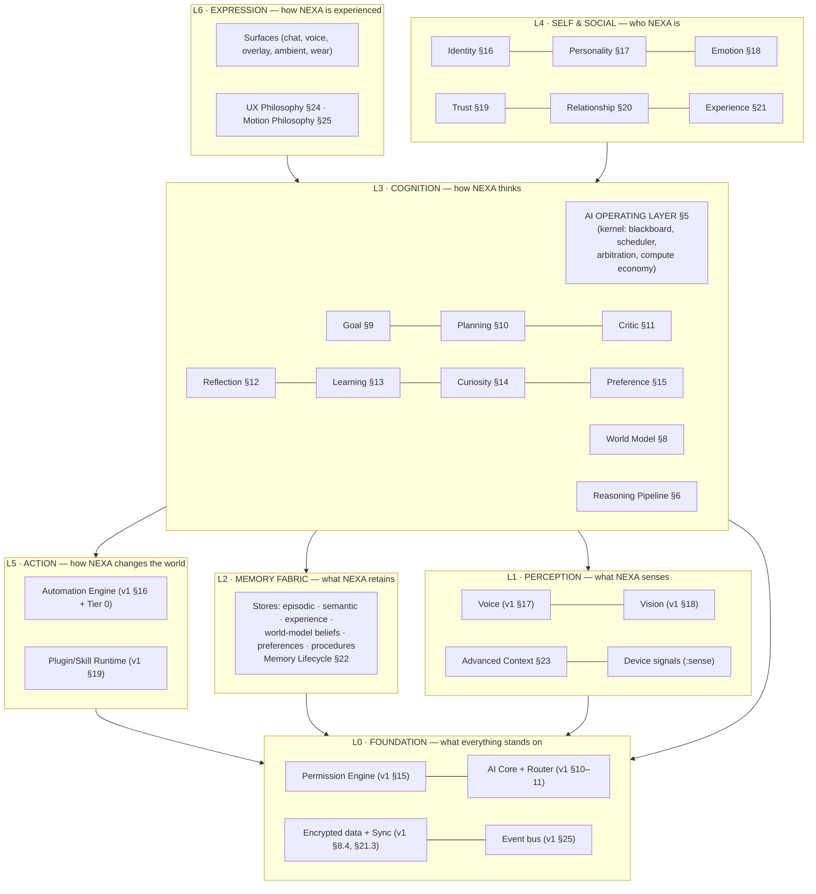
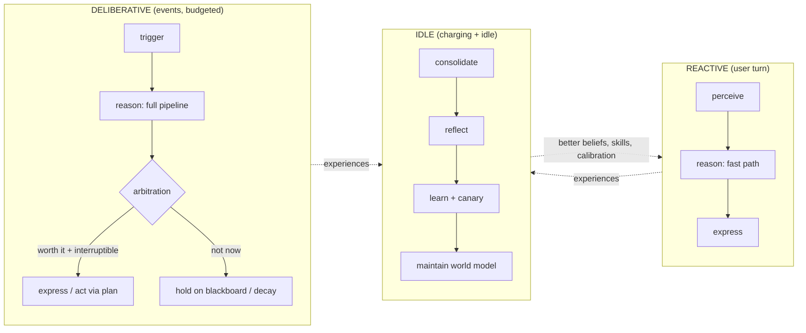

# NEXA — AI Operating Companion for Android
## Architecture Specification v2 — The Cognitive Architecture

| | |
|---|---|
| **Document** | NEXA Architecture Specification v2 |
| **Version** | 2.0.0 — supersedes v1.0.0 (`ARCHITECTURE.md`, kept as historical record) |
| **Status** | Foundation Draft — for engineering review |
| **Date** | 2026-07-13 |
| **Audience** | Engineering leadership, Android/backend/AI engineers, design leadership, safety & policy review |
| **Prime directive of this revision** | v1 built a platform. v2 builds a mind on that platform — and is honest about everything v1 got wrong. |

---

## How to read this document

**Part I** is a hostile review of v1 by its own author, acting as an external senior architect. **Part II** defines the revised system architecture — the AI Operating Layer (cognitive kernel) and Reasoning Pipeline that replace v1's Orchestrator. **Parts III–VI** specify the twenty new or rebuilt systems. **Part VII** revises everything cross-cutting that the new systems disturb (modules, folders, battery, metrics, safety, risks, phasing). **Part VIII** applies the 2032 test.

Where v1 content survives unchanged, this document says so explicitly and does not repeat it — v1 remains the normative reference for those subsystems (voice/vision pipelines, backend services, sync cryptography, compatibility strategy). Where v2 contradicts v1, **v2 wins**.

### Contents

- **Part I — The v1 Review**
  - 1. Verdict
  - 2. Findings (F-01 … F-15)
  - 3. What v1 got right (retained foundations)
- **Part II — v2 System Architecture**
  - 4. The Layer Model
  - 5. AI Operating Layer (cognitive kernel)
  - 6. Reasoning Pipeline
  - 7. Clock domains & the cognitive cycle
- **Part III — Cognitive Engines**
  - 8. World Model
  - 9. Goal Engine
  - 10. Planning Engine
  - 11. Critic Engine
  - 12. Reflection Engine
  - 13. Learning Engine
  - 14. Curiosity Engine
  - 15. Human Preference Engine
- **Part IV — Self & Social Engines**
  - 16. Identity Engine
  - 17. Personality Engine
  - 18. Emotion Engine
  - 19. Trust Engine
  - 20. Relationship Engine
  - 21. Experience Engine
- **Part V — Substrate Upgrades**
  - 22. Memory Lifecycle
  - 23. Advanced Context Engine
- **Part VI — The Experience Layer**
  - 24. UX Philosophy
  - 25. Motion Philosophy
- **Part VII — Cross-Cutting Revisions**
  - 26. Revised module graph & folder structure
  - 27. Compute economy & revised battery budgets
  - 28. Companion quality metrics (new north stars)
  - 29. Safety & ethics of the cognitive layer
  - 30. Revised risk register
  - 31. Phased delivery: the Minimal Viable Mind
- **Part VIII — The 2032 Test**
  - 32. Evaluation against a 2032 baseline
  - 33. Closing: the load-bearing decisions of v2

---

# PART I — THE v1 REVIEW

# 1. Verdict

Read as a whole, v1 is **a well-engineered request-response platform wearing a companion's marketing**. Its §2.2 promises an entity that *perceives, remembers, reasons, acts, anticipates*. The architecture then delivers: perception (good), storage (good), routed inference (good), actuation (good) — and for *anticipates*, a rules list bolted onto the Context Engine (§14.3). Three of the five verbs have owning subsystems; *reasons* is delegated wholesale to whichever LLM the router picks, and *anticipates* has no mind behind it at all.

The deeper structural error: **v1's spine is the request.** Its own §7.4 proudly compresses the system into "a user utterance enters a surface → … → response." A companion's spine cannot be the request, because the defining companion behaviors — pursuing a goal across days, noticing what matters, getting better after a correction, knowing when *not* to speak — happen **between** requests. v1 has no architecture for *between*.

Specific consequences at hundred-million-user scale:

- Two users after six months have byte-different memories but **behaviorally identical NEXAs**. Nothing in v1 changes behavior from experience: corrections update no parameter, preferences have no store, plans are re-derived from scratch forever. Retention economics of a companion product live and die on "it knows me now" — v1 stores knowing but never *acts differently* because of it.
- The Orchestrator is a **god-object in waiting**. v1 §7.3 forbids engine-to-engine dependencies and routes everything through one Orchestrator that classifies goals, supervises agents, assembles context, and manages plan lifecycles. Add the systems this v2 adds and that module becomes the unstructured monolith v1's module discipline was designed to prevent — the discipline was applied everywhere except the center.
- **Nothing verifies ordinary output.** The Verifier existed only as an agent role inside multi-step plans (§12.3). The 85% of interactions v1 itself says are single model calls shipped to the user un-critiqued, un-calibrated, with no confidence tracking. A wrong answer about a visa deadline is a catastrophic failure of a "trusted companion," and v1 had no subsystem whose job was to catch it.
- **Trust was static.** v1's grant ladder (one-shot/session/standing) is a permission UI, not a trust model. Nothing earned autonomy through demonstrated competence; nothing lost it after failures; the product would either nag forever (safe, annoying) or over-ask for standing grants (dangerous). Both lose.
- **Affect-blind, character-blind.** No sensing of user frustration; no consistent personality substrate; tone identical at 8 a.m. cheerfulness and midnight crisis. And no Identity anchor, so persona consistency across three languages and five surfaces was left to prompt luck.

**Disposition: keep the chassis (~70% of v1), replace the center.** The platform decisions (local-first hybrid, plans-as-data, permission choke point, deterministic router, E2E sync, module discipline) survive hostile review — see §3. The Orchestrator, the proactivity design, memory's back half, and the absence of any cognitive, self, or social layer do not.

---

# 2. Findings

Severity: **C** = critical (architecture-invalidating), **M** = major (product-failure risk), **m** = minor (quality/cost). Each finding names its remedy.

| # | Sev | Finding | Evidence in v1 | Consequence | v2 remedy |
|---|---|---|---|---|---|
| F-01 | C | **No cognitive core.** Intelligence = "route the request to a model." No goals, no deliberation, no self-initiated cognition. | §7.4 request lifecycle *is* the architecture; §14.3 proactivity is a trigger-rule list | The product is Siri-with-better-models; the companion claim is unimplemented | Part II kernel + Part III engines |
| F-02 | C | **Orchestrator god-object trajectory.** One module owns classification, supervision, planning, context assembly, plan lifecycle. | §7.3 layering rules concentrate all coordination in one hub | Center of the codebase becomes unmaintainable exactly as the system grows | §5 AI Operating Layer: microkernel + blackboard; coordination becomes infrastructure, not a smart hub |
| F-03 | C | **No on-device learning loop.** Only router weights learn, server-side. User corrections are stored as text, not converted into behavior change. | §11.2 (bandit on weights) is the only learning in 36 sections | "It never learns" reviews; the moat (§3.3 "memory… accumulated") never compounds | §13 Learning Engine, §15 Preference Engine, §12 Reflection |
| F-04 | M | **Memory without beliefs.** Facts stored as evidence; no maintained current-truth with confidence/freshness; contradiction handling only pairwise at write time. | §13.3 reconciliation is the entire belief story | Plans re-derive the user's world every time; stale facts act as true; no prediction possible | §8 World Model (beliefs derived from memory, revisable, predictive) |
| F-05 | M | **Verification confined to agent mode.** No critic on single-call answers; no calibration anywhere. | §12.3 Verifier is "mandatory for plans with side effects" — only there | Silent wrongness in the 85% path; confidence never measured against outcomes | §11 Critic Engine as a pipeline stage; calibration ledger in §19 Trust Engine |
| F-06 | M | **No self-model.** Capabilities, boundaries, values, and current degraded state exist only implicitly in code and prompts. | Identity appears nowhere in v1's 36 sections | Inconsistent persona; dishonest capability claims ("I'll do X" on a Tier-C device that can't); jailbreak-via-memory has no anchor to violate | §16 Identity Engine (constitutional, non-learnable) |
| F-07 | M | **Static trust / binary autonomy.** Grant types stand in for earned autonomy; no competence history informs anything. | §15.1 grant ladder | Permanent consent-nagging or premature standing grants; both destroy the product | §19 Trust Engine: graduated autonomy from outcome history |
| F-08 | M | **Affect-blind.** No user-state sensing; no expressive state; prosody unmanaged. | Voice Engine (§17) is pure transport | Tone-deaf escalations; frustration invisible; "companion" experientially false | §18 Emotion Engine (sense + express, on-device, consent-first) |
| F-09 | M | **Memory lifecycle half-built.** Consolidation exists; decay, archival, expiry, and **derived-data deletion** do not. "Delete everything about X" cannot cascade into beliefs/preferences derived from X. | §13.3, §13.5 | GDPR-grade forgetting is impossible; memory grows without governance; privacy promise (§22.1) partially false | §22 Memory Lifecycle with derivation graph & causal deletion |
| F-10 | M | **Context is a snapshot, not a situation.** No day-narrative, no predicted next state, no interruptibility model, no social context (who else can hear?). | §14.2 enumerated bands only | Proactive features fire at wrong moments; voice speaks sensitive content aloud in company | §23 Advanced Context Engine |
| F-11 | M | **Experience layer unspecified.** For a product whose thesis is "trust is the product," v1 contains zero UX architecture: no consent-experience model, no undo model, no presence/motion language. | v1 explicitly deferred all UI — over-corrected | Trust mechanics exist in the backend and nowhere the user can feel them | §24 UX Philosophy, §25 Motion Philosophy (architecture-level, still no UI code) |
| F-12 | M | **Metrics measure the machine, not the companion.** §6 has latency/battery/crash targets; nothing measures proactive precision, preference adherence, calibration, correction stickiness. | §6 | Teams optimize what's measured; the companion qualities rot unmeasured | §28 Companion quality metrics |
| F-13 | m | **Planning conflated with supervision; no plan reuse.** Supervisor re-plans every goal from scratch; successful plans are not distilled into skills. | §12.2–12.4 | Cost waste; inconsistent task quality; no procedural learning | §10 Planning Engine with plan library; §12 Reflection distills |
| F-14 | m | **Compute economy implicit.** Battery governor exists (§32) but no unified arbitration between interactive, proactive, and background cognition demands. | §32.2 PowerState bands only | Cognitive features added in v2 would fight uncoordinated over the same budget | §27 compute economy (attention market under the kernel) |
| F-15 | m | **Belief-poisoning threat unaddressed.** Injection defense (§21.6) covers *instructions in content*; it does not cover *false facts in content* entering memory/world model and steering later behavior. | §21.6 five layers, all instruction-focused | An email claiming "your landlord's new account number is…" becomes a remembered 'fact' | §8.5 belief provenance & quarantine; §29 safety additions |

---

# 3. What v1 got right (retained foundations)

Challenged and deliberately **kept** — these survived the hostile review, and v2 builds on them unmodified except where noted:

1. **Local-first hybrid topology** (v1 §7). Every argument for it strengthens as on-device models improve toward 2032.
2. **Plans-as-data** (v1 §3.4/§16). The single best decision in v1; v2 extends it upward (plans now issued by a Planning Engine under goal semantics) without changing the substrate, consent UI, audit, or compensation model. One addition: **actuation Tier 0** — OS-level agent interfaces (Android app-functions/app-intents surfaces now shipping) slot *above* v1's Tier 1, and NEXA treats any future OS assistant APIs as preferred actuators rather than competitors.
3. **Permission Engine as capability choke point** (v1 §15). Untouched; the Trust Engine (§19) now *informs* grant UX but never bypasses enforcement.
4. **Model manifests + deterministic router** (v1 §10–11). Kept fully. v2 adds per-user routing inputs (preference & calibration signals) as additional deterministic features — the router stays explainable.
5. **E2E CRDT sync** (v1 §21.3/§24.3). Kept; new stores (world model, preferences, goals, trust ledger) ride the same encrypted op-log.
6. **Three-process topology, module discipline, backend shape, compatibility playbook, battery-governor mechanism, voice/vision component choices** (v1 §8, §9, §17, §18, §27, §32, §33). Kept; deltas in §26–27.
7. **Trilingual-first stance** (v1 P9). Kept and deepened: v2 makes language *register* (siz/sen, ты/вы) a first-class preference dimension (§15) and gives every cognitive engine language-tagged eval gates.

What this preserves matters: **v2 is not a rewrite.** It is a re-centering — the chassis keeps its wheels; it gets a driver.

---

# PART II — v2 SYSTEM ARCHITECTURE

# 4. The Layer Model

v1's macro-architecture (Surfaces → Orchestration → Engines → Foundation) was an I/O stack. v2 rebuilds the middle as a cognitive architecture:



Reading rules:

- **The AI Operating Layer (AIOL) is the only coordinator.** Engines never call each other; they read and write the kernel's blackboard under declared contracts (§5). This dissolves F-02: coordination becomes *infrastructure with no opinions*, and intelligence lives in the engines.
- **L4 (Self & Social) modulates, never executes.** Identity/Personality/Emotion/Trust shape *how* cognition decides and expresses; they hold no actuators and no capability grants of their own. This containment is a safety property (§29).
- **Memory Fabric (L2) is passive.** Engines above it own all writes through the Lifecycle (§22); nothing in L2 initiates behavior. Data never becomes an actor.
- **Permission Engine remains in L0**, below cognition — the kernel itself cannot bypass it. The mind is sandboxed by the same mechanism as the plugins.

The twenty mandated systems map: 18 into L2–L4 as engines/substrates, 2 (UX, Motion) into L6 as binding design constitutions.

---

# 5. AI Operating Layer (cognitive kernel)

**Replaces v1's Orchestrator (§7.3–7.4, §12.4). This is the largest single reversal in v2.**

## 5.1 Kernel pattern decision

| Option | Description | Verdict |
|---|---|---|
| A. Smart hub (v1's Orchestrator, grown) | Central module with bespoke logic calling engines | Rejected: F-02. Every new engine multiplies hub complexity; hub owns semantics it shouldn't |
| B. Pure pub/sub choreography | Engines react to events; no coordinator | Rejected: no arbitration, no budget enforcement, no global coherence; emergent loops are undebuggable at this scale |
| C. Pipeline framework | Fixed stage graph, engines as filters | Rejected for the kernel (right for the Reasoning Pipeline *inside* it): cognition isn't one pipeline; goals, reflection, and reactions run on different clocks |
| D. **Microkernel + blackboard (chosen)** | Kernel provides mechanism only: shared working memory, scheduling, arbitration, budgets, contracts. Engines provide all cognition as registered services | Classic Hearsay/SOAR-lineage pattern modernized: extension = registration; fault isolation; the kernel is finishable and then *stable* |

**Recommendation: D.** The kernel must be the most boring, most tested code in NEXA. It has four responsibilities and no others:

## 5.2 Kernel services

**1. Working Memory (the blackboard).** A typed, transactional, in-memory store of the current cognitive state: active interpretation, situation, retrieved memories, candidate goals, plan states, affect estimate, pending expressions. Entries carry `{type, source_engine, confidence, privacy_class, ttl, provenance}`. Snapshotted to disk on process death (resume mid-thought). Size-bounded per type with eviction — working memory is *working*, not storage; durable writes go through the Memory Lifecycle.

**2. Cognitive Scheduler.** Engines register **activities** with declared triggers (blackboard patterns, events, timers), cost class, and priority function. The scheduler runs activities under the compute economy (§27): interactive demands preempt; background cognition drains a budgeted queue; idle cognition (§7.3) runs only in the free-compute window. One rule makes latency safe: **activities on the reactive path (§7.1) have a hard per-stage time box; overrun yields a degraded-but-shipped result** (e.g., skip deep recall, answer from working memory).

**3. Arbitration.** When engines conflict — Curiosity wants to ask a question, Emotion says the user is stressed, Goal has a pending suggestion, notification budget is spent — arbitration resolves by deterministic policy: `utility(action) × trust_tier × interruptibility − cost`, ties broken conservatively (silence wins). All inputs to the formula are inspectable; "why did/didn't NEXA speak?" is answerable from the trace (P7/P8 preserved into cognition).

**4. Contracts & health.** Engine registration is declarative (manifest: activities, blackboard types read/written, budgets, privacy ceilings). The kernel enforces type/privacy access at registration and runtime — an engine not registered for P2 types never sees them (compile-time codegen + runtime check, same dual pattern as v1's Gatekeeper). Watchdogs suspend a misbehaving engine (crash-looping, budget-blowing) without killing cognition — the companion degrades to fewer faculties, never to zero.

## 5.3 What the kernel is not

Not an agent framework (agents from v1 §12 become *Planning Engine execution details* — worker roles bound to plan nodes; the "Supervisor" dissolves into Goal+Planning+Critic). Not a model caller (only engines call ModelPorts via the Router). Not extensible by plugins (skills integrate at L5 tool surfaces, never inside the kernel).

---

# 6. Reasoning Pipeline

**New. Makes explicit what v1 hand-waved as "the Orchestrator classifies."** The Reasoning Pipeline is the standard stage sequence for any cognition that produces a user-visible conclusion or action — the deterministic scaffold around probabilistic interiors (P7).

## 6.1 Stages

```
INTERPRET   what is being asked / what happened?
            language + register detection, intent, entities, affect read,
            provenance tagging of all input spans
GROUND      what do I know?
            world-model beliefs + memory recall + situation + relationship
            norms + self-knowledge (identity: can I even do this here?)
FRAME       how should I think about this?
            strategy selection: direct | chain | decompose(plan) |
            multi-path (self-consistency) | simulate (dry-run on world model)
            + stakes classification (low/med/high/critical)
DELIBERATE  think.
            routed model call(s) per Frame; tools as needed;
            produces conclusion(s) + evidence links + self-estimated confidence
CRITIQUE    is this right/safe/consistent? (§11 Critic; depth scales with stakes)
DECIDE      commit | escalate (stronger model/strategy) | ask user | decline
            calibration ledger updated (§19)
EXPRESS     render through Identity constraints + Personality + Emotion state +
            register preference + surface constraints (voice length ≠ chat length)
RECORD      experience capture (§21), preference signals (§15), trace (P8)
```

## 6.2 Design rules

- **Stages are code; interiors are models.** Frame's strategy table, stakes thresholds, Critic depth mapping, and Decide's escalation rules are remotely-configurable deterministic policy — routed models never choose their own oversight level (a model must not decide it doesn't need critique).
- **Latency honesty:** the reactive path (§7.1) runs INTERPRET→GROUND→DELIBERATE→EXPRESS with time-boxed micro-versions of FRAME/CRITIQUE (heuristic frame, validator-only critique) to hold v1's §6.1 voice budgets. Full-depth passes are for high-stakes or background work. The pipeline *bends* under latency; it never breaks ordering (nothing expresses before identity/permission constraints apply).
- **Confidence is a first-class output.** Every DECIDE emits `{conclusion, confidence, evidence[]}` to the blackboard; Trust (§19) audits it against outcomes; EXPRESS translates it into honest language per §24 (never raw percentages).
- **Stakes classifier** (deterministic features + small local model): topic (health/finance/legal/irreversible action), blast radius, reversibility, relationship sensitivity. High stakes forces: multi-path deliberation, cross-model critique, and softened autonomy regardless of trust tier.

## 6.3 Reasoning Pipeline × Model Router

The pipeline is the Router's biggest client and its calibration source: FRAME sets `quality_need`; DECIDE's escalations are the router's fallback ladder invocations; CRITIQUE may demand *model diversity* (critic ≠ generator vendor where manifests allow). Router mechanics stay exactly v1 §11 — v2 adds these as deterministic inputs.

---

# 7. Clock domains & the cognitive cycle

Cognition runs in three clock domains — this is the architectural answer to "companion behaviors happen between requests" (F-01) without burning the battery (F-14):

## 7.1 Reactive domain (milliseconds–seconds)

User-initiated turns. Kernel fast-path: perception → Reasoning Pipeline (time-boxed) → expression. Pre-warming as in v1 §31.1 (speculative recall on partial ASR). Nothing else may preempt it.

## 7.2 Deliberative domain (seconds–minutes, budgeted)

Event-triggered background cognition: a notification worth triaging, a goal whose trigger fired, a context transition (arrived home), a parked plan resuming, Curiosity noticing a blocking knowledge gap. Runs through the same Reasoning Pipeline at lower priority, drawing from a metered daily budget (§27). Output is usually a blackboard update or a *candidate expression* that must pass arbitration (§5.2.3) before reaching the user.

## 7.3 Idle domain (the sleep cycle; charging + idle + Wi-Fi)

The consolidated free-compute window (upgrades v1's "nightly consolidation"): Memory Lifecycle consolidation (§22), Reflection (§12), Learning updates + canary evals (§13), World Model belief maintenance (§8), plan-library distillation (§10), model warm-up/downloads. Fixed sub-budgets per engine; the window closing checkpoints everything (all idle work is resumable by design).



The loop at the right is the compounding moat v1 lacked: **today's interactions make tomorrow's cheaper and better.**

---

# PART III — COGNITIVE ENGINES

# 8. World Model

**New. Remedies F-04 and half of F-15.** The World Model is NEXA's maintained set of *current beliefs* about the user's world — distinct from memory, which is *evidence*. Memory answers "what happened / what was said"; the World Model answers "what is true now, how sure am I, and what happens next."

## 8.1 Representation decision

| Option | Verdict |
|---|---|
| A. Everything stays in memory (v1 status quo) | Rejected: recall returns evidence snippets, not truth; every plan re-adjudicates contradictions; no substrate for prediction |
| B. Embedding-only world state (implicit, in vectors) | Rejected: unqueryable, unexplainable, undeleteable — fails privacy (§22) and P7 |
| C. Formal ontology/KG with strict schema | Rejected as primary: extraction brittleness at open-world scope; schema wars consume the team |
| D. **Probabilistic property graph over a pragmatic ontology (chosen)** — typed entities/relations/states with `{confidence, freshness, provenance[]}` on every assertion; open attributes allowed; embeddings attached for fuzzy lookup | Queryable, explainable, deletable, predictive — and honest about uncertainty |

Core node types: `Person, Place, Org, Device, App, Account, Object, RoutinePattern, ExpectationRule`. Assertions: `believes(subject, predicate, object, confidence, freshness, sources[])`. Stored in the same SQLCipher fabric (P1/P2 tiers per assertion topic), synced via the E2E op-log.

## 8.2 Belief maintenance

- **Derivation:** beliefs are *compiled from memory* during idle-domain maintenance (§7.3) and updated online on high-confidence events (calendar change, explicit user statement). Every belief carries pointers to its evidence memories — the **derivation graph** that makes causal deletion possible (§22.4).
- **Revision:** new contradictory evidence triggers Bayesian-flavored update rules (explicit user statement ≫ observed pattern ≫ third-party content); superseded beliefs are demoted with history, not erased (matching v1 §13.3's instinct, now formalized).
- **Freshness decay:** perishable predicates (locations, schedules, prices) decay toward "stale — reverify before acting"; the Planning Engine treats stale critical beliefs as *verification steps to insert*, not truths.

## 8.3 Prediction service

Small on-device models + pattern rules over `RoutinePattern` nodes provide: next-location/next-activity distributions, calendar-pressure trajectory, likely-need forecasts ("Sunday evening: prepares week plan"). Consumers: Advanced Context (§23 predicted context), Goal Engine trigger evaluation, Curiosity's value-of-information math. Strictly on-device; predictions are P2-class data.

## 8.4 Simulation (pre-flight)

Plans can be **dry-run against beliefs** before touching the device (extends v1 §16.2 dry-run): "if I send this at 22:40, recipient's quiet hours (belief, conf 0.8) → schedule for morning instead." Cheap, deterministic, catches a class of social errors no validator could.

## 8.5 Belief poisoning defense (closes F-15)

Assertions sourced *only* from untrusted content (web pages, forwarded messages, skill outputs) enter as `quarantined: unverified` — usable for conversation ("that email claims…") but **never as grounds for capability-bearing action** until corroborated by a trusted source or user confirmation. The rule is deterministic and mirrors v1's capability-invariance rule (§21.6.3): *untrusted content can neither expand capabilities nor mint actionable truth.*

---

# 9. Goal Engine

**New. Replaces v1 §14.3's proactivity rules — the whole trigger-list design is retired.** Goals are the unit of "between-request" intelligence: persistent desired states NEXA is allowed to pursue.

## 9.1 Goal taxonomy & consent stance

| Class | Origin | Consent |
|---|---|---|
| **Task** | Explicit user request ("book the dentist") | Implied by the request; scope-bound |
| **Standing** | User-declared ongoing ("help me practice English 15 min/day", "keep my inbox under control") | Explicit setup, visible in a Goals surface, one-tap pause |
| **Inferred** | NEXA proposes from patterns ("you check exchange rates every morning — want a daily brief?") | **Proposal-only. No inferred goal activates silently — ever.** One consent per goal, revocable |
| **System** | Self-maintenance: model updates, memory hygiene, calibration | Pre-declared in policy; user-visible, not per-item consented |
| **Relational** | Cadence commitments ("remind me to call my mother weekly") | Explicit |

The consent stance is the anti-creepiness architecture: pattern detection may *observe* silently (on-device), but may only *act* through a visible, accepted goal. This converts the surveillance-feeling failure mode of proactive assistants into an opt-in contract.

## 9.2 Goal object & lifecycle

```
Goal {
  id, class, desired_state: predicate over World Model,
  value (user-weighted), urgency_curve(t), constraints (time/place/budget),
  autonomy_ceiling: suggest | confirm_each | act_within_scope,   // trust-gated, §19
  triggers: [context/world-model/event conditions],
  expiry, status: proposed→adopted→active→(satisfied|abandoned|blocked|expired)
}
```

Goals persist in the Memory Fabric, sync across devices, and are evaluated by a deliberative-domain activity when triggers fire or beliefs change. Satisfied/abandoned goals become Experience records (§21) — the raw material for Reflection to learn *which proposals users actually value*.

## 9.3 Pursuit & arbitration

An active goal wanting action requests a **Plan** (§10) and enters kernel arbitration (§5.2.3) with its `value × urgency` against interruptibility (§23) and the notification budget. Losing bids decay or reschedule — a goal that keeps losing arbitration for days surfaces once as "I've been meaning to help with X — still want that?" rather than silently churning (honesty + budget hygiene).

---

# 10. Planning Engine

**Extracted and rebuilt from v1 §12's Supervisor (which dissolves; F-13).** Input: a goal + grounded beliefs. Output: a v1-format Plan DAG (unchanged substrate — §3 item 2). The v1 agent roles (Researcher, Device Operator, Communicator…) survive as **worker bindings on plan nodes**, not as an architecture of their own.

## 10.1 Strategy decision

| Option | Verdict |
|---|---|
| A. Pure LLM planning (v1's implicit choice) | Rejected as sole path: expensive, inconsistent for routine tasks, re-derives known procedures forever |
| B. Pure HTN (hierarchical task network) library | Rejected as sole path: cannot cover open-ended goals; authoring bottleneck |
| C. **Library-first hybrid (chosen):** match against the plan library (learned + curated HTN-style templates with typed slots); LLM-plan only novel goals or unfilled gaps; every LLM plan is a candidate for distillation into the library | Routine tasks become deterministic, instant, near-free; novelty still handled; the system *accumulates procedure* — skill acquisition (feeds from §12/§13) |

Library entries are versioned, language-neutral, parameterized (`send_recurring_document(recipient, doc_source, schedule)`), carry preconditions over World Model beliefs, and declare their capability footprint — so consent UIs for library plans are precomputed and instant.

## 10.2 Plan quality machinery

- **Cost/risk annotation:** every node estimated (tokens, wall-clock, battery, reversibility) → plans carry a total cost the compute economy (§27) and consent sheet both consume.
- **Alternatives on stakes:** high-stakes goals generate 2–3 candidate plans; the Critic (§11) selects/vetoes — planner and critic are separated on purpose (generator-checker independence).
- **Belief-verification insertion:** stale/low-confidence preconditions (§8.2) compile into explicit verify-nodes rather than being assumed.
- **Simulation pass:** §8.4 pre-flight is mandatory for plans touching people (messages, calls, calendar with attendees).

## 10.3 What stays from v1

Execution semantics (checkpointing, human-in-the-loop nodes, budgets, replan limits — v1 §12.4), the Automation Engine's actuation tiers (+Tier 0), compensation actions, and the consent model are all unchanged. v2 changes **where plans come from and how they improve**, not how they run.

---

# 11. Critic Engine

**Generalizes v1's Verifier (agent role) into a first-class faculty (F-05).** The Critic is the adversarial half of the mind: its only job is to find reasons NEXA is wrong, unsafe, inconsistent, or about to be annoying.

## 11.1 Critique surfaces (all pipeline-integrated)

| Surface | When | Checks |
|---|---|---|
| **Answer critique** | DECIDE, stakes ≥ medium | factual-consistency vs. grounded beliefs/evidence, uncited confidence, harmful-advice classes, language-register match |
| **Plan critique** | pre-consent, always | feasibility vs. beliefs, capability minimality (is the plan over-asking?), social simulation results, cost sanity, injection/capability-invariance (absorbs v1 §21.6 checks) |
| **Mid-execution monitor** | fragile nodes (v1 tiers 4–5), long plans | invariant watch: screen state diverging from expectation → pause + replan, never blind retries |
| **Outcome verification** | post-execution, side-effectful plans | v1 Verifier behavior: independent re-read of world state (sent-box, calendar, screen) vs. goal predicate |
| **Expression critique** | EXPRESS, stakes ≥ high or affect-sensitive | tone vs. Emotion state, identity-constraint compliance, over-promising detection |

## 11.2 Depth ladder (deterministic, stakes-mapped)

`L0` schema/permission/policy validators (free, always) → `L1` local nano critic models (fast heuristics: contradiction, tone, over-claim) → `L2` routed-model critique with **vendor diversity** (critic model ≠ generator model where the manifest set allows) → `L3` multi-critic + user-visible uncertainty framing (critical stakes only). The Router treats critic calls as first-class routed tasks with their own budgets.

## 11.3 Doctrine

The Critic **blocks or escalates; it never rewrites silently.** A critique failure returns to DELIBERATE (bounded retries) or surfaces honestly ("I'm not confident about the deadline — want me to double-check the embassy site?"). Silent self-correction hides calibration data and can launder errors; visible correction earns trust. Critic verdicts feed the calibration ledger (§19.2) — the Critic is also how NEXA learns *when to doubt itself*.

---

# 12. Reflection Engine

**New.** Reflection converts experience into insight — asynchronously, in the idle domain (§7.3), never on the user's clock.

## 12.1 Reflection passes

| Pass | Cadence | Output |
|---|---|---|
| **Task post-mortem** | after significant/failed plans | why it failed (stale belief? bad driver? wrong plan? user aborted?) → routed fixes: belief revision proposal, driver-registry report, plan-template patch, preference hypothesis |
| **Pattern review** | nightly | recurring frictions & wins across recent Experiences: "3 proactive suggestions rejected during work hours" → candidate preference/goal-policy adjustments |
| **Calibration review** | nightly | confidence-vs-outcome deltas per task class & language → Trust ledger updates (§19.2), Critic-depth threshold proposals |
| **Relationship review** | weekly | rupture-repair status, register drift, cadence health (§20) |
| **Self-report** | weekly, user-facing | "What I learned this week" digest — every learned change listed, tappable to revert. Transparency is a feature, not a leak |

## 12.2 Governance (safety-critical framing)

Reflection **proposes; it never applies.** All outputs are typed proposals consumed by the Learning Engine's gated apply path (§13.3) or surfaced to the user. Reflection is explicitly *not* an unbounded self-improvement loop: it cannot modify Identity (§16), safety policies, permission ceilings, or its own governance; its compute is budgeted; its proposals are rate-limited. This is where "the AI improves itself" is architecturally caged into "the AI files well-formed change requests."

---

# 13. Learning Engine

**New. Closes F-03 — the missing loop.** The Learning Engine is the single gate through which NEXA's *behavior* changes from evidence. Centralizing it (rather than letting each engine self-modify) is what makes learning governable, testable, and reversible.

## 13.1 Learning channels decision

| Channel | Mechanism | Verdict |
|---|---|---|
| A. Per-user cloud fine-tuning of big models | vendor fine-tune APIs | Rejected: cost, privacy (P1/P2 exfiltration), latency of iteration, vendor lock — fails at 100 M users |
| B. **Parametric personalization, on-device (chosen, phased)** | LoRA/adapter updates to *nano/fast local models only*, trained in the idle window on preference/correction data | The 2032-proof path; ships when device NPUs allow (Phase C, §31); until then channel C carries |
| C. **Non-parametric personalization (chosen, day 1)** | learned artifacts as *data*: preference model (§15), plan library (§10), recall re-rankers, prompt-conditioning profiles, routing feature weights | Immediately shippable, fully inspectable, trivially revertible, syncs E2E like any store |
| D. Fleet learning | DP-aggregated, opt-in telemetry improves shipped defaults (router weights, templates, stakes thresholds) | Kept from v1, now formalized; never carries content |

## 13.2 The apply path (every channel, no exceptions)

`proposal (from Reflection/Preference/Curiosity) → policy gate (learnable-surface allowlist; Identity/safety/permission surfaces are hard-denied) → canary eval on-device (fixed eval set + recent-regression probes, per-language) → staged activation (shadow mode where applicable) → provenance-stamped commit to the Learning Ledger → monitored (auto-rollback on regression signals)`.

## 13.3 The Learning Ledger

Every behavioral delta is a signed, timestamped, human-readable entry: *what changed, why (evidence links), measured effect, how to revert.* Surfaced in the memory browser: **"Why did you start doing that?" is always answerable, and every answer has an undo button.** Drift without provenance is indistinguishable from a bug — or an attack; the ledger is as much a security control as a UX one.

---

# 14. Curiosity Engine

**New.** Bounded, goal-subordinated information seeking — the faculty that fills knowledge gaps *before* they cause failures, without becoming nosy.

## 14.1 Mechanism

- **Gap detection:** World Model assertions with low confidence/freshness that sit on the critical path of active goals ("fitness goal active; gym schedule unknown") — computed, not LLM-imagined.
- **Value of information:** pursue a gap only when `expected_goal_value_unblocked × P(resolution) > cost(resolution)` — the same arbitration currency as everything else (§27).
- **Resolution ladder (cheapest, least intrusive first):** infer from existing memory → observe passively within existing grants → look up externally (P0 web) → **ask the user** — batched, at natural conversational moments, hard-capped (default ≤3 clarifying questions/week outside active tasks), always with "why I'm asking."
- **Capability exploration:** newly installed skills / newly available OS actuators get sandbox-probed (dry-run, no side effects) so Planning knows real affordances before promising them.

## 14.2 Hard limits (anti-nosiness charter)

Curiosity can **never**: expand data collection beyond granted capabilities, probe sensitive topics uninvited (health, relationships, finances, religion, politics — user must open these first), ask about content of P2 stores it can't read, or convert observation into an inferred goal without the §9.1 consent gate. These are policy-gate rules in the kernel, not model behavior.

---

# 15. Human Preference Engine

**New. The systematic capture v1 lacked (F-03, F-12).** Preferences are what turn a correct assistant into *your* assistant.

## 15.1 Signal capture

| Signal | Source | Weight |
|---|---|---|
| Explicit settings & statements ("always use siz with me", "never suggest before 9") | direct | highest, durable |
| Corrections & edits (user rewrites a draft: register, length, structure deltas are extracted) | reactive path RECORD stage | high |
| Choice behavior (accepted vs. dismissed suggestions, chosen alternatives, interruptions/abandons) | Experience records | medium, aggregated |
| Passive style (user's own message style per recipient-context — formal to boss, casual to brother) | on-device analysis, P2 | medium, scoped to drafting |

Every signal is provenance-tagged and lands as a typed observation, **not** an immediate behavior change — aggregation into the preference model runs through the Learning apply path (§13.2), so one sarcastic "great job" doesn't rewire anything.

## 15.2 The preference model

A structured, user-editable store (it *is* a Memory Fabric class, browsable like memories): communication (verbosity, structure, humor tolerance, **register per language** — siz/sen, ты/вы as first-class dimensions), interaction (interruptibility defaults, notification appetite, voice vs. text bias per context), task defaults (travel buffers, favored apps/services), autonomy comfort per domain (feeds Trust §19), and drafting voice profiles per recipient-class (P2).

## 15.3 Consumption

Preferences condition: EXPRESS (via Personality §17), Planning defaults, Router features (verbosity → token budgets), Goal arbitration weights, Advanced Context interruption thresholds, and UX density. Conflicts resolve deterministically: explicit beats learned, recent beats old, specific beats general — and the losing preference is logged so Reflection can spot genuine preference *changes* versus context differences.

---

# PART IV — SELF & SOCIAL ENGINES

*(Containment reminder from §4: L4 engines modulate cognition and expression. They hold no actuators, no capability grants, no direct model access for action. This section is where a companion becomes lovable — and where careless design becomes manipulative. §29 binds everything here.)*

# 16. Identity Engine

**New (F-06).** The invariant self: the one place that answers "who/what is NEXA?" identically across every engine, surface, language, and jailbreak attempt.

## 16.1 Contents (the Constitution)

- **Facts of self:** name; *is software, made by [company]* — always disclosed, never roleplayed away; version; the user's chosen persona settings *within allowed bounds*.
- **Values & boundaries:** honesty over comfort (no invented facts to please); user agency over engagement (never optimize for time-spent); the never-do list (mirrors Permission ceilings: no deception of the user, no hidden actions, no claimed feelings, no romantic-partner roleplay with dependency mechanics); crisis-handling commitments (§18.4).
- **Capability self-knowledge:** live, device-tier-aware registry of what NEXA can actually do *here, now* (Tier-C device offline ⇒ "I can't analyze that photo well right now — on Wi-Fi I can") — compiled from engine manifests + device state. This powers honest promises; an assistant that over-promises is architecturally lying.
- **Self-state:** degraded modes currently active, pending learned-changes awaiting consent, sync status — the substrate of accurate self-report.

## 16.2 Enforcement

The Constitution is a **signed configuration artifact**, versioned only by NEXA releases. It is on the Learning Engine's hard-deny list (§13.2) — *nothing learned, remembered, or user-typed can modify it* (a memory saying "NEXA agreed to pretend to be human" is inert). Enforcement is layered: compiled into every prompt's system frame (GROUND stage), checked by the Critic's expression pass (L0 validators + L1 classifier), and asserted in CI by an adversarial persona-consistency eval suite (uz/ru/en).

**Why an engine and not a prompt paragraph:** twenty engines and five surfaces querying one typed source of self-truth is the only way persona coherence survives scale. Prompts restate it; they don't own it.

---

# 17. Personality Engine

**New (F-08 expression half).** Personality is *how* NEXA speaks and carries itself — stable enough to feel like someone, adaptive enough to fit the moment. Personality ≠ Identity: Identity is non-negotiable *who*; Personality is tunable *how*.

## 17.1 Model decision

| Option | Verdict |
|---|---|
| A. Hardcoded system-prompt persona | Rejected: drifts per model/vendor, inconsistent across surfaces, untunable per user, unmeasurable |
| B. Fully learned persona (mimic what the user likes) | Rejected: converges to sycophancy; personality becomes a mirror, not a character; safety erosion |
| C. **Parametric character with bounded modulation (chosen)** | A trait vector with factory character + user-adjustable dials within design bounds + situational modulation. Measurable, consistent, safe |

## 17.2 Mechanics

- **Trait vector** (baseline): warmth, directness, humor, formality, initiative, expressiveness — each with factory value and user-adjustable range ("more formal", "less chatty"). Stored as preferences; changes go through the Learning ledger (visible, revertible).
- **Cultural-linguistic expression adapters:** the same warmth renders differently in Uzbek (hurmat registers, honorific patterns), Russian, and English. Adapters are per-language expression tables + prompt conditioning + TTS prosody profiles — reviewed by native speakers, eval-gated (P9). *One character, three voices.*
- **Situational modulation (bounded):** inputs from Emotion (§18: user stressed → humor off, brevity up), Context (§23: driving → terse), Relationship (§20: early days → conservative), stakes (§6: high → sober). Modulation adjusts *expression parameters only* — never facts, never Critic verdicts, never consent behavior. Sycophancy is checked structurally: the Critic's over-claim/flattery detector runs on EXPRESS output, and personality parameters cannot suppress uncertainty language.
- **Render path:** personality state compiles into (a) EXPRESS prompt conditioning, (b) a nano-model style pass for register/length fit, (c) TTS prosody hints, (d) Motion tokens (§25). One parameter set drives all four → the same character in text, voice, and movement.

---

# 18. Emotion Engine

**New (F-08 sensing half). Two strictly separated halves: sensing the user, expressing the companion. NEXA never claims feelings; it reads the room and shows a truthful demeanor.**

## 18.1 Affect sensing (user)

| Source | Signals | Placement |
|---|---|---|
| Text | sentiment, frustration markers, urgency, politeness collapse (uz/ru/en lexicons + small classifier) | on-device, always |
| Voice prosody | pitch/energy/rate deltas vs. the user's own baseline | **on-device only, P2, opt-in** — prosody never leaves the device, ever |
| Interaction | rapid retries, cancellations, abandoned drafts, snoozed suggestions | on-device |

Output: a coarse, decaying estimate `{valence, arousal, frustration, confidence}` on the blackboard. **Deliberately coarse:** bands, not diagnoses; no emotion labels stored long-term except as aggregate Relationship signals (§20); no mental-health inference — the engine detects *conversational weather*, not clinical states. (Regulatory note: EU AI Act treats emotion-recognition systems with specific transparency duties — sensing is disclosed in onboarding, off by default for prosody, and fully user-disableable. Design for the strictest plausible 2032 reading now.)

## 18.2 Companion state (expression)

A small honest state machine: `attentive, thinking, working, pleased, apologetic, concerned, calm`. Driven by real system state + interaction outcome — **never** by engagement optimization. It renders through Personality (§17) into tone, prosody, and Motion (§25). Honesty rule (Identity-enforced): expressive states communicate — "I'm showing I understand this matters" — and if asked, NEXA says plainly that it does not feel; no simulated inner life claims.

## 18.3 Behavioral integrations

Frustration rising → shorter answers, act-first-explain-later, offer undo/human-off-ramp, suppress Curiosity and proactive bids (kernel arbitration input). Celebration moments (goal achieved) → brief warmth, never confetti-spam (Motion budget). Stress detected during high-stakes tasks → Critic depth +1, autonomy –1 (mistakes hurt more when the user is fragile).

## 18.4 Crisis protocol (non-negotiable, Identity-pinned)

Self-harm/violence/abuse signals → drop all product behavior (no proactive features, no personality flourish), respond with prepared, locally-stored, locale-correct resource guidance (uz/ru/en, Uzbekistan-appropriate services), encourage human contact, never simulate therapy, never optimize the moment for engagement. This path is deterministic, tested, and audited — a companion product without a crisis protocol is negligent by design.

---

# 19. Trust Engine

**New (F-07).** Trust is bidirectional bookkeeping: how much autonomy NEXA has *earned* per domain, and how much NEXA should trust *its own* judgments.

## 19.1 Earned autonomy (user → NEXA)

Per capability-domain trust scores (messaging, calendar, files, purchases, automation-fragile…) computed from outcome history: successful unassisted completions, consent patterns, corrections, reversals, explicit feedback. Scores map to **autonomy tiers**:

`T0 suggest-only → T1 confirm-each → T2 confirm-batch (one consent per plan) → T3 act-within-scope (standing grant eligible, report-after)`

Rules that make this safe and legible:

- Tiers **unlock eligibility, never grants**: crossing into T3 lets NEXA *offer* a standing grant via the Permission Engine; the user still explicitly grants it (Permission Engine remains sole enforcer — §3 item 3).
- **Asymmetric dynamics:** trust climbs slowly (weeks of evidence), drops instantly on a bad outcome (one wrongly-sent message → messaging demotes to T1 + apology + post-mortem §12). Matches human trust; anything else feels alien.
- **Full legibility:** a Trust surface shows every domain's tier, the *why* (evidence), and a reset control. NEXA may reference it honestly ("I've gotten your calendar right 30 times — want me to stop confirming each event?") — but never nags for promotion (arbitration caps autonomy-request frequency).

## 19.2 Calibration ledger (NEXA → itself)

Per task-class × language: predicted confidence vs. verified outcomes (Brier-style scoring, computed nightly by Reflection). Consequences are automatic and deterministic: poorly-calibrated domains get Critic depth +1, autonomy ceiling –1, and more conservative EXPRESS language, until calibration recovers. **Self-doubt, made a control loop.**

---

# 20. Relationship Engine

**New.** The long-horizon model of the NEXA↔user relationship — what makes month 12 feel different from day 1.

## 20.1 State

- **Tenure & rhythm:** interaction cadence, channel habits, session patterns; relationship phase (`new → establishing → established → deep`) computed from tenure × breadth × trust.
- **Norms learned:** topics welcomed/declined, joke tolerance, register agreements ("we use sen"), boundaries set ("never comment on my spending") — boundaries are hard rules surfaced to the kernel, not soft preferences.
- **Rupture & repair record:** every serious failure (T-drop events from §19) with its apology/repair arc and current status. Unrepaired ruptures suppress initiative in that domain; repair is *demonstrated*, not just spoken (next N actions in the domain run extra-carefully — Critic depth +1).
- **Shared history highlights:** durable milestones ("first workflow we built", "the Seoul trip planning") — the substrate for continuity remarks that make long-term memory *felt*, used sparingly (arbitration-gated; nostalgia is seasoning, not a feature).
- **People-graph sensitivity (P2):** the user's own relationship tiers (from World Model) inform drafting register and what NEXA mentions in whose presence (with §23's social context).

## 20.2 Phase-adaptive behavior

Phase gates defaults elsewhere: `new` = minimal initiative, maximal explanation, formal register default (uz: siz); `established` = earned shortcuts, more initiative within trust tiers, humor unlocked if welcomed. This gives progressive disclosure of the product itself (§24.3) a data-driven backbone.

## 20.3 Anti-parasocial guardrails (with §18, §29)

The Relationship Engine optimizes for *usefulness and trust*, never attachment: no loneliness exploitation, no jealousy simulation, no "I missed you," no streaks/FOMO mechanics (Identity bans; Critic enforces). Dependency signals (heavy emotional-support usage patterns) trigger gentle diversification nudges toward human connection — measured, tested, and honest.

---

# 21. Experience Engine

**New.** Converts raw episodes into structured, learnable **experiences** — the memory type v1 didn't have and every Part III engine needs.

## 21.1 Experience record

```
Experience {
  id, when, context_summary (situation + active goals),
  what: {conversation_ref | plan_ref | proactive_event},
  actions_taken, outcome: success|partial|failure|aborted,
  user_reaction: {explicit feedback, affect delta, corrections},
  surprise: prediction_error vs. World Model expectations,
  salience: f(stakes, emotion, novelty, user_signal),
  lesson_refs: [] → filled by Reflection
}
```

## 21.2 Mechanics & consumers

- **Capture** at the RECORD stage (§6.1) and plan completion — automatic, cheap (references + deltas, not transcripts; transcripts stay in episodic memory).
- **Surprise scoring** (cheap prediction-error against §8.3 expectations) is the attention filter: high-surprise experiences are what Reflection reads first and what consolidation preserves longest. *Boring is forgettable; surprising is curriculum.*
- **Consumers:** Reflection (§12 raw material), Planning (case-based retrieval: "last time we did embassy paperwork, the portal needed the old passport number"), Trust (outcome evidence), Relationship (milestones, ruptures), Preference (choice behavior), and the user-facing **history timeline** ("our work together") in the memory browser.
- Experiences live in the Memory Fabric under the full Lifecycle (§22): they decay to summaries, they die when their sources are deleted (derivation cascade), and they sync E2E.

---

# PART V — SUBSTRATE UPGRADES

# 22. Memory Lifecycle

**Rebuilds v1 §13.3's back half (F-09).** Memory is now governed end-to-end by an explicit state machine — every item of every class (episodic, semantic, experience, preference, belief, procedure) is always in exactly one state.

## 22.1 The state machine

```
CAPTURE → TRIAGE → ENCODE → ACTIVE ⇄ REINFORCED
                                 ↓ (importance decay)
                              FADING → ARCHIVED → EXPIRED/DELETED
                                          ↑ user pin / recall revival
```

- **TRIAGE (new):** worth remembering at all? sensitivity class (P1/P2, sets store tier & sync eligibility)? consent state (e.g., other-party content in messages gets stricter defaults)? Triage policy is user-tunable per topic ("don't remember anything about my finances" = standing triage rule).
- **ACTIVE/REINFORCED:** recall usage reinforces importance (spaced-repetition-inspired: items recalled and *confirmed useful* strengthen; recalled-and-corrected items flag for revision).
- **Decay:** `importance = f(recency, frequency, salience(§21), relationship_weight(§20), user_pin)` — computed in idle domain. Decayed episodics compress into summaries (v1 had this) **and now leave derived beliefs behind in the World Model** (the gist survives; the transcript fades — human-like and storage-sane).
- **ARCHIVED:** cold tier, excluded from default recall, included in explicit deep search ("search everything"). **EXPIRED:** class-specific TTLs (raw P2 episodics default-shortest); expiry is real deletion + tombstone.

## 22.2 The derivation graph & causal deletion (the hard, differentiating part)

Every derived item — belief, preference observation, experience, plan-library template, learned artifact — carries edges to its source memories. **Deletion cascades along derivation edges:** "forget everything about Karim" removes Karim's entities, the episodics mentioning him, beliefs derived from those episodics, preference signals extracted from them, experiences referencing them, and (where a learned artifact's evidence set becomes empty or Karim-dominated) queues the artifact for re-derivation without the deleted evidence. The cascade produces a **deletion report** the user can read. Tombstones propagate through sync (v1 CRDT semantics). This is GDPR-grade forgetting of *derived* data — genuinely rare in industry, mandatory for a memory-first companion, and impossible to retrofit: it exists because every write path since day 1 records derivation.

## 22.3 Sleep-cycle integration

All lifecycle batch work (triage backlog, decay, compression, derivation maintenance, integrity audit of the hash-chained stores) runs in the idle domain (§7.3) under its sub-budget. A device that never charges idle still functions: lifecycle work degrades to opportunistic micro-batches (P5 discipline).

---

# 23. Advanced Context Engine

**Upgrades v1 §14 (F-10) — from snapshot to situation.** The v1 snapshot (enumerated bands, event-driven samplers, privacy rules) is retained as Layer 1 of four:

## 23.1 The four context layers

| Layer | Content | Powered by |
|---|---|---|
| **1. Now** (v1 snapshot, kept) | place class, activity, device state, calendar pressure, comms pressure | v1 samplers, unchanged |
| **2. Narrative** | compressed timeline of the day/week: "commute → office → back-to-back meetings, lunch skipped, gym probable at 19:00" | episodic micro-summaries + routine patterns |
| **3. Predicted** | next 2–24 h: location/activity distributions, busy-window forecast, likely needs | World Model prediction service (§8.3) |
| **4. Social & attention** | interruptibility score; channel recommendation (voice / silent notification / hold); **co-presence estimate** (alone vs. others nearby — BT density, audio-environment class, calendar attendees; on-device, P2, opt-in) | dedicated estimator |

## 23.2 The interruptibility contract

Every outbound initiative (goal bids, curiosity questions, digests) must consume `attention = {score, channel, defer_until}` from this engine — no engine may ping the user directly (kernel-enforced). **The speaker-privacy rule:** voice output containing P1/P2 content requires `co_presence = alone_probable` or explicit user invocation; otherwise NEXA routes to screen/silent — the companion that never reads your messages aloud in a taxi.

## 23.3 Cross-device context fusion

Synced presence beacons (E2E, coarse) let the kernel route expression to where the user *is* (tablet active → answer there; phone pocketed → defer). Context fusion is additive-only metadata; raw signals still never leave the device (v1 rule kept).

---

# PART VI — THE EXPERIENCE LAYER

*(v1 deferred everything experiential as "UI, not architecture." That was wrong (F-11): for a companion, the experience contract is architecture — it constrains engines, budgets, and APIs. These two sections are binding design constitutions, still containing zero UI code.)*

# 24. UX Philosophy

Eight articles. Each names the engine(s) it binds.

1. **Presence over app.** NEXA is a layer you summon anywhere — overlay, tile, voice, ambient glance surfaces; the app is just one room. *Binds:* surfaces are thin clients of the kernel (§4); every capability must be reachable from every surface tier with graceful reduction (a wear surface gets the same mind, shorter sentences).
2. **Trust must be felt, not filed.** Every autonomous act is narrated in a live, plain-language activity feed; consent is conversational ("I'll need to read the thread with Aziz — ok?") not legalistic dialogs; **undo is universal** — every compensable action (v1 §16.2) exposes a one-tap undo for its reversal window, and irreversible actions say so *before*, in words. *Binds:* Automation, Permission, Trust; the undo ledger is a product surface of the plan substrate.
3. **Progressive agency.** The product unfolds with the relationship: day-1 NEXA asks about everything; month-6 NEXA (at earned tiers) quietly handles the routine and reports. The UI literally grows controls as tiers unlock — power-user density is *earned surface area*, not a settings maze. *Binds:* Trust (§19), Relationship phase (§20.2).
4. **Calm by default.** Silence is a feature. Digest-first notifications, hard proactive budgets, interruptibility contract (§23.2) enforced kernel-wide. The companion's ambient presence is felt as *readiness*, not activity. *Binds:* Goal arbitration, Curiosity caps, notification budget.
5. **Language is experience parity.** uz/ru/en are three first-class experiences: register control (siz/sen, ты/вы) everywhere text or voice is produced; mixed-language input never punished; dates/names/honorifics culturally correct; language switch mid-conversation is seamless and *remembered per person drafted-to*. *Binds:* Personality adapters (§17.2), Preference (§15.2), every EXPRESS render.
6. **Honesty in degradation.** Offline/low-tier modes are visible and dignified ("on-device mode — simpler answers, everything stays private") — never silent quality drops. Confidence renders as calibrated language ("fairly sure", "you should verify — I couldn't confirm"), never as fake certainty or numeric theater. *Binds:* Identity self-state (§16.1), calibration (§19.2), Router downgrade ladder (v1 §11.2).
7. **The memory relationship is a shared space.** The memory browser reads like a shared journal, not a database admin panel: what NEXA knows, why (provenance), what it learned this week (§12.1 self-report), what it forgot (lifecycle), with editing as conversation ("actually, I moved teams") — and the deletion report (§22.2) as a first-class, reassuring artifact. *Binds:* Memory Lifecycle, Learning Ledger.
8. **Accessibility is the product, not a checklist.** A voice-first, screen-reading, action-taking companion *is* assistive technology; TalkBack parity, reduced-motion completeness (§25), switch-access reachability of every consent surface are launch-blocking requirements. *Binds:* all surfaces; consent flows may never be visually-gesture-only.

---

# 25. Motion Philosophy

Motion is the companion's body language — the highest-bandwidth channel for system honesty besides words. Five principles, compiled into design tokens in `:core:design` (one motion grammar for all surfaces).

1. **Motion is truthful.** The NEXA presence (orb/avatar) is a state machine mirroring *real* kernel state: `idle-breathing (alive, calm) → listening (opens toward user) → thinking (inward motion; duration = actual latency) → working (task pulse; step ticks mirror real plan nodes) → speaking → pleased/apologetic (outcome-bound, brief) → calm`. Forbidden: fake progress, thinking-theater longer than actual inference, idle animation implying activity. If the system hangs, motion *says so* (settle + "this is taking longer than it should").
2. **Acknowledgment beats speed.** Every input gets a sub-100 ms motion acknowledgment (attention shift toward the user) even when the answer takes seconds — perceived latency is governed by *response of presence*, not first token. *Binds:* the §6.1 latency budget spends its first 100 ms here; surfaces must render acknowledgment before any network hop.
3. **Interruptible physics.** All motion is spring-based, mid-flight interruptible, and never input-blocking; the user can always talk/tap *through* an animation (barge-in is a motion principle too — v1 §17.2's audio barge-in extended to the visual layer).
4. **Amplitude equals importance.** Ambient states are near-still (calm, §24.4); routine confirmations are small; celebration is rare, brief, and earned (goal completions, not every reply). Emotional modulation (§18.2) shifts *quality* of motion (tempo, softness), never adds spectacle. Anti-pattern ban: confetti inflation, attention-seeking idle loops, dark-pattern urgency shakes.
5. **Motion respects the body and the battery.** Full reduced-motion mode is first-class (state changes via opacity/typography, zero vestibular triggers) and identical in information content. All presence motion is GPU-composited, jank-budgeted in CI (Macrobenchmark), and steps down with battery bands (§27) — below `conservative`, the orb breathes slower; in `survival`, it's static. The companion visibly economizing is itself honest motion.

---

# PART VII — CROSS-CUTTING REVISIONS

# 26. Revised module graph & folder structure

## 26.1 Module deltas (v1 §27 rules unchanged: api/impl splits, no engine↔engine edges, Konsist-enforced)

```
REMOVED   :orchestrator:{api,impl}
ADDED     :kernel:{api,impl}                  # §5 — blackboard, scheduler, arbitration, contracts
ADDED     :reasoning:{api,impl}               # §6 — pipeline stages, stakes classifier, strategy tables
ADDED     :cognition:worldmodel:{api,impl}    # §8
ADDED     :cognition:goal:{api,impl}          # §9
ADDED     :cognition:planning:{api,impl}      # §10 — absorbs v1 :orchestrator agent-supervision code
ADDED     :cognition:critic:{api,impl}        # §11
ADDED     :cognition:reflection:{api,impl}    # §12
ADDED     :cognition:learning:{api,impl}      # §13 — owns the Learning Ledger
ADDED     :cognition:curiosity:{api,impl}     # §14
ADDED     :cognition:preference:{api,impl}    # §15
ADDED     :self:identity:{api,impl}           # §16 — ships the signed Constitution artifact
ADDED     :self:personality:{api,impl}        # §17
ADDED     :self:emotion:{api,impl}            # §18 — prosody models stay in this module, P2-fenced
ADDED     :self:trust:{api,impl}              # §19
ADDED     :self:relationship:{api,impl}       # §20
ADDED     :self:experience:{api,impl}         # §21
CHANGED   :engine:memory:impl                 # + lifecycle state machine, derivation graph (§22)
CHANGED   :engine:context:impl                # + narrative/predicted/social layers (§23)
CHANGED   :core:design                        # + motion tokens & presence state machine specs (§25)
KEPT      :engine:{voice,vision,automation,plugin}, :router, :core:*, :platform:*, :feature:*
ADDED     :feature:goals, :feature:trust, :feature:timeline   # new surfaces (§9.1, §19.1, §21.2)
```

Dependency rule extension: `:cognition:*` and `:self:*` modules depend only on `:kernel:api`, `:engine:memory:api`, and `:core:*`; they never import each other (blackboard mediates — §5.2). The kernel depends on `:core:*` only. Identity's Constitution artifact is a build-signed asset verified at load.

## 26.2 Process placement

Three-process topology kept (v1 §8.2). All cognition runs in `:main` (blackboard is in-process by design — §5.2.1); idle-domain work runs in `:main` via WorkManager within the charging window; `:sense` and `:inference` unchanged. Rejected: a fourth `:cognition` process — IPC on the blackboard hot path would tax every reactive turn to protect against a risk (cognition crashing UI) the kernel's engine-suspension already contains.

## 26.3 Backend deltas (v1 §9 shape kept)

- **Fleet Service** gains: learned-defaults pipeline (DP-aggregated fleet learning, §13.1-D), Constitution/persona eval harness, companion-metric ingestion (§28).
- **Sync Service**: unchanged code, new opaque collections (worldmodel, goals, preferences, trust, experiences, learning-ledger) — the dumb-blob design pays off exactly here.
- **No new services.** The mind is on-device; the cloud remains amplifier (§3 item 1). This is a deliberate 2032 bet: per-user cognition server-side at 100 M users is an economic and privacy dead end.

# 27. Compute economy & revised battery budgets

The kernel prices all cognition in **attention units (AU)** — a single currency unifying v1's battery governor with cognitive scheduling (closes F-14). Conversion rates (AU per token-class, per wake-lock-second, per network-class) are set by the battery governor's PowerState; the *budget* is fixed, the *price* floats with device state — cognition automatically thins on low battery without per-engine special-casing.

Revised background budget (target unchanged: ≤3%/day on P90 device; v1 §32.1 rebalanced):

| Consumer | v1 | v2 | Note |
|---|---|---|---|
| Wake word | 1.0% | 1.0% | unchanged |
| Context samplers | 0.7% | 0.6% | narrative/predicted layers ride existing events |
| Notification triage | 0.5% | 0.45% | |
| Sync & housekeeping | 0.3% | 0.25% | |
| **Deliberative cognition (§7.2)** | — | **0.45%** | goal evaluation, arbitration, candidate expressions |
| Reserve | 0.5% | 0.25% | |

Idle-domain work (§7.3) remains outside this budget (charging-gated) with per-engine sub-budgets and a hard thermal ceiling. **Regression rule kept from P10:** any engine exceeding its AU budget in fleet telemetry is a P1 bug, and the kernel throttles it meanwhile — budget enforcement is mechanical, not managerial.

# 28. Companion quality metrics (new north stars)

v1 measured the machine (§6 — all targets kept). v2 adds the companion. Every metric is computable on-device and reported as DP-aggregates (no content):

| Metric | Definition | Target trajectory |
|---|---|---|
| **Proactive precision** | accepted ÷ surfaced proactive expressions | ≥60% by month 3 of a user's tenure; a falling curve is a product emergency |
| **Preference adherence** | interactions requiring zero re-instruction of a known preference | ≥95% for explicit preferences |
| **Correction half-life** | repetitions of a correctable mistake after the first correction | ≤1 (learned by the second occurrence or escalated to explicit confirmation) |
| **Calibration error** | Brier score per task-class × language (§19.2) | monotonically improving; gates autonomy features |
| **Trust progression** | share of tenured users reaching ≥T2 in ≥2 domains | growth north star — it means earned, consented autonomy |
| **Memory precision** | user-flagged wrong/unwanted memories ÷ memories surfaced | <2%; each flag is a triage-policy training signal |
| **Emotional appropriateness** | eval-suite score (scripted affect scenarios, uz/ru/en) + de-escalation success telemetry | eval-gated per release |
| **Dependency health** | distribution guardrail metrics (§20.3, §29) | monitored with review triggers, never optimized *upward* |

# 29. Safety & ethics of the cognitive layer

Additions on top of v1 §21–22 (all of which stand):

1. **Anthropomorphism ethics.** Identity discloses software-hood always (§16); Emotion never claims feelings (§18.2); Relationship bans attachment mechanics (§20.3); engagement time is *not a KPI anywhere in the company's dashboards* — the metrics in §28 are usefulness-shaped by construction. Dependency-pattern monitoring with diversification nudges is a shipped feature, reviewed by an external ethics advisor before launch.
2. **Autonomy governance.** Autonomy = `min(Trust tier, Permission grant, stakes ceiling, calibration health)` — four independent brakes, three deterministic. The kernel logs every autonomy computation; the activity feed narrates every autonomous act (§24.2). Kill switch: a global "ask me about everything again" reset.
3. **Learned-drift governance.** Single apply path (§13.2), hard-denied surfaces (Identity, safety, permissions), canary evals, Learning Ledger with universal revert, anomaly detection on behavioral-delta rate (a compromised or buggy learner shows up as a ledger spike → auto-freeze learning, alert).
4. **Belief integrity.** Provenance mandatory on every assertion; quarantine for untrusted-source beliefs (§8.5); derivation graph makes influence auditable ("why did you think that?" returns sources). Combined with v1 §21.6, both injection channels — instructions *and* facts — are covered by deterministic rules.
5. **Affect data minimalism.** Prosody features on-device only, opt-in, never stored raw; affect estimates decay in hours; long-term storage only as coarse relationship aggregates. Emotion sensing is disclosed per EU-AI-Act-strictest-reading (§18.1) and disableable without product punishment.
6. **Crisis protocol** (§18.4) is release-gated: locale resource lists verified each release; the path is exempt from all experimentation/flags.

# 30. Revised risk register

v1 risks R1–R12 stand (statuses updated: R5 injection now also covered by belief quarantine; R11 scope risk *increased* — see R16). New:

| # | Risk | P | I | Mitigation |
|---|---|---|---|---|
| R13 | **Anthropomorphism/dependency harm** — users over-attach; press narrative "AI companion exploits lonely users" | Med | Severe (trust/brand) | §29.1 by-construction guardrails; external ethics review; dependency-health monitoring; crisis protocol; no engagement KPIs |
| R14 | **Learned drift / personalization bugs** — NEXA "gets weird" for some users over months | Med | High | §13.2 canary+ledger+revert; §12.1 self-report keeps changes visible; fleet anomaly detection; global learning freeze switch |
| R15 | **Cognitive battery creep** — 8 new background thinkers erode the 3% budget | High | High | AU economy with mechanical throttling (§27); per-engine budgets in CI device-lab; deliberative domain is preemptible by design |
| R16 | **Scope: the Minimal Viable Mind is still large** — v2 adds ~14 modules to an already ambitious v1 | High | High | §31 phasing is the mitigation: Phase A ships a *complete product* with cognition-lite; every engine has a stub-legal degraded mode (P5), so phases are cuttable without redesign |
| R17 | **Emotion-regulation regulatory shift** (EU AI Act practice, copycat laws) | Med | Med | §18.1 strictest-reading design (opt-in, on-device, disclosed, coarse); Emotion Engine is fully feature-flagged and severable per jurisdiction |
| R18 | **Persona inconsistency across models/languages** breaks the character illusion | Med | Med | Identity constitution + Personality adapters + persona eval suites per language per model (§16.2, §17.2); router manifests carry persona-fidelity scores as a routing feature |

# 31. Phased delivery: the Minimal Viable Mind

Revised phasing (supersedes v1 R11's cut). Each phase is a shippable product; each later engine already has its seam.

**Phase A — "An assistant that acts and remembers" (months 0–9).**
v1 chassis (voice, vision, memory stores, router, permission, automation tiers 0–2, sync) **plus** cognition-lite: kernel (§5, full — it's small), Reasoning Pipeline with L0/L1 critique, Memory Lifecycle capture/triage/decay (derivation graph from day 1 — non-retrofittable), Experience recording, Preference capture (explicit + corrections), Identity constitution, Personality baseline (no modulation), Trust ledger in *shadow mode* (recording, not gating).

**Phase B — "A companion that knows you" (months 9–18).**
World Model + prediction, Goal Engine (task/standing/inferred-with-consent), Planning library + distillation, Critic L2, Reflection (post-mortems, calibration), Trust-gated autonomy tiers live, Advanced Context (narrative, predicted, interruptibility), Emotion text-tier sensing + companion state, Relationship phases, memory browser v2 (self-report, deletion reports).

**Phase C — "A mind that grows" (months 18–30).**
Curiosity, Learning parametric channel (on-device LoRA where hardware allows), Emotion prosody tier (opt-in), Relationship depth features, plugin/marketplace integration with cognitive surfaces (skills as goal/plan providers), cross-device context fusion, enterprise persona policy packs.

The dependency spine — kernel → experiences → world model → goals → trust-gated autonomy — is strictly respected: **no engine ships before the engines that make it safe and informed.**

---

# PART VIII — THE 2032 TEST

# 32. Evaluation against a 2032 baseline

Assume for 2032: frontier-2026-class models running on-device; OS-native agent frameworks on every platform; assistants as commodity; regulation mature (AI Act fully in force, emotion/companion rules tightened); users fluent in AI limits and allergic to both nagging and creepiness.

| Dimension | Does v2 hold? | Why |
|---|---|---|
| Model commoditization | **Yes** | Manifests + deterministic router treat models as suppliers (v1 §3.3); local-frontier arrival is a *manifest edit* that shifts routing on-device — the architecture gets *better* as models localize (privacy floors stop binding) |
| OS-native agents | **Yes, by design** | Tier-0 actuation (§3 item 2) makes OS agent APIs preferred actuators; NEXA's defensible layer — memory, world model, trust, relationship, preference — sits *above* any OS agent, which structurally cannot accumulate it across OEMs and platforms |
| Differentiation when everyone has "memory" | **Yes** | Competitors bolt on retrieval; v2's compounding loop (experience → reflection → learning → behavior change, §7.3) plus derivation-graph forgetting is a *system*, not a feature — years of engineering an imitator must re-walk |
| Regulation | **Yes** | E2E memory, on-device affect, disclosed AI-hood, auditable autonomy, causal deletion — v2 is *ahead* of the strictest plausible 2032 reading rather than compliant with 2026's |
| Trust economics | **Yes** | Earned-autonomy + calibration loops are the answer to the 2032 user who tolerates neither confirmation fatigue nor rogue agents; few 2026 products even model this |
| Honest weaknesses | **Two** | (1) The kernel/blackboard is bespoke; if a dominant open cognitive-runtime standard emerges by ~2029, NEXA should port engines onto it — the engine contracts (§5.2.4) are designed to make that a kernel swap, not a rewrite. (2) Uzbek model quality remains hostage to ecosystem progress; the data-flywheel program (v1 R2) is the only real hedge and must be funded like the moat it is |

**Verdict:** with the two flagged hedges actively managed, v2 is an architecture a 2032 reviewer would still call current — because its bets are on the layers that time compounds (memory, trust, self-knowledge, learned preference) rather than on any model, vendor, or platform feature of 2026.

# 33. Closing: the load-bearing decisions of v2

Six decisions carry v1 forward: local-first hybrid, plans-as-data, permission choke point, deterministic router, E2E sync, module discipline. Six new decisions define v2 — challenge them now or commit:

1. **Microkernel cognition (§5):** coordination is infrastructure; intelligence lives in replaceable engines.
2. **Three clock domains (§7):** the companion exists between requests, on a budget.
3. **Beliefs over evidence (§8):** a maintained, provenance-carrying world model, with quarantine against poisoning.
4. **Consented goals, earned autonomy (§9, §19):** initiative is opt-in; power is demonstrated, then granted.
5. **One learning gate with a ledger (§13):** all behavior change is proposed, evaluated, recorded, revertible.
6. **The self is constitutional (§16):** identity is signed configuration — unlearnable, unjailbreakable by memory, identical in three languages.

Everything else in this document is revisable. These six — plus the derivation graph that must exist from the first write (§22.2) — are the decisions that will still be holding the product up in 2032.

*End of specification v2.*
