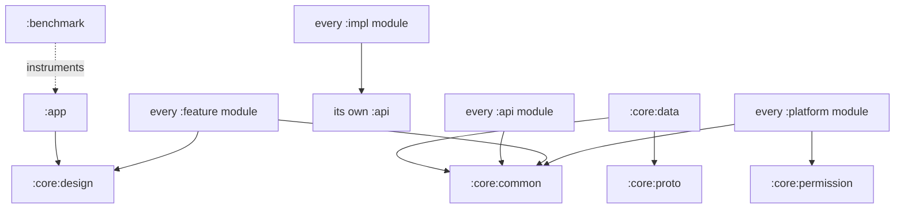

# Module Dependency Graph

86 Gradle modules. Sprint 1 ships the complete skeleton (SPEC §4.2: post-V1 engines exist as day-1 seams); populated modules are marked ●.

## Structure

```
:app ●                          composition root (flavors: gms/nogms)
:kernel:{api,impl}              cognitive kernel seam
:reasoning:{api,impl}           reasoning pipeline seam
:router:{api,impl}              model router seam
:cognition:{worldmodel,goal,planning,critic,reflection,learning,curiosity,preference}:{api,impl}
:self:{identity,personality,emotion,trust,relationship,experience}:{api,impl}
:engine:memory:{api,impl}       :engine:context:{api,impl}   :engine:automation:{api,impl}
:engine:voice:{api,impl,whisper,tts,androidspeech}
:engine:vision:{api,impl,ocr,screen,camera}
:engine:plugin:{api,impl}
:core:common ●                  dispatcher qualifiers + DI
:core:proto ●                   Wire schemas (LocalSettings v1)
:core:ai                        ModelPorts home (pure JVM)
:core:inference-local           :inference process home (NDK later)
:core:permission                Gatekeeper home
:core:data ●                    Room(KSP wired) + typed DataStore ● + future crypto/vec
:core:sync  :core:events  :core:background  :core:network
:core:design ●                  tokens + NexaTheme (M3 wrapper)
:platform:{telephony,calendar,contacts,files,notifications,accessibility,camera,sensors,connectivity,media}
:feature:{chat,voice-ui,overlay,memory-browser,workflows,goals,trust,timeline,onboarding,settings-privacy}
:benchmark ●                    Macrobenchmark (cold start)
:konsist-tests ●                architecture law (2 active rules)
```

## Current edges (Sprint 1)



Type-level edges (api→common, feature→design/common, platform→permission/common, impl→own api) are wired by the convention plugins — a new module is born lawful.

## The law (SPEC §4.3 — Konsist-enforced, growing per ED-11)

1. `:feature:* → :kernel:api` + `:core:design`/`:core:common` only — never engine/cognition/self modules.
2. No `:impl → :impl` across engines; the kernel/events mediate.
3. `:cognition:* ↔ :self:*` direct edges forbidden.
4. Nothing depends on `:app`.
5. `kotlin-domain` and all `:api` modules: zero Android.
6. Runtime fences: Room/SQLCipher only in `:core:data`; OkHttp/gRPC only in `:core:network`; sensitive OS APIs only in `:platform:*`; model runtimes only in `:core:ai`/`:core:inference-local`.
7. `:core:*` never depends on engine/feature/cognition/self modules.
